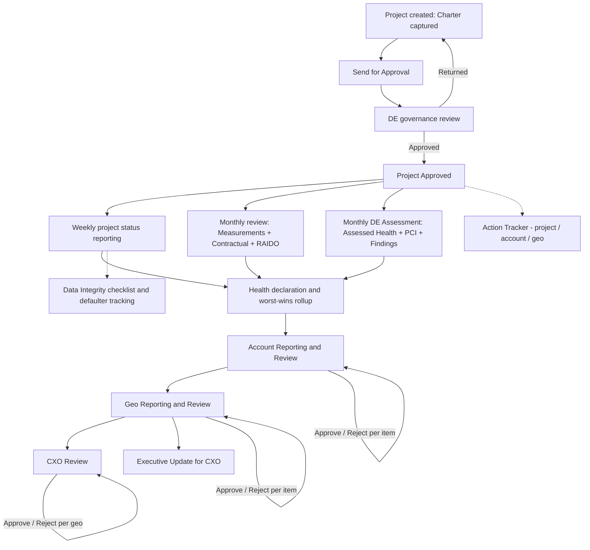

# 00 — Product Overview

**Document type:** Product-Brain Reference
**Product:** ProjectGovernance (working title)
**Status:** Draft — generated 2026-08-29, pending review
**Depends on:** none
**Feeds:** product-brain/01, product-brain/02, product-brain/03, and every later document

> **Purpose of this document.** This is the entry point to the product brain. It frames what
> ProjectGovernance is, who uses it, what is in and out of scope, and the end-to-end
> governance lifecycle it supports. Every later document — module catalogue, business
> processes, functional spec, business rules, workflows — elaborates a slice of what is
> introduced here. Read this first, then `product-brain/13_gaps_assumptions_decisions_register.md`
> for what is still unsettled.

---

## 1. Product Purpose

ProjectGovernance is an **internal Bahwan CyberTek (BCT) PMO / delivery-governance web
application**. It is the single system of record for project delivery health across BCT's
project portfolio, covering the full reporting chain from an individual project up to CXO:
project charter and master data; health declaration with a worst-wins Red / Amber / Green
rollup from project to account to geography to enterprise; a report-and-review workflow at
each tier; five RAID registers; weekly status reporting; delivery metrics by engagement
type; contractual SLA and milestone-payment tracking; Delivery Excellence assessment and
governance approval; a data-integrity checklist; an action tracker; executive updates;
role-based dashboards; and user/role administration.

It exists to replace a patchwork of per-project, per-account, and per-geography governance
**spreadsheets** — which have no single source of truth, no consistent rollup rule, and no
shared audit trail — with one controlled, attributable, status-driven application.

It is a **greenfield build**, actively under construction: a Next.js / React frontend over a
FastAPI / PostgreSQL backend. It is **internal only** (no customer-facing surface) and runs
**on-premises within the BCT network**.

---

## 2. Business Problem

| Problem | Impact today | How ProjectGovernance addresses it |
| --- | --- | --- |
| Project health, RAID registers, contractual compliance, and Delivery Excellence audits are tracked in separate spreadsheets per project, account, and geography | No single system of record; governance data lives only in local files | One application covering project → account → geo → CXO |
| No consistent rule for rolling a project's health up to its account, geo, and the enterprise | A Red project can be hidden inside a Green account or geo view | Worst-wins RAG rollup, computed from project data at every tier |
| Review and sign-off happen informally | No timestamped, attributable record of who approved or rejected what | Reporting and Review surfaces with an Approve / Reject action at each tier, audited |
| Roll-up reports are assembled by hand | Manual effort; account and geo numbers go stale | Account and geo views are computed live from current project data, not re-typed |
| No shared audit trail for DE assessments, findings, and data-integrity checks | Not queryable across the portfolio | DE Assessment, Findings, and a Data Integrity checklist run across all projects |

---

## 3. User Groups

ProjectGovernance implements **eight roles** (exact codes as stored in `roles.code`). A user
is individually assigned to one or more **Accounts** and/or **Geos**; that scoping drives
what they see on every reporting, review, and dashboard screen. Full permission detail is in
`product-brain/07_roles_permissions_matrix.md`.

| Role code | Name | What they do |
| --- | --- | --- |
| `ADMIN` | Admin | Users, roles, and Account/Geo scope; reference data; integrations; backups. Superset of all permissions; can approve/reject at every tier; bypasses scope checks. |
| `CXO` | CXO | Reviews and approves every Geo's rolled-up status; enterprise dashboard. Lightest write footprint — top of the review chain. |
| `GEO_HEAD` | Geo Head | Reviews and approves Accounts in their Geo(s); authors their Geo's own status and health; builds the CXO Executive Update (draft only). |
| `ACCOUNT_MANAGER` | Account Manager ("Account Head") | Reviews and approves Projects in their Account(s); authors their Account's own status and health; Pull / Ignore / Undo project rollup items. |
| `PROJECT_MANAGER` | Project Manager (PM) | Owns the Project Charter, Scope & Schedule, Resource Allocation, all five RAID logs, Health Declarations, Status Reports, Measurement entry, and Contractual Compliance; sends the project for approval. |
| `TEAM_MEMBER` | Team Member | Updates RAID items assigned to them; read-only on Charter and Status. |
| `DELIVERY_EXCELLENCE` | Delivery Excellence (DE) | Performs the DE Assessment (Assessed Health + PCI score), logs Findings and Alerts, and governs project approval (PM → Send for Approval → DE Approve / Return). *See §11 — DE write/approve gates are only partly wired today.* |
| `PMO` | PMO | Owns Contractual Compliance and Milestone Payments; runs the Data Integrity checklist across the portfolio. *See §11 — PMO has no distinguishing write permission yet.* |

---

## 4. In Scope

- Project charter and project master data (identity, contract type, engagement type, dates,
  resource allocation, Oracle Project ID mapping)
- Health declaration and a Red / Potential Red / Amber / Green rollup from project → account
  → geo → enterprise, using the worst-wins rule
- The report-and-review workflow at each tier (self-authored **Reporting** surface; read-only
  one-tier-up **Review** surface with Approve / Reject)
- Five RAID registers per project — Risk, Issue, Dependency, Assumption, Opportunity (RAIDO)
- Weekly project status reporting, with retained history
- Delivery metrics by engagement type (Development, Support, Professional Staffing, Testing,
  Consulting, Cloud Maintenance, Cloud Migration), entered values vs. computed KPIs
- Contractual SLA commitment tracking and milestone-payment tracking, with actuals
- Delivery Excellence assessment (Assessed Health, PCI score, Findings, Alerts) and a DE
  governance-approval workflow
- A data-integrity checklist that flags stale / not-updated data across every module
- An Action Tracker at project, account, and geo level
- Executive Updates (CXO-facing content prepared by Geo Heads)
- Role-scoped dashboards ("My Summary" per role) and a portfolio-wide Project Health view
- User, role, and Account/Geo-scope administration; reference-data management

---

## 5. Out of Scope

- Payroll and any financial system of record. ProjectGovernance holds revenue and forecast
  *fields* but is **not** a finance system.
- Full CRM functionality
- Timesheet capture (referenced as an input to Data Integrity, but not built here)
- Any customer-facing surface — this is an internal BCT tool only
- Advanced forecasting / analytics engines beyond the defined computed metrics
- Native mobile application design (the app is desktop-first; mobile is "should work")

---

## 6. Major Capabilities

| # | Capability | Summary |
| --- | --- | --- |
| C1 | Project onboarding & governance approval | Charter capture → Send for Approval → DE governance review → Approved |
| C2 | Weekly status reporting | Dated narrative reports (accomplishments, upcoming, leadership support, risks/issues) with retained history |
| C3 | Monthly project review | Measurements + Contractual Compliance + RAIDO on a monthly cadence |
| C4 | Health declaration & worst-wins rollup | 6-category RAG per project → overall → account → geo → enterprise |
| C5 | RAID(O) management | Five consistent registers with monthly review |
| C6 | Delivery metrics | Engagement-type-specific entered inputs and read-only computed KPIs, with per-type targets |
| C7 | Contractual & milestone tracking | SLA commitments and payment milestones with actuals and Met / Not-Met derivation |
| C8 | Delivery Excellence assessment | Dated per-project assessment: Assessed Health, PCI score, Findings, Alert-if-not-Green |
| C9 | Reporting / Review cascade | Identical Reporting + Review surfaces at Account, Geo, and CXO; pull / ignore / undo of items from the tier below |
| C10 | Data integrity | Per-project, per-period "updated / not updated" checklist across every module, judged against each item's own cadence |
| C11 | Action tracking | Project / account / geo actions with a full history and assignee-driven lifecycle |
| C12 | Executive updates | Structured rich-text / image / table content for the CXO, prepared by Geo Heads |
| C13 | Role-based dashboards | "My Summary" per role plus a portfolio-wide Project Health view (KPIs + drill-in grids) |
| C14 | Access control | Role-based, Account/Geo-scoped, status-aware permissions; a "Work as" (act-as) context for higher roles |
| C15 | AI-assisted data entry | A local LLM extracts structured values from uploaded documents; the user reviews and applies them — the AI never writes to business tables |
| C16 | Auditability | Status changes, approvals, and rejections are attributable and retained; history is never overwritten |

---

## 7. Major Modules

Grouped by area. Full detail — purpose, users, functions, screens, entities, dependencies —
is in `product-brain/01_module_catalogue.md`.

<!-- pending: reconcile the module list below against product-brain/01 once generated -->

| Group | Modules |
| --- | --- |
| Project | Project Charter · Project Status Reporting · RAID(O) Registers · Project Health Declarations · Measurement / Delivery Metrics · Metric Targets · Contractual Compliance |
| Delivery Excellence | DE Assessment · DE Allocation · DE Governance Approval |
| Tiered governance | Account Reporting & Health · Geo Reporting & Health · Rollup & Aggregation · Reporting / Review Cascade · Executive Updates |
| Cross-cutting | Action Tracker · Data Integrity Checklist · Dashboards · AI Assist & Documents |
| Platform | Authentication & Access · Reference / Master Data · User & Role Administration · Integrations & Backup · Audit / Activity Log |

---

## 8. High-Level Governance Lifecycle

**Narrative**

1. **Onboarding** — A PM creates a project and completes the Charter (Project Profile, Scope
   & Schedule, Resource Allocation, Oracle Project ID). All Project Profile fields must be
   present to Send for Approval.
2. **Governance approval** — The project goes to Delivery Excellence for a module-by-module
   governance review; DE Approves (→ `Approved`) or Returns (→ `Draft`). *Today PMs can
   effectively self-approve — see §11.*
3. **Weekly status reporting** — Once `Approved`, the PM submits a dated status report each
   week (Draft → Submitted).
4. **Monthly review** — Each month the PM updates Measurements, Contractual Compliance, and
   the RAIDO registers.
5. **Monthly DE assessment** — DE records a dated assessment: DE-Assessed Health, PCI score,
   Key Findings, and — when the assessed rating is not Green — an Alert.
6. **Health & rollup** — The PM's 6-category Delivery-Declared health and the latest
   DE-Assessed health combine into an overall project health; the **worst-wins** rule then
   rolls project health up to account, geo, and enterprise.
7. **Reporting / Review cascade** — Each tier authors its own status and health on a
   **Reporting** surface; the tier above sees a read-only **Review** surface with an
   Approve / Reject action per rolled-up item (Account Manager reviews Projects; Geo Head
   reviews Accounts; CXO reviews Geos). Items are promoted with Pull / Ignore / Undo.
8. **Executive Update** — Geo Heads prepare structured CXO-facing content (draft only).
9. **Cross-cutting** — Actions are tracked at every tier; the Data Integrity checklist flags,
   per period, which data points have not been updated.

Detailed flows, alternates, and exceptions are in
`product-brain/02_end_to_end_business_processes.md`.

---

## 9. Major Integrations

Full detail is folded into `product-brain/18_solution_architecture.md` (seams) and
`product-brain/19_security_and_audit_specification.md` (security).

| Integration | Direction | Purpose | Status |
| --- | --- | --- | --- |
| **OneLogin (OIDC SSO)** | Inbound | Authenticate users against the corporate IdP; strict pre-provisioned users | **Planned / in progress.** `AUTH_TYPE` toggle exists (`no_password` \| `onelogin`). Default today is `no_password` — a prototype that matches a free-text identifier to a user record with **no password check**. |
| **Local AI extraction pipeline** | Inbound | A local vLLM server (OpenAI-compatible) returns structured JSON extracted from uploaded project documents; document parsing happens outside the LLM | **Working** for Project Creation and Project Reporting extraction. The app stores the JSON and **never writes AI values to business tables** — the PM applies or ignores each suggestion. |
| **BCT Oracle Application** | Inbound | Source for Resource Allocation / head count on the Charter and for Project Manager / employee-code lookups | **ID mapping only.** The Oracle Project ID linkage is stored; no live data sync exists. |
| **Microsoft 365** | Bidirectional | Configured connection for future document / calendar sync | **Registry only** — a connection-status record exists; nothing syncs live. |
| **Ticketing tools** | Inbound | Configured connection for future incident / SR feed into Support metrics | **Registry only** — nothing syncs live. |
| **Database backup / restore** | Internal | Admin-triggered backup and restore per the Security requirement | **Logged trigger only** — a `backup_restore_log` records the action; end-to-end operation not confirmed. |

---

## 10. Key Terminology

The canonical vocabulary is `product-brain/03_glossary_and_terminology.md`; the canonical
status vocabulary is `product-brain/06_status_workflow_catalogue.md`. A few terms needed to
read this document:

| Term | Definition |
| --- | --- |
| **RAG / health rating** | A four-state rating, worst to best: `Red`, `Potential Red`, `Amber`, `Green`. |
| **Worst-wins rollup** | A parent's rating equals the worst rating among its children — across the 6 categories to an overall project rating, and from a child tier to its parent tier. |
| **RAID / RAIDO** | Risk, Assumption, Issue, Dependency — plus Opportunity, tracked as a fifth register. |
| **Reporting surface** | The screen where a tier (Project / Account / Geo) enters its own status and health. |
| **Review surface** | The read-only, one-level-up screen where the next tier reviews and approves/rejects what was reported below it. |
| **Geo** | Geography / region — the organisational tier between Account and CXO (e.g. APAC, MEA, US). |
| **PCI score** | Delivery Excellence's numeric project compliance/quality index, produced by the DE Assessment. |
| **Work Context ("act as")** | A higher role (Account Manager, Geo Head) viewing the app as a lower role within its own scope. |
| **Reporting period** | A `Weekly`, `Monthly`, or `Baseline` bucket; weeks are keyed to the Monday date. |

---

## 11. Assumptions

Every item below is an `ASSUMPTION:` — invented, unverified, or an open decision. Each is
catalogued and managed in `product-brain/23_gaps_assumptions_decisions_register.md`.

| ID | Assumption |
| --- | --- |
| A-OVW-001 | `ASSUMPTION:` There is no confirmed product name. "ProjectGovernance" is a working title — to confirm with the PMO sponsor. |
| A-OVW-002 | `ASSUMPTION:` Authentication is currently a **no-password prototype** (identifier lookup, no password check). OneLogin OIDC is the intended replacement. The application should not be exposed beyond a controlled pilot until real authentication is delivered. |
| A-OVW-003 | On-premises within the BCT network; no project, RAID, or contractual data leaves the network (data residency). |
| A-OVW-004 | Primarily desktop, data-entry-heavy forms and tables; mobile / tablet is a "should work", not a design target. |
| A-OVW-005 | History is retained, never overwritten — status reports, health declarations, DE assessments — so trends can be reconstructed. |
| A-OVW-006 | `ASSUMPTION:` The project-health model is mid-migration — an older single-rating-per-category model and a newer itemised register (`project_health_items`) coexist. |
| A-OVW-007 | `ASSUMPTION:` The `DELIVERY_EXCELLENCE` and `PMO` roles are specified but not yet fully write-enabled in the backend; DE governance approval and PMO ownership of Contractual / Data Integrity need verification against code. |
| A-OVW-008 | `ASSUMPTION:` The DE Assessment cadence (monthly vs. quarterly) is undecided. |
| A-OVW-009 | `ASSUMPTION:` The eight-role split (from the source workbook's combined "CEO/CDO/GEO Head/Delivery Manager" group) is treated as final, pending stakeholder confirmation. |
| A-OVW-010 | `ASSUMPTION:` PMs can currently edit any project (role-only, no per-PM assignment) and can effectively self-approve; the intended design routes approval to Delivery Excellence. |

---

## 12. Related Documents

| Document | What it adds on top of this overview |
| --- | --- |
| `01_module_catalogue.md` | Every module with users, functions, screens, dependencies, entities |
| `02_end_to_end_business_processes.md` | Full governance process flows with alternates, exceptions, diagrams |
| `03_glossary_and_terminology.md` | The canonical term vocabulary |
| `04_functional_specification.md` | Module-by-module functional behaviour |
| `05_business_rules_catalogue.md` | Uniquely identified, enforceable business rules |
| `06_status_workflow_catalogue.md` | Status definitions and transitions per entity |
| `07_roles_permissions_matrix.md` | Role / permission and status-dependent, scope-dependent access |
| `23_gaps_assumptions_decisions_register.md` | Managed gaps, assumptions, decisions, risks, dependencies |
| `24_build_status_and_delivery_roadmap.md` | Per-module Built / Partial / Planned and the forward plan |
