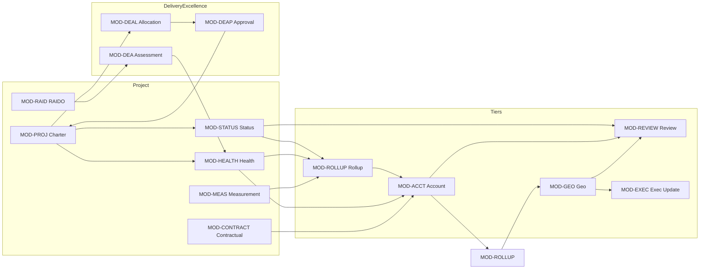
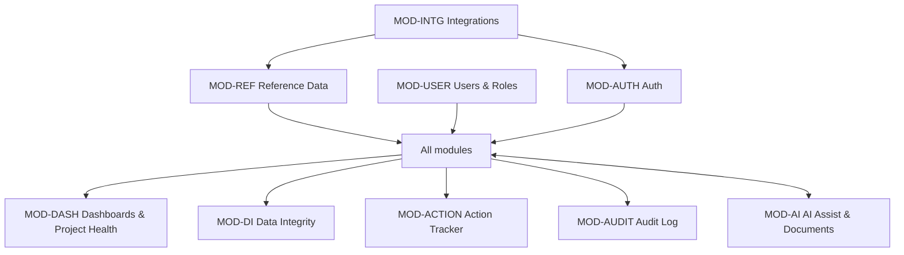

# 01 — Module Catalogue

**Document type:** Product-Brain Reference
**Product:** ProjectGovernance (working title)
**Status:** Draft — generated 2026-08-29, pending review
**Depends on:** product-brain/00
**Feeds:** product-brain/02, product-brain/04, product-brain/07, product-brain/08, product-brain/10, product-brain/17

> **Purpose of this document.** The structural map of ProjectGovernance. It names every
> module, gives it a stable **Module ID** (`MOD-*`) and short code, and records its users,
> functions, screens, dependencies, integrations, and owned entities. Later documents cite
> these IDs instead of re-describing scope. Module short codes (bracketed in §1) are the
> `<MOD>` segment used by `FC-*`, `BR-*`, and `SCR-*` IDs pack-wide.

---

## 1. Module Index

| Module ID | Short | Module | Area |
| --- | --- | --- | --- |
| MOD-AUTH | AUTH | Authentication & Access | Platform |
| MOD-REF | REF | Reference / Master Data | Platform |
| MOD-USER | USER | User & Role Administration | Platform |
| MOD-INTG | INTG | Integrations & Backup | Platform |
| MOD-AUDIT | AUDIT | Audit / Activity Log | Platform |
| MOD-PROJ | PROJ | Project Charter | Project |
| MOD-STATUS | STATUS | Project Status Reporting | Project |
| MOD-RAID | RAID | RAID(O) Registers | Project |
| MOD-HEALTH | HEALTH | Project Health Declarations | Project |
| MOD-MEAS | MEAS | Measurement / Delivery Metrics | Project |
| MOD-TARGET | TARGET | Metric Targets | Project |
| MOD-CONTRACT | CONTRACT | Contractual Compliance | Project |
| MOD-DEA | DEA | Delivery Excellence Assessment | Delivery Excellence |
| MOD-DEAL | DEAL | DE Allocation | Delivery Excellence |
| MOD-DEAP | DEAP | DE Governance Approval | Delivery Excellence |
| MOD-ACCT | ACCT | Account Reporting & Health | Tiered Governance |
| MOD-GEO | GEO | Geo Reporting & Health | Tiered Governance |
| MOD-ROLLUP | ROLLUP | Rollup & Aggregation *(cross-cutting)* | Tiered Governance |
| MOD-REVIEW | REVIEW | Reporting / Review Cascade *(cross-cutting)* | Tiered Governance |
| MOD-EXEC | EXEC | Executive Updates | Tiered Governance |
| MOD-ACTION | ACTION | Action Tracker | Cross-cutting |
| MOD-DI | DI | Data Integrity Checklist | Cross-cutting |
| MOD-DASH | DASH | Dashboards & Project Health | Cross-cutting |
| MOD-AI | AI | AI Assist & Documents | Cross-cutting |

**Newer than the source BRS** (`docs/Project-Governance-Tool-BRS.md`, v0.1, 2026-08-12) and
documented here for the first time: MOD-DEAL, MOD-DEAP, MOD-EXEC, MOD-ACTION, the Project
Health portfolio within MOD-DASH, the Consulting engagement type in MOD-MEAS/MOD-TARGET, and
`regions` in MOD-REF.

**Cross-cutting modules.** MOD-ROLLUP and MOD-REVIEW are patterns, not separate screens:
their logic lives inside the reporting endpoints (`project_status.py`, `regional_status.py`,
`account_rollup.py`, `geo_rollup.py`) and surfaces as panels/action-bars within the Account,
Geo, and Review screens.

### 1.1 Backend file → module map

| Backend file | Module |
| --- | --- |
| `endpoints/auth.py`, `api/deps.py`, `core/session.py`, `core/security.py` | MOD-AUTH |
| `endpoints/reference_data.py` | MOD-REF |
| `endpoints/users.py` | MOD-USER |
| `endpoints/integrations.py` | MOD-INTG |
| `endpoints/audit.py` | MOD-AUDIT |
| `endpoints/projects.py` | MOD-PROJ |
| `endpoints/project_status.py` (report + items) | MOD-STATUS |
| `endpoints/project_status.py` (`/{report_id}/review`) | MOD-REVIEW |
| `endpoints/raid.py` | MOD-RAID |
| `endpoints/health_declarations.py` | MOD-HEALTH |
| `endpoints/measurement.py` | MOD-MEAS |
| `endpoints/metric_target.py` | MOD-TARGET |
| `endpoints/contractual.py` | MOD-CONTRACT |
| `endpoints/de_assessment.py` | MOD-DEA |
| `endpoints/de_allocation.py` | MOD-DEAL |
| `endpoints/de_approval.py` | MOD-DEAP |
| `endpoints/account_health_declarations.py`; account routers in `regional_status.py` | MOD-ACCT |
| `endpoints/geo_health_declarations.py`; geo routers in `regional_status.py` | MOD-GEO |
| `endpoints/account_rollup.py`, `account_health_rollup.py`, `geo_rollup.py` | MOD-ROLLUP |
| `/{report_id}/review` in `regional_status.py` (account + geo) | MOD-REVIEW |
| `endpoints/executive_updates.py` | MOD-EXEC |
| `endpoints/actions.py` | MOD-ACTION |
| `endpoints/data_integrity.py` | MOD-DI |
| `endpoints/dashboard.py` (incl. `/project-health/*`) | MOD-DASH |
| `endpoints/ai_suggestions.py`, `ai_row_suggestions.py`, `documents.py` | MOD-AI |

Screen IDs (`SCR-*`) are assigned in `product-brain/08_screen_catalogue.md`; this document
names screens by their route. <!-- pending: reconcile screen names with product-brain/08 -->

---

## 2. Module Details

Standard attribute set per module: Module ID · Name · Purpose · Primary Users · Major
Functions · Main Screens · Upstream Modules · Downstream Modules · Integrations · Major
Business Entities. Role codes are from `product-brain/00` §3.

### 2.1 MOD-AUTH — Authentication & Access

| Attribute | Value |
| --- | --- |
| Module ID | MOD-AUTH |
| Purpose | Authenticate users and enforce a valid session on every API call; resolve a user's role and Account/Geo scope for downstream authorization. |
| Primary Users | All (as authenticated principals); `ADMIN` configures auth mode |
| Major Functions | `GET /auth/config` (mode discovery); `POST /auth/login` (no-password identifier flow); `GET /auth/onelogin/login` + `/auth/onelogin/callback` (OIDC); `GET /auth/me`; `POST /auth/logout`; session-cookie issue/verify; two request gates (`X-API-Key` + `get_current_user`); `touch_project_on_write` activity side-effect |
| Main Screens | `/login`, `/login/callback` |
| Upstream Modules | MOD-USER (the pre-provisioned user record), MOD-INTG (OneLogin connection) |
| Downstream Modules | Every module (access enforcement) |
| Integrations | OneLogin (OIDC SSO) — *planned; `no_password` prototype is the default today* |
| Major Business Entities | User (read), Role (read), session token (`pg_session` cookie — not persisted) |

### 2.2 MOD-REF — Reference / Master Data

| Attribute | Value |
| --- | --- |
| Module ID | MOD-REF |
| Purpose | Govern shared reference data used as dropdowns, filters, and the org hierarchy. |
| Primary Users | `ADMIN` (write); all roles (read) |
| Major Functions | CRUD (via `build_crud_router`) for `/organizations`, `/geos`, `/regions`, `/project-types`, `/products`, `/accounts`, `/reporting-periods`; bulk Excel import (`app/master_data/`, CLI only) |
| Main Screens | `/admin/accounts` (Accounts only today); other entities are seed-script / API only |
| Upstream Modules | — |
| Downstream Modules | MOD-PROJ, MOD-USER, MOD-ACCT, MOD-GEO, MOD-DASH, and every module with a period selector |
| Integrations | BCT Oracle Application (Project Type / employee lookups — *ID mapping only*) |
| Major Business Entities | Organization, Geo, Region, Account, Project Type, Product, Reporting Period |

### 2.3 MOD-USER — User & Role Administration

| Attribute | Value |
| --- | --- |
| Module ID | MOD-USER |
| Purpose | Manage user accounts, role assignment, and the Account/Geo scope that drives every reporting and review screen. |
| Primary Users | `ADMIN` only |
| Major Functions | `GET /roles`; `GET/PUT /users/{id}/accounts`; `GET/PUT /users/{id}/geos`; `GET /geos/{id}/geo-head`; user create/edit/deactivate (via `/users` CRUD); role assignment |
| Main Screens | `/admin/users` |
| Upstream Modules | MOD-REF (Accounts, Geos), MOD-AUTH (identity) |
| Downstream Modules | Every module (scope + role enforcement) |
| Integrations | — (OneLogin decides who may *attempt* sign-in; MOD-USER decides who has an account) |
| Major Business Entities | User, Role, UserAccount, UserGeo, UserProject *(largely unused)* |

### 2.4 MOD-PROJ — Project Charter

| Attribute | Value |
| --- | --- |
| Module ID | MOD-PROJ |
| Purpose | System of record for a project's identity, contract/engagement attributes, dates, resource allocation, Oracle Project ID mapping, and cached health/approval state. Entry point of the governance lifecycle. |
| Primary Users | `PROJECT_MANAGER` (create/edit); all (read); `DELIVERY_EXCELLENCE` (governance approval, via MOD-DEAP) |
| Major Functions | `POST /projects` (create); `PUT /projects/{id}` (edit); Send for Approval / Approve transitions (`project_status` + `de_review_status`); `GET/POST/DELETE /projects/{id}/oracle-ids`; `GET/POST/PUT/DELETE /projects/{id}/resources` + `/resources/summary` (head count) |
| Main Screens | `/new-project` (index), `/new-project/[id]/create`, `/new-project/[id]/project-charter` (Profile), `/project-charter/schedule` (Scope & Schedule), `/new-project/[id]/map-oracle-projects`; read-only mirror under `/project-reporting/[id]/project-charter*` |
| Upstream Modules | MOD-REF (Org, Geo, Account, Project Type, Product), MOD-USER (PM, DM, DE, Geo Head defaults) |
| Downstream Modules | MOD-STATUS, MOD-RAID, MOD-HEALTH, MOD-MEAS, MOD-CONTRACT, MOD-DEA, MOD-DEAP, MOD-DASH, MOD-DI |
| Integrations | BCT Oracle Application (Project ID mandatory to unlock the right-hand menu; resourcing sync *not wired*) |
| Major Business Entities | Project, ProjectOracleId, ProjectResource |

### 2.5 MOD-STATUS — Project Status Reporting

| Attribute | Value |
| --- | --- |
| Module ID | MOD-STATUS |
| Purpose | Weekly dated narrative status report per project, with retained history and per-item rollup tracking into the Account register. |
| Primary Users | `PROJECT_MANAGER` (edit/submit); all (read); `ACCOUNT_MANAGER` (review — via MOD-REVIEW) |
| Major Functions | `GET/POST/PUT /projects/{id}/status-reports` (+ `/latest`); Submit (Draft → Submitted); `GET/POST/PUT/DELETE /projects/{id}/status-items`; `PATCH /status-items/{id}/rollup-status` (Pending/Pulled/Ignored) |
| Main Screens | `/project-reporting/[id]/project-status`; `/new-project/[id]/project-status` |
| Upstream Modules | MOD-PROJ, MOD-REF (Reporting Period) |
| Downstream Modules | MOD-ROLLUP (items → account), MOD-REVIEW, MOD-DASH, MOD-DI |
| Integrations | MOD-AI (AI-assisted extraction of report items) |
| Major Business Entities | ProjectStatusReport, ProjectStatusItem, project→account status-item rollup rows |

### 2.6 MOD-RAID — RAID(O) Registers

| Attribute | Value |
| --- | --- |
| Module ID | MOD-RAID |
| Purpose | Five per-project registers — Risk, Issue, Dependency, Assumption, Opportunity — sharing one list/detail interaction pattern (built from a single `RaidConfig`). |
| Primary Users | `PROJECT_MANAGER` (full CRUD); `TEAM_MEMBER` (items assigned to them); all (read) |
| Major Functions | Per register (`/projects/{id}/{risks\|issues\|dependencies\|assumptions\|opportunities}`): list (paged, filterable), create, get, update, delete; computed fields (e.g. Risk Score = Probability × Impact); monthly-review dates (Risk today; others an open item) |
| Main Screens | `/project-reporting/[id]/raido`; `/new-project/[id]/raido` (tabbed by register) |
| Upstream Modules | MOD-PROJ |
| Downstream Modules | MOD-DASH (Project Health RAIDO grids), MOD-DI, MOD-DEA (findings context) |
| Integrations | MOD-AI (row-level suggestions per register) |
| Major Business Entities | Risk, Issue, Dependency, Assumption, Opportunity |

### 2.7 MOD-HEALTH — Project Health Declarations

| Attribute | Value |
| --- | --- |
| Module ID | MOD-HEALTH |
| Purpose | Dated 6-category RAG self-assessment per project; feeds the overall project health and the worst-wins rollup. |
| Primary Users | `PROJECT_MANAGER` (declare); all (read) |
| Major Functions | `GET/POST/PUT /projects/{id}/health-declarations` (+ `/latest`); itemized register `GET/POST/PUT/DELETE /projects/{id}/health-items`; `PATCH /health-items/{id}/rollup-status`; overall rating computed by `services/health_rollup.py` |
| Main Screens | `/new-project/[id]/project-charter/self-assessment`; `/project-reporting/[id]/project-charter/self-assessment` (RAG Status) |
| Upstream Modules | MOD-PROJ, MOD-DEA (DE-Assessed health, read-only into the overall) |
| Downstream Modules | MOD-ROLLUP, MOD-ACCT, MOD-DASH, MOD-DI |
| Integrations | — |
| Major Business Entities | HealthDeclaration, ProjectHealthItem *(the older single-rating and newer itemised models coexist)* |

### 2.8 MOD-MEAS — Measurement / Delivery Metrics

| Attribute | Value |
| --- | --- |
| Module ID | MOD-MEAS |
| Purpose | Capture engagement-type-specific delivery metrics per reporting period: entered inputs vs. read-only computed KPIs. |
| Primary Users | `PROJECT_MANAGER` (edit); all (read) |
| Major Functions | Per type (`/projects/{id}/measurements/{development\|support\|staffing\|testing\|consulting\|cloud-maintenance\|cloud-migration}`): list/latest, create, get, update, delete; nested child tables for Development defects and Staffing priority metrics; metric derivation at write time (`services/measurement_metrics.py`) |
| Main Screens | `/project-reporting/[id]/measurement`; `/new-project/[id]/measurement` (type-switcher) |
| Upstream Modules | MOD-PROJ (Project Type selects the tab), MOD-TARGET (targets), MOD-REF (Reporting Period) |
| Downstream Modules | MOD-DASH (Project Health Metrics grid), MOD-DI |
| Integrations | Ticketing tools (future feed into Support metrics — *registry only*) |
| Major Business Entities | MeasurementDevelopment (+Defects), MeasurementSupport, MeasurementStaffing (+PriorityMetrics), MeasurementTesting, MeasurementConsulting, MeasurementCloudMaintenance, MeasurementCloudMigration |

### 2.9 MOD-TARGET — Metric Targets

| Attribute | Value |
| --- | --- |
| Module ID | MOD-TARGET |
| Purpose | Per-project-type target values for the computed measurement KPIs; used for variance/RAG on dashboards. |
| Primary Users | `PROJECT_MANAGER` (set); all (read) |
| Major Functions | Per type (`/projects/{id}/metric-targets/{type}`): get, upsert (`PUT`), delete; staffing priority-level targets |
| Main Screens | Embedded in `/project-reporting/[id]/measurement` and `/new-project/[id]/measurement` |
| Upstream Modules | MOD-MEAS (mirrors its type set) |
| Downstream Modules | MOD-DASH (variance / "meeting target %"), MOD-DI |
| Integrations | — |
| Major Business Entities | MetricTargetDevelopment, …Support, …Staffing (+Priority), …Testing, …Consulting, …CloudMaintenance, …CloudMigration |

### 2.10 MOD-CONTRACT — Contractual Compliance

| Attribute | Value |
| --- | --- |
| Module ID | MOD-CONTRACT |
| Purpose | Track SLA/contractual commitments and payment milestones against actuals, with Met/Not-Met and Paid-status derivation. |
| Primary Users | `PROJECT_MANAGER` (edit today); *intended owner: `PMO`*; all (read) |
| Major Functions | `/projects/{id}/contractual-commitments` CRUD + `/{id}/actuals` (per-frequency); `/projects/{id}/milestone-payments` CRUD + `/{id}/actual` |
| Main Screens | `/project-reporting/[id]/contractual-compliance`; `/new-project/[id]/contractual-compliance` (Commitments / Milestones tabs) |
| Upstream Modules | MOD-PROJ |
| Downstream Modules | MOD-DASH (Contractual + Payment Milestones tiles and Project Health grids), MOD-DI |
| Integrations | — |
| Major Business Entities | ContractualCommitment (+Actual), MilestonePayment (+Actual) |

### 2.11 MOD-DEA — Delivery Excellence Assessment

| Attribute | Value |
| --- | --- |
| Module ID | MOD-DEA |
| Purpose | Dated per-project DE assessment: DE-Assessed Health (4-state RAG), PCI score, Key Findings, and an Alert when the rating is not Green. |
| Primary Users | `DELIVERY_EXCELLENCE` (intended); `PROJECT_MANAGER`/`ADMIN` (current write reality — verify); all (read) |
| Major Functions | `/projects/{id}/de-assessments` list/latest/get; `POST` create; `PATCH` update; findings `POST`/`PUT`; alert `POST`; Draft → Submitted |
| Main Screens | `/project-reporting/[id]/de-assessment`; `/new-project/[id]/de-assessment`; `/de-assessment` (queue) + `/de-assessment/[id]` (workspace) |
| Upstream Modules | MOD-PROJ, MOD-DEAL (assessor assignment) |
| Downstream Modules | MOD-HEALTH (DE-Assessed health → overall project health), MOD-DASH, MOD-DI |
| Integrations | — |
| Major Business Entities | DEAssessment, DEAssessmentFinding, DEAssessmentAlert |

### 2.12 MOD-DEAL — DE Allocation

| Attribute | Value |
| --- | --- |
| Module ID | MOD-DEAL |
| Purpose | Assign a DE assessor to a project (sets `projects.delivery_excellence_id`), typically before it is approved. |
| Primary Users | `DELIVERY_EXCELLENCE`, `ADMIN` |
| Major Functions | `GET /de-allocation` (grid of projects + current assessor); `PATCH /de-allocation/allocations` (bulk assign) |
| Main Screens | `/de-allocation` |
| Upstream Modules | MOD-PROJ, MOD-USER |
| Downstream Modules | MOD-DEA, MOD-DEAP (`require_project_de_scope` uses the assignment) |
| Integrations | — |
| Major Business Entities | Project (`delivery_excellence_id`) |

### 2.13 MOD-DEAP — DE Governance Approval

| Attribute | Value |
| --- | --- |
| Module ID | MOD-DEAP |
| Purpose | Module-by-module governance review of a project before it is approved; DE Approves (→ `Approved`) or Returns (→ `Draft`). |
| Primary Users | `DELIVERY_EXCELLENCE` (scoped by `require_project_de_scope`) |
| Major Functions | `GET /de-approval/queue`; `GET /de-approval/{project_id}` (review detail); `PUT /de-approval/{project_id}` (per-module verdicts); `PATCH /de-approval/{project_id}/decision` (Approve/Return); completeness score via `services/governance_completeness.py` |
| Main Screens | `/de-approval` (queue), `/de-approval/[id]` (governance review workspace) |
| Upstream Modules | MOD-PROJ, MOD-DEAL, MOD-STATUS/RAID/HEALTH/MEAS/CONTRACT (the governance modules scored) |
| Downstream Modules | MOD-PROJ (`project_status` → `Approved`; `de_review_status`) |
| Integrations | — |
| Major Business Entities | DeProjectModuleReview, Project (`de_review_status`) |

### 2.14 MOD-ACCT — Account Reporting & Health

| Attribute | Value |
| --- | --- |
| Module ID | MOD-ACCT |
| Purpose | An Account's own self-authored status report and health declaration, independent of any one project; the Reporting surface for the Account tier. |
| Primary Users | `ACCOUNT_MANAGER` (scoped to owned accounts); `ADMIN` |
| Major Functions | `/accounts/{id}/status-reports` (+ items, + `/review`); `/accounts/{id}/health-declarations` (+ health-items); Submit; Key Metrics capture |
| Main Screens | `/account-reporting/[id]` (hub), `/status`, `/rag-status`, `/dashboard` (read-only), `/ai-hub/document-processing` |
| Upstream Modules | MOD-ROLLUP (pulls from projects), MOD-REF |
| Downstream Modules | MOD-GEO (via rollup), MOD-REVIEW (Geo Head reviews), MOD-DASH |
| Integrations | MOD-AI |
| Major Business Entities | AccountStatusReport, AccountStatusItem, AccountHealthDeclaration, AccountHealthItem |

### 2.15 MOD-GEO — Geo Reporting & Health

| Attribute | Value |
| --- | --- |
| Module ID | MOD-GEO |
| Purpose | A Geo's own self-authored status report and health declaration; the Reporting surface for the Geo tier. |
| Primary Users | `GEO_HEAD` (scoped to owned geos); `ADMIN` |
| Major Functions | `/geos/{id}/status-reports` (+ items, + `/review`); `/geos/{id}/health-declarations` (+ `/latest`); Submit |
| Main Screens | `/geo-reporting/[id]` (hub), `/status`, `/executive-update`, `/dashboard`, `/ai-hub/document-processing`. **No geo RAG-status screen yet** — backend endpoints exist, no UI (known gap). |
| Upstream Modules | MOD-ROLLUP (pulls from accounts), MOD-REF |
| Downstream Modules | MOD-REVIEW (CXO reviews), MOD-EXEC, MOD-DASH |
| Integrations | MOD-AI |
| Major Business Entities | GeoStatusReport, GeoStatusItem, GeoHealthDeclaration |

### 2.16 MOD-ROLLUP — Rollup & Aggregation *(cross-cutting)*

| Attribute | Value |
| --- | --- |
| Module ID | MOD-ROLLUP |
| Purpose | Compute worst-wins health rollup and period-scoped Key Metric sums up the tier chain, and surface lower-tier status/health items for pull into the parent register. |
| Primary Users | `ACCOUNT_MANAGER` (project→account), `GEO_HEAD` (account→geo) |
| Major Functions | `GET /accounts/{id}/rollup`, `POST` pull/ignore/undo; `GET /accounts/{id}/health-rollup`, `POST`; `GET /geos/{id}/rollup`, `POST`; reducers in `services/{account_rollup,account_health_rollup,geo_rollup,health_rollup}.py` |
| Main Screens | Rollup source panels inside `/account-reporting/*` and `/geo-reporting/*` |
| Upstream Modules | MOD-STATUS, MOD-HEALTH (project); MOD-ACCT (account) |
| Downstream Modules | MOD-ACCT, MOD-GEO, MOD-DASH |
| Integrations | — |
| Major Business Entities | project→account and account→geo status-item and health-item rollup rows (`RollupStatus`) |

### 2.17 MOD-REVIEW — Reporting / Review Cascade *(cross-cutting)*

| Attribute | Value |
| --- | --- |
| Module ID | MOD-REVIEW |
| Purpose | The read-only, one-tier-up review of a submitted report, with an Approve / Reject action per item: Account Manager reviews Projects; Geo Head reviews Accounts; CXO reviews Geos. |
| Primary Users | `ACCOUNT_MANAGER`, `GEO_HEAD`, `CXO`, `ADMIN` |
| Major Functions | `PATCH /projects/{id}/status-reports/{rid}/review` (`_account_manager_review`); `PATCH /accounts/{id}/status-reports/{rid}/review` (`_geo_head_review`); `PATCH /geos/{id}/status-reports/{rid}/review` (`_cxo_review`) |
| Main Screens | `/project-review/[id]`, `/account-review/[id]`, `/geo-review/[id]` |
| Upstream Modules | MOD-STATUS, MOD-ACCT, MOD-GEO (a report must be `Submitted`) |
| Downstream Modules | MOD-DASH |
| Integrations | — |
| Major Business Entities | ProjectStatusReport / AccountStatusReport / GeoStatusReport (`ReportStatus` → Approved/Rejected) |

### 2.18 MOD-EXEC — Executive Updates

| Attribute | Value |
| --- | --- |
| Module ID | MOD-EXEC |
| Purpose | Structured CXO-facing content (Delivery / People / Financials / Operations sections; rich-text / image / table blocks) prepared by a Geo Head. Save Draft only — no approval step. |
| Primary Users | `GEO_HEAD` (edit); `CXO`, `ADMIN` (view) |
| Major Functions | `/geos/{id}/executive-updates` list/create/update; image upload (`POST …/images`, `GET …/images/{filename}`); clipboard image + Excel-range paste (frontend) |
| Main Screens | `/geo-reporting/[id]/executive-update` |
| Upstream Modules | MOD-GEO |
| Downstream Modules | MOD-DASH (Executive Update view) |
| Integrations | Local filesystem (image storage) |
| Major Business Entities | ExecutiveUpdate (sections + blocks as structured JSON) |

### 2.19 MOD-ACTION — Action Tracker *(cross-cutting)*

| Attribute | Value |
| --- | --- |
| Module ID | MOD-ACTION |
| Purpose | One action-tracking implementation across GEO / ACCOUNT / PROJECT levels (built from an `ActionLevelConfig`), with a full history and an assignee-driven lifecycle. |
| Primary Users | PROJECT: `PROJECT_MANAGER`/`ACCOUNT_MANAGER`/`ADMIN`; ACCOUNT: `ACCOUNT_MANAGER`/`GEO_HEAD`/`ADMIN`; GEO: `GEO_HEAD`/`CXO`/`ADMIN`. The assignee can always transition their own action. |
| Major Functions | `/{geos\|accounts\|projects}/{id}/actions` list/get/create/update; `/history`; `PATCH …/start\|complete\|close\|cancel`; `POST …/comments`; lifecycle `OPEN→IN_PROGRESS→COMPLETED→CLOSED` or `→CANCELLED` |
| Main Screens | `/project-health/actions`; action panels within project/account/geo screens |
| Upstream Modules | MOD-PROJ, MOD-ACCT, MOD-GEO (the entity an action is scoped to) |
| Downstream Modules | MOD-DASH (Project Health Actions grid) |
| Integrations | — |
| Major Business Entities | Action, ActionHistory |

### 2.20 MOD-DI — Data Integrity Checklist *(cross-cutting)*

| Attribute | Value |
| --- | --- |
| Module ID | MOD-DI |
| Purpose | Per-project, per-period view of which data points across every module have or have not been updated, each judged against its own expected cadence. |
| Primary Users | `PMO` (intended owner); `ADMIN` (catalog); all (read) |
| Major Functions | Checklist catalog (`data_integrity_checklist_items`); freshness rollup computed at query time (`services/data_integrity_rollup.py`) mapping `module_name` → the table/column that answers "last updated for this project" |
| Main Screens | `/project-health/data-integrity` |
| Upstream Modules | Every project-scoped module (freshness sources) |
| Downstream Modules | MOD-DASH; defaulter tracking |
| Integrations | — |
| Major Business Entities | DataIntegrityChecklistItem; computed freshness rows |

### 2.21 MOD-DASH — Dashboards & Project Health *(cross-cutting)*

| Attribute | Value |
| --- | --- |
| Module ID | MOD-DASH |
| Purpose | Role-scoped "My Summary" dashboards and a portfolio-wide Project Health view; live aggregation over every module. |
| Primary Users | All roles (own "My Summary"); `PMO`/`CXO`/`ADMIN` (Project Health portfolio) |
| Major Functions | `GET /dashboard/summary` + role-specific sections; `GET /dashboard/project-health/{projects\|rag\|risks\|issues\|dependencies\|assumptions\|opportunities\|metrics\|commitments\|payment-milestones\|assessments\|findings\|actions\|data-integrity}` (paged, filter by Geo/Account/Project) |
| Main Screens | `/dashboard`, `/dashboard/{admin\|cxo\|geo-head\|account-manager\|project-manager\|pmo\|delivery-excellence}`; `/project-health/*` (14 sub-screens) |
| Upstream Modules | Every module (read) |
| Downstream Modules | — (consumer only) |
| Integrations | — |
| Major Business Entities | none owned (aggregates). PM "My Summary" is still on mock data (verify). |

### 2.22 MOD-AI — AI Assist & Documents *(cross-cutting)*

| Attribute | Value |
| --- | --- |
| Module ID | MOD-AI |
| Purpose | Store and serve LLM-extracted structured suggestions for Project Creation / Reporting screens; hold uploaded project documents. The AI never writes to business tables. |
| Primary Users | `PROJECT_MANAGER` (apply/ignore); external pipeline (POST suggestions in) |
| Major Functions | `/projects/{id}/ai-suggestions` list/create + `/{id}/ignore` + `/resolve` (field-level); `/projects/{id}/ai-row-suggestions` list/create + `/{id}/ignore` + `/{id}/apply` (RAID rows); `/projects/{id}/documents` upload/list/process/delete/download |
| Main Screens | `.../ai-hub/document-processing` under each reporting tree |
| Upstream Modules | MOD-PROJ; external vLLM pipeline |
| Downstream Modules | MOD-PROJ, MOD-RAID, MOD-STATUS (values pre-populate, applied only by the user) |
| Integrations | Local vLLM (OpenAI-compatible); local filesystem (document storage) |
| Major Business Entities | AiFieldSuggestion, AiRowSuggestion, ProjectDocument |

### 2.23 MOD-INTG — Integrations & Backup

| Attribute | Value |
| --- | --- |
| Module ID | MOD-INTG |
| Purpose | Registry of external-system connections and their status; trigger and log database backup/restore. |
| Primary Users | `ADMIN` |
| Major Functions | Integration-connection registry (Microsoft 365, BCT Oracle Application, Ticketing Tools, Project Management Tools); `GET /backup-restore-log`; `POST` backup/restore trigger |
| Main Screens | `/admin/integrations` (menu present; the sidebar `system-health` link is dead) |
| Upstream Modules | — |
| Downstream Modules | MOD-AUTH (OneLogin), MOD-REF/MOD-PROJ (Oracle), MOD-MEAS (ticketing — future) |
| Integrations | Microsoft 365, BCT Oracle Application, Ticketing Tools — **all registry/status only; nothing syncs live** |
| Major Business Entities | IntegrationConnection, BackupRestoreLog |

### 2.24 MOD-AUDIT — Audit / Activity Log

| Attribute | Value |
| --- | --- |
| Module ID | MOD-AUDIT |
| Purpose | Read access to a user activity / audit log of system actions. |
| Primary Users | `ADMIN` |
| Major Functions | `GET /audit-log` (paged); write side is `touch_project_on_write` + per-endpoint logging (coverage needs confirmation — BRS FR-AUTH-4) |
| Main Screens | none dedicated yet (surfaced in Admin) |
| Upstream Modules | Every module (writes) |
| Downstream Modules | — |
| Integrations | — |
| Major Business Entities | UserActivityLog |

---

## 3. Module Relationships

### 3.1 Governance flow (project → enterprise)

### 3.2 Cross-cutting modules

---

## 4. Upstream / Downstream Dependency Matrix

`→` = row module sends work/data to column module. Platform and cross-cutting modules
(AUTH, REF, USER, INTG, AUDIT, ROLLUP, REVIEW, ACTION, DI, DASH, AI) are omitted from the
grid; their relationships are in §2–§3.

| From \ To | PROJ | STATUS | RAID | HEALTH | MEAS | CONTRACT | DEAL | DEAP | DEA | ACCT | GEO | EXEC |
| --- | --- | --- | --- | --- | --- | --- | --- | --- | --- | --- | --- | --- |
| PROJ | | → | → | → | → | → | → | → | → | | | |
| STATUS | | | | | | | | → | | → | | |
| RAID | | | | | | | | → | → | | | |
| HEALTH | | | | | | | | → | | → | | |
| MEAS | | | | | | | | → | | → | | |
| CONTRACT | | | | | | | | → | | → | | |
| DEAL | | | | | | | | → | → | | | |
| DEAP | → | | | | | | | | | | | |
| DEA | | | | → | | | | | | | | |
| ACCT | | | | | | | | | | | → | |
| GEO | | | | | | | | | | | | → |

---

## 5. Assumptions

| ID | Assumption |
| --- | --- |
| A-MOD-001 | `ASSUMPTION:` 24 modules is the working baseline. Sub-areas (e.g. Resource Allocation, Findings, Alerts) are treated as functions within a module, not separate modules. |
| A-MOD-002 | `ASSUMPTION:` MOD-ROLLUP and MOD-REVIEW are cross-cutting patterns; their endpoints live inside `project_status.py` / `regional_status.py` / the `*_rollup.py` files rather than a dedicated file. |
| A-MOD-003 | `ASSUMPTION:` `regional_status.py` serves MOD-ACCT and MOD-GEO as mirror-image routers; its `/review` endpoints belong to MOD-REVIEW. |
| A-MOD-004 | `ASSUMPTION:` MOD-CONTRACT and MOD-DI are owned by `PMO` by intent, but `PMO` has no distinguishing write gate today — writes are effectively PM/Admin. To confirm against `product-brain/07`. |
| A-MOD-005 | `ASSUMPTION:` MOD-DEA writes are still PM/Admin-reachable despite the `DELIVERY_EXCELLENCE` intent; the DE menu, `/de-assessment*`, `/de-allocation`, `/de-approval*` route trees and the DE dashboard now exist. Verify backend enforcement in `product-brain/07`. |
| A-MOD-006 | `ASSUMPTION:` MOD-DASH owns no entities; `/dashboard/*` is live aggregation. PM "My Summary" is still on mock data. |
| A-MOD-007 | `ASSUMPTION:` MOD-GEO has backend health-declaration endpoints but no RAG-status screen — a known UI gap (see `DATA-ENTRY-GUIDE.md`). |
| A-MOD-008 | `ASSUMPTION:` `TEAM_MEMBER` and `PMO` currently see a dashboard-only menu; `PMO` additionally sees Project Health. |
