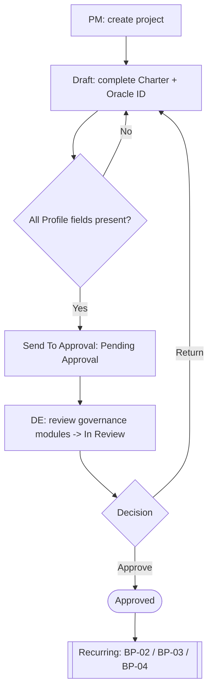
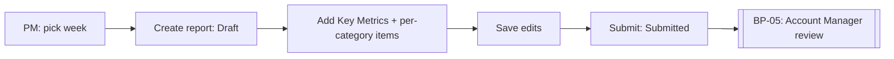
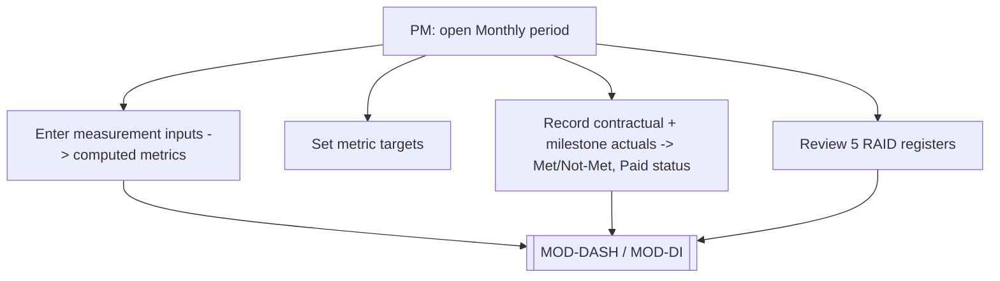
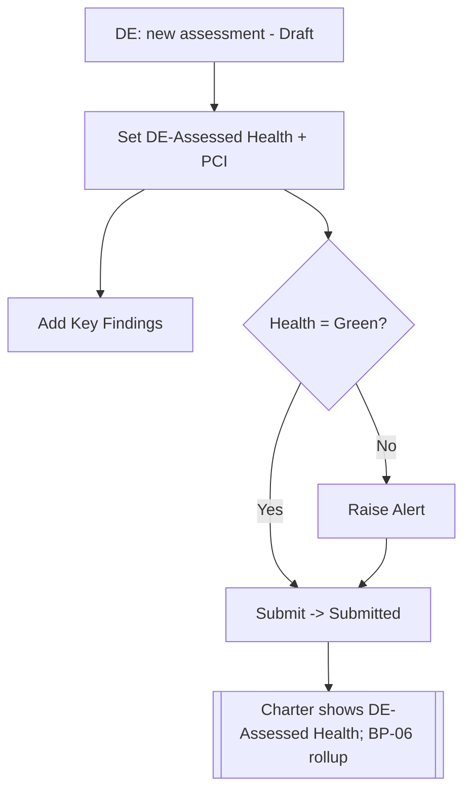
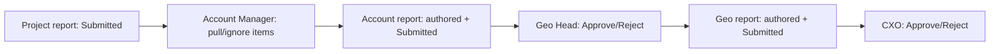
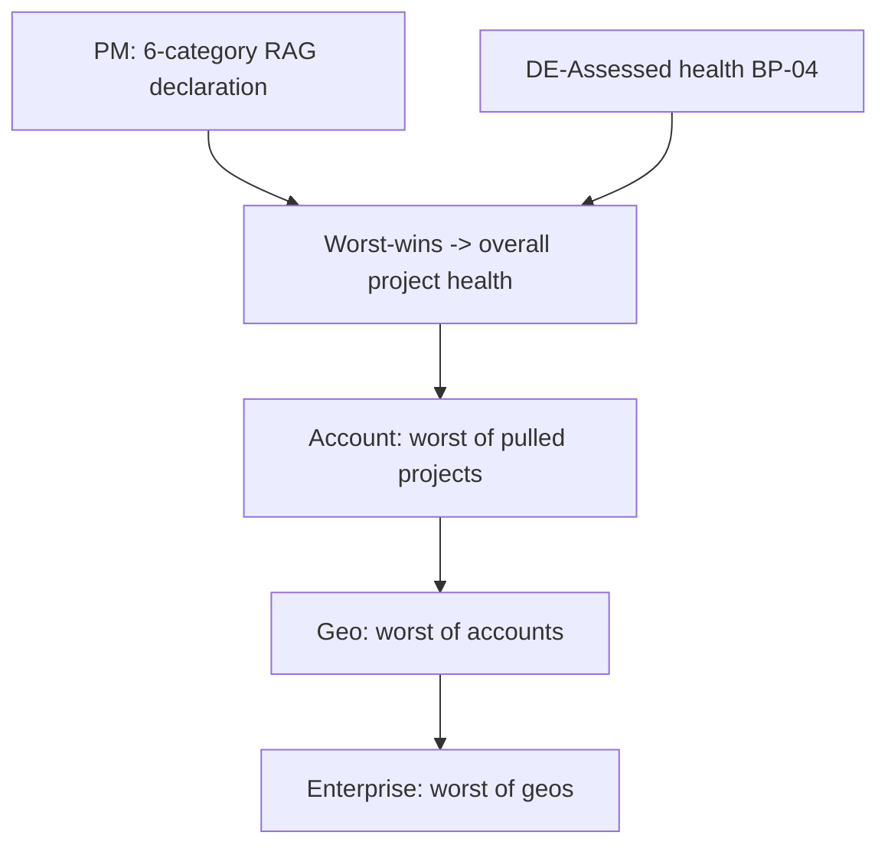
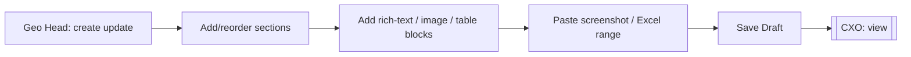
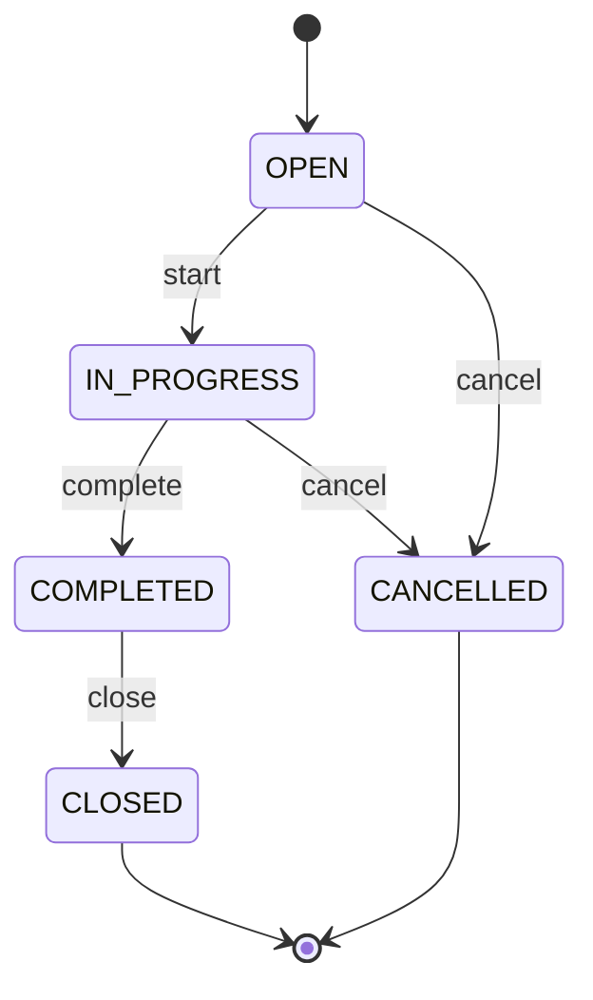
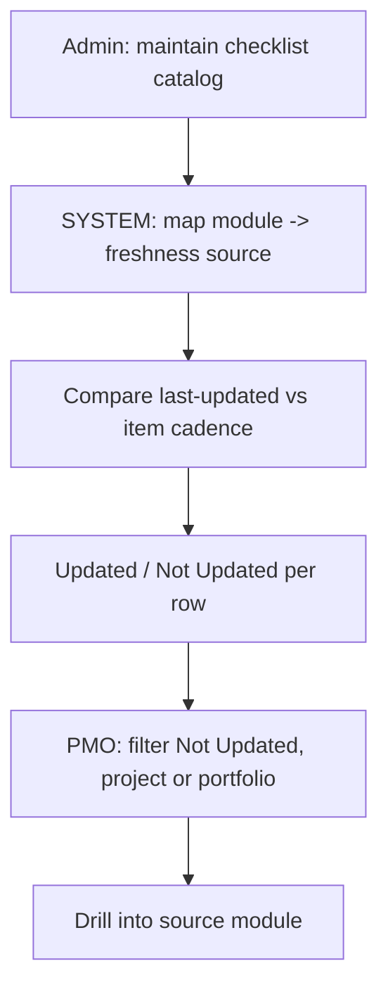
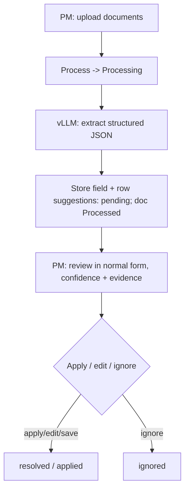

# 02 — End-to-End Business Processes

**Document type:** Product-Brain Reference
**Product:** ProjectGovernance (working title)
**Status:** Draft — generated 2026-08-29, pending review
**Depends on:** product-brain/00, product-brain/01
**Feeds:** product-brain/04, product-brain/05, product-brain/06, product-brain/26

> **Purpose of this document.** How ProjectGovernance behaves across modules for the
> scenarios the business cares about. Each process is captured with the same structure so
> flows, exceptions, rules, and status changes are comparable. Business Rule references
> (`BR-*`) resolve in `product-brain/05`; status names resolve in `product-brain/06`; module
> IDs in `product-brain/01`; roles in `product-brain/00` §3. Because `05`/`06` are not yet
> generated, rule and notification IDs below are forward references marked
> `<!-- pending -->`.

---

## Process Index

| ID | Process | Primary modules | Start state | End state |
| --- | --- | --- | --- | --- |
| BP-01 | Project Onboarding & Governance Approval | MOD-PROJ → MOD-DEAL → MOD-DEAP | Project *(none)* → `Draft` | Project `Approved` |
| BP-02 | Weekly Project Status Reporting | MOD-STATUS | Status Report `Draft` | Status Report `Submitted` |
| BP-03 | Monthly Project Review | MOD-MEAS, MOD-CONTRACT, MOD-RAID | prior period's records | current-month records saved |
| BP-04 | Monthly Delivery Excellence Assessment | MOD-DEA | DE Assessment *(none)* → `Draft` | DE Assessment `Submitted` |
| BP-05 | Reporting / Review Cascade (Project → Account → Geo → CXO) | MOD-STATUS, MOD-ACCT, MOD-GEO, MOD-ROLLUP, MOD-REVIEW | Report `Submitted` | Report `Approved` \| `Rejected` at each tier |
| BP-06 | Health Declaration & Worst-Wins Rollup | MOD-HEALTH, MOD-DEA, MOD-ROLLUP | Health Declaration *(none)* | project / account / geo overall health computed |
| BP-07 | Executive Update Preparation | MOD-EXEC | Executive Update *(none)* | Executive Update saved (`Draft` only) |
| BP-08 | Action Tracking | MOD-ACTION | Action *(none)* → `OPEN` | Action `CLOSED` \| `CANCELLED` |
| BP-09 | Data Integrity & Defaulter Tracking | MOD-DI | period opens | "Not Updated" items surfaced per project & portfolio |
| BP-10 | AI-Assisted Data Entry | MOD-AI | Document `Not Processed` | Suggestions `resolved` \| `ignored` \| `applied` |

**Actor legend:** `PROJECT_MANAGER`, `TEAM_MEMBER`, `DELIVERY_EXCELLENCE`, `ACCOUNT_MANAGER`,
`GEO_HEAD`, `CXO`, `PMO`, `ADMIN` (roles from `product-brain/00` §3); `SYSTEM` (automatic);
`AI-PIPELINE` (external vLLM extraction service).

---

## BP-01 — Project Onboarding & Governance Approval

| Field | Detail |
| --- | --- |
| **Process ID** | BP-01 |
| **Purpose** | Take a project from creation through charter completion to a governance-reviewed `Approved` state, after which recurring reporting begins. |
| **Trigger** | A `PROJECT_MANAGER` creates a project. |
| **Actors** | `PROJECT_MANAGER`, `DELIVERY_EXCELLENCE`, `ADMIN`, `SYSTEM` |
| **Preconditions** | Reference data exists (Organization, Geo, Account, Project Type); the PM holds the create permission. |

### Main Flow

| # | Actor | Step | Result / state |
| --- | --- | --- | --- |
| 1 | `PROJECT_MANAGER` | `POST /projects` — create with name + core attributes | `SYSTEM` generates `project_code` (`PRJ-YYYY-NNNN`); `project_status` = `Draft` |
| 2 | `PROJECT_MANAGER` | Complete the Charter: Project Profile, Scope & Schedule, Resource Allocation; add ≥ 1 **Oracle Project ID** | Charter populated; right-hand module menu unlocks once an Oracle Project ID exists `<!-- pending: BR-PROJ-* -->` |
| 3 | `DELIVERY_EXCELLENCE` / `ADMIN` | Allocate a DE assessor (`PATCH /de-allocation/allocations`) | `projects.delivery_excellence_id` set |
| 4 | `PROJECT_MANAGER` | **Send To Approval** — `PUT /projects/{id}` with `project_status: "Pending Approval"` | Frontend validates **every Project Profile field is present** `<!-- pending: BR-PROJ-* -->`; `project_status` = `Pending Approval`; project appears on the DE approval queue |
| 5 | `DELIVERY_EXCELLENCE` | Open the governance workspace; `PUT /de-approval/{id}/modules/{module_key}` per governance module (Status, RAIDO, Health, Measurement, Contractual) | First module marked → `de_review_status` = `In Review`; `SYSTEM` computes a completeness % and gap count (`compute_governance_completeness`) |
| 6 | `DELIVERY_EXCELLENCE` | `PATCH /de-approval/{id}/decision` with `decision: "Approve"` | `project_status` = `Approved`; `de_review_status` = `Approved`; `de_reviewed_by` / `de_reviewed_at` recorded |
| 7 | `SYSTEM` | Project becomes selectable under "Project Reporting" and "Project Review" | Recurring processes BP-02 / BP-03 / BP-04 begin |

### Alternate Flows

| ID | Condition | Handling |
| --- | --- | --- |
| BP-01-A1 | DE returns the project | `PATCH …/decision` with `decision: "Return"` → `project_status` = `Draft`, `de_review_status` = `Returned`; PM edits and re-sends (step 4). |
| BP-01-A2 | PM edits after `Pending Approval` | The Charter form offers **Edit Project**, which reverts to editable; re-send required. |
| BP-01-A3 | Project put on hold / closed | `PUT /projects/{id}` with `project_status` ∈ {`Hold`, `Closed`, `Open Only for Billing`}. |
| BP-01-A4 | **PM self-approval (current reality)** | `ASSUMPTION:` historically the Charter screen let PM/Admin move a project to `Approved` directly. The intended design routes approval exclusively through `DELIVERY_EXCELLENCE` via BP-01 steps 5–6. Flagged in `product-brain/23`. |

### Exceptions

| ID | Exception | System behaviour |
| --- | --- | --- |
| BP-01-E1 | Send To Approval attempted with missing Project Profile fields | Blocked client-side with field errors; `project_status` stays `Draft` `<!-- pending: BR-PROJ-* -->`. |
| BP-01-E2 | Decision submitted for a project not in `Pending Approval` | `400` — "Only a project Pending Approval can be reviewed". |
| BP-01-E3 | DE assessor not the signed-in user | `403` via `require_project_de_scope`. |
| BP-01-E4 | Fields changed after `Approved` | `ASSUMPTION:` only Project Type is intended to remain immutable-editable; other fields locked `<!-- pending: BR-PROJ-* -->`. |

**Business Rules referenced:** BR-PROJ-* (Oracle-ID unlock, all-fields-mandatory on send, post-approval immutability), BR-DEAP-* (DE scope, decision preconditions) `<!-- pending: reconcile with product-brain/05 -->`

**Status Changes**

| Entity | Transitions |
| --- | --- |
| Project | *(none)* → `Draft` → `Pending Approval` → (`Approved` \| `Draft` on Return); also → `Hold` / `Closed` / `Open Only for Billing` |
| Project `de_review_status` | *(null)* → `In Review` → (`Approved` \| `Returned`) |
| DE Module Review | *(none)* → `Reviewed` \| `Gap Identified` per governance module |

**System Interactions:** BCT Oracle Application (Project ID mapping — stored, not synced); `SYSTEM` code generation; `touch_project_on_write` activity log.
**Notifications:** N-DEAP-QUEUED, N-DEAP-DECISION `<!-- pending: reconcile with product-brain/09 -->`
**Outputs:** an `Approved` project with a completed Charter and a governance-review record.

---

## BP-02 — Weekly Project Status Reporting

| Field | Detail |
| --- | --- |
| **Process ID** | BP-02 |
| **Purpose** | Produce one dated narrative status report per project per week, retained as history, with per-item rollup tracking for the Account tier. |
| **Trigger** | Weekly cadence; a `PROJECT_MANAGER` opens the current reporting period. |
| **Actors** | `PROJECT_MANAGER`, `ACCOUNT_MANAGER` (review, in BP-05), `SYSTEM` |
| **Preconditions** | Project is `Approved`; a `Weekly` reporting period exists (weeks keyed to the Monday date). |

### Main Flow

| # | Actor | Step | Result / state |
| --- | --- | --- | --- |
| 1 | `PROJECT_MANAGER` | Select the reporting week; `POST /projects/{id}/status-reports` | Report created, `status` = `Draft` |
| 2 | `PROJECT_MANAGER` | Enter Key Metrics (Revenue, Onsite/Offshore FTE, Projects Count) and add per-category **status items** (`POST /projects/{id}/status-items`): Key Accomplishments, Upcoming Key Releases/Milestones/Actions, Leadership Support/Attention Required, Key Risks/Issues | Items attached; each item `account_rollup_status` = `Pending` |
| 3 | `PROJECT_MANAGER` | `PUT /projects/{id}/status-reports/{rid}` to save edits | Draft updated |
| 4 | `PROJECT_MANAGER` | **Submit Report** | `status` = `Submitted`; report becomes visible on the Account Manager's Review surface (BP-05) |

### Alternate Flows

| ID | Condition | Handling |
| --- | --- | --- |
| BP-02-A1 | AI-assisted entry | Items may be pre-populated from AI extraction (BP-10); PM applies or edits each. |
| BP-02-A2 | Correction after submit | `ASSUMPTION:` a `Submitted` report is re-openable to `Draft` only before Account review, or via `Rejected` in BP-05 `<!-- pending: BR-STATUS-* -->`. |

### Exceptions

| ID | Exception | System behaviour |
| --- | --- | --- |
| BP-02-E1 | Second report created for the same week | `ASSUMPTION:` one report per project per period; the create is rejected or returns the existing one `<!-- pending: BR-STATUS-* -->`. |
| BP-02-E2 | Review attempted on a `Draft` report | `400` — "Only Submitted reports can be reviewed". |

**Business Rules referenced:** BR-STATUS-* (one-per-period, submit-before-review, item rollup states) `<!-- pending -->`

**Status Changes:** Status Report *(none)* → `Draft` → `Submitted` (→ `Approved` / `Rejected` in BP-05). Status Item `account_rollup_status`: `Pending` (→ `Pulled` / `Ignored` in BP-05).
**System Interactions:** MOD-AI (optional pre-fill); MOD-DASH (feeds Top Highlights); MOD-DI (freshness source).
**Notifications:** N-STATUS-SUBMITTED, N-STATUS-DEFAULTER (weekly reminder) `<!-- pending -->`
**Outputs:** a dated `Submitted` status report with categorised items ready for rollup.

---

## BP-03 — Monthly Project Review

| Field | Detail |
| --- | --- |
| **Process ID** | BP-03 |
| **Purpose** | On a monthly cadence, refresh the three review datasets: Measurements, Contractual Compliance, and the RAIDO registers. |
| **Trigger** | Monthly cadence; a `PROJECT_MANAGER` opens the `Monthly` reporting period. |
| **Actors** | `PROJECT_MANAGER`, `PMO` (Contractual — intended), `TEAM_MEMBER` (RAID items assigned to them), `SYSTEM` |
| **Preconditions** | Project is `Approved`; a `Monthly` reporting period exists; the project's Project Type selects the Measurement tab. |

### Main Flow

| # | Actor | Step | Result / state |
| --- | --- | --- | --- |
| 1 | `PROJECT_MANAGER` | Enter measurement inputs for the period (`POST /projects/{id}/measurements/{type}`) — one type per project | `SYSTEM` derives read-only computed metrics (`measurement_metrics`) at write time; some metrics remain `None` where no input exists |
| 2 | `PROJECT_MANAGER` | Set / confirm metric targets (`PUT /projects/{id}/metric-targets/{type}`) | Targets stored for variance / "meeting target %" on dashboards |
| 3 | `PROJECT_MANAGER` / `PMO` | Record contractual-commitment actuals (`POST …/contractual-commitments/{id}/actuals`) per commitment frequency; record milestone-payment actuals (`PUT …/milestone-payments/{id}/actual`) | `SYSTEM` derives `Met` / `Not Met` and `Paid On Time` / `Delayed Payment` / `Yet To Be Paid` `<!-- pending: BR-CONTRACT-* -->` |
| 4 | `PROJECT_MANAGER` / `TEAM_MEMBER` | Review and update the five RAID registers; refresh Last/Next Review Date where present | Registers current for the month |

### Alternate Flows

| ID | Condition | Handling |
| --- | --- | --- |
| BP-03-A1 | No contractual-actuals UI | `ASSUMPTION:` commitment/milestone *definitions* can be entered but the "actuals" entry screen is a known gap for some paths — dashboards then show "Not Recorded" `<!-- pending -->`. |
| BP-03-A2 | Consulting engagement | Uses the Consulting measurement tab (Effort Variation, SPI, CPI). |

### Exceptions

| ID | Exception | System behaviour |
| --- | --- | --- |
| BP-03-E1 | Computed metric edited directly | Blocked — computed fields are read-only `<!-- pending: BR-MEAS-* -->`. |
| BP-03-E2 | Period not selected | Entry is scoped to a reporting period; without one, "current period" resolution applies (`product-brain/14`). |

**Business Rules referenced:** BR-MEAS-* (computed vs entered), BR-CONTRACT-* (Met/Not-Met, Paid status), BR-RAID-* (monthly review) `<!-- pending -->`

**Status Changes:** none intrinsic — these are period-scoped data records. RAID item lifecycles per `product-brain/06`.
**System Interactions:** MOD-DASH (Project Health Metrics / Commitments / Payment Milestones grids); MOD-DI (freshness sources); Ticketing tools (future Support-metrics feed).
**Notifications:** N-REVIEW-DEFAULTER (monthly reminder) `<!-- pending -->`
**Outputs:** period measurement records + computed metrics; contractual/milestone actuals; refreshed RAID registers.

---

## BP-04 — Monthly Delivery Excellence Assessment

| Field | Detail |
| --- | --- |
| **Process ID** | BP-04 |
| **Purpose** | Delivery Excellence records a dated per-project assessment: DE-Assessed Health, PCI score, Key Findings, and — when the rating is not Green — an Alert. |
| **Trigger** | DE cadence (monthly vs. quarterly — `ASSUMPTION:` undecided, `product-brain/14`). |
| **Actors** | `DELIVERY_EXCELLENCE` (intended); `PROJECT_MANAGER` / `ADMIN` (current write reality — verify); `SYSTEM` |
| **Preconditions** | Project is `Approved`; a DE assessor is allocated. |

### Main Flow

| # | Actor | Step | Result / state |
| --- | --- | --- | --- |
| 1 | `DELIVERY_EXCELLENCE` | `POST /projects/{id}/de-assessments` — new dated assessment | `status` = `Draft` (default `Submitted` on some paths — verify); `assessment_date`, `next_assessment_due_date` set |
| 2 | `DELIVERY_EXCELLENCE` | Set DE-Assessed Health (4-state RAG) and PCI score | Fields recorded |
| 3 | `DELIVERY_EXCELLENCE` | Add Key Findings (`POST …/findings`): sequence #, Classification, description, severity, action taken, dates, status | Findings attached; each `Open` → … lifecycle per `product-brain/06` |
| 4 | `SYSTEM` / `DELIVERY_EXCELLENCE` | If DE-Assessed Health ≠ `Green`, raise an Alert (`POST …/alerts`): category, brief + detailed description, raised by/on | Alert recorded `<!-- pending: BR-DEA-* -->` |
| 5 | `DELIVERY_EXCELLENCE` | Submit the assessment | `status` = `Submitted`; latest assessment's rating flows read-only into the Project Charter and the overall project health (BP-06) |

### Alternate Flows

| ID | Condition | Handling |
| --- | --- | --- |
| BP-04-A1 | Finding follow-up | Findings are updated across periods (`PUT …/findings/{id}`) until `Closed` / `Cancelled`. |
| BP-04-A2 | "Not Started" | No assessment row = "Not Started" — never stored as a status. |

### Exceptions

| ID | Exception | System behaviour |
| --- | --- | --- |
| BP-04-E1 | Rating not Green but no Alert logged | `ASSUMPTION:` the user is nudged / an Alert is mandatory `<!-- pending: BR-DEA-* -->`. |
| BP-04-E2 | Overdue vs. `next_assessment_due_date` | Surfaced as overdue on the DE dashboard and Data Integrity. |

**Business Rules referenced:** BR-DEA-* (Alert-if-not-Green, PCI capture, history retained) `<!-- pending -->`

**Status Changes:** DE Assessment *(none)* → `Draft` → `Submitted`. DE Finding: `Open` → `In Progress` → `Awaiting Closure` → `Closed` (or `Cancelled`).
**System Interactions:** MOD-HEALTH (overall project health uses DE-Assessed), MOD-DASH, MOD-DI.
**Notifications:** N-DEA-ALERT, N-DEA-OVERDUE `<!-- pending -->`
**Outputs:** a dated `Submitted` DE assessment with PCI score, findings, and any alert.

---

## BP-05 — Reporting / Review Cascade (Project → Account → Geo → CXO)

| Field | Detail |
| --- | --- |
| **Process ID** | BP-05 |
| **Purpose** | Promote each tier's submitted status up one level: the parent authors its own status, pulls selected items from the tier below, and Approves/Rejects the submitted report. Identical pattern at every tier. |
| **Trigger** | A lower tier submits its status report (BP-02, or the Account/Geo equivalent). |
| **Actors** | `PROJECT_MANAGER` → `ACCOUNT_MANAGER` → `GEO_HEAD` → `CXO`; `ADMIN` (any tier) |
| **Preconditions** | The lower report is `Submitted`; the reviewer holds the role **and** the Account/Geo scope. |

### Main Flow (one hop — Project → Account; identical for Account → Geo and Geo → CXO)

| # | Actor | Step | Result / state |
| --- | --- | --- | --- |
| 1 | `ACCOUNT_MANAGER` | Open Account Reporting; `POST /accounts/{id}/status-reports` for the period | Account report `Draft` |
| 2 | `ACCOUNT_MANAGER` | Open the rollup source panel (`GET /accounts/{id}/rollup`) — sees each project's `Pending` status items and Key Metric sums | Candidate items listed |
| 3 | `ACCOUNT_MANAGER` | **Pull** an item (`POST /accounts/{id}/rollup` pull) | Project item `account_rollup_status` = `Pulled`; a copy becomes an Account status item |
| 4 | `ACCOUNT_MANAGER` | **Ignore** an item, or **Undo** a prior decision | `Ignored`, or back to `Pending` |
| 5 | `ACCOUNT_MANAGER` | Author the Account's own narrative + health (BP-06); **Submit** the Account report | Account report `Submitted` |
| 6 | `GEO_HEAD` | Open Account Review (`PATCH /accounts/{id}/status-reports/{rid}/review`) with `decision` ∈ {`Approved`, `Rejected`} + comment | Account report `Approved` \| `Rejected`; `reviewed_by` / `reviewed_at` recorded |
| 7 | *(repeat)* | `GEO_HEAD` authors the Geo report and pulls from accounts; `CXO` reviews Geo reports (`_cxo_review`, no ownership scoping) | Geo report `Approved` \| `Rejected` |

### Alternate Flows

| ID | Condition | Handling |
| --- | --- | --- |
| BP-05-A1 | Rejected report | Returns to the author for correction and re-submit `<!-- pending: BR-REVIEW-* -->`. |
| BP-05-A2 | Health-item rollup | Runs on the same Pull/Ignore/Undo mechanism via `/accounts/{id}/health-rollup` and `/geos/{id}/rollup`. |
| BP-05-A3 | Work Context ("act as") | An `ACCOUNT_MANAGER` may act as `PROJECT_MANAGER`, a `GEO_HEAD` as `ACCOUNT_MANAGER`/`PROJECT_MANAGER`, within their own scope. |

### Exceptions

| ID | Exception | System behaviour |
| --- | --- | --- |
| BP-05-E1 | Review of a non-`Submitted` report | `400` — "Only Submitted reports can be reviewed". |
| BP-05-E2 | Pull of an item not `Pending` | `RollupItemAlreadyHandledError`. |
| BP-05-E3 | Reviewer outside the Account/Geo scope | `403` via `require_account_scope` / `require_geo_scope` (`ADMIN`, and `CXO` at geo level, bypass). |

**Business Rules referenced:** BR-REVIEW-* (submit-before-review, one-tier-up, scope), BR-ROLLUP-* (pull idempotency, undo, worst-wins) `<!-- pending -->`

**Status Changes:** Report `Submitted` → `Approved` \| `Rejected` at Project, Account, Geo tiers. Status/Health Item `Pending` → `Pulled` \| `Ignored` (reversible via Undo).
**System Interactions:** MOD-ROLLUP reducers (`account_rollup`, `geo_rollup`, `account_health_rollup`); MOD-DASH (governance matrix, Top Highlights).
**Notifications:** N-REVIEW-PENDING, N-REVIEW-DECISION `<!-- pending -->`
**Outputs:** an approved status report and health rollup at each tier, attributable and timestamped.

---

## BP-06 — Health Declaration & Worst-Wins Rollup

| Field | Detail |
| --- | --- |
| **Process ID** | BP-06 |
| **Purpose** | Turn category-level RAG ratings into an overall project health, then roll project health up to account, geo, and enterprise using the worst-wins rule. |
| **Trigger** | A `PROJECT_MANAGER` declares or re-declares project health for a period; or a DE assessment is submitted (BP-04); or a parent tier opens its health rollup. |
| **Actors** | `PROJECT_MANAGER`, `ACCOUNT_MANAGER`, `GEO_HEAD`, `SYSTEM` |
| **Preconditions** | Project is `Approved`; the 6 health categories are known (Core Delivery, People, Operational, Customer, Financial, Compliance). |

### Main Flow

| # | Actor | Step | Result / state |
| --- | --- | --- | --- |
| 1 | `PROJECT_MANAGER` | `POST /projects/{id}/health-declarations` (or add `health-items`, one per category per period) with a RAG per category | Dated declaration stored (history retained, never overwritten) |
| 2 | `SYSTEM` | `services/health_rollup.py` — overall project health = worst of the 6 category ratings, worst→best order `Red > Potential Red > Amber > Green` | `overall_rating` computed |
| 3 | `SYSTEM` | `compute_overall_project_health(delivery_declared, de_assessed)` — combine the PM declaration with the latest DE-Assessed health (BP-04) | project's effective health set |
| 4 | `ACCOUNT_MANAGER` | Open `/accounts/{id}/health-rollup`; Pull project health items into the Account declaration | Account overall = worst of pulled project ratings |
| 5 | `GEO_HEAD` | Open `/geos/{id}/rollup`; Pull account health | Geo overall = worst of accounts |
| 6 | `SYSTEM` / `CXO` | Enterprise view = worst of geos | Portfolio health visible on dashboards |

### Alternate Flows

| ID | Condition | Handling |
| --- | --- | --- |
| BP-06-A1 | Itemised vs. legacy model | `ASSUMPTION:` the older single-rating-per-category and the newer `project_health_items` register coexist; both feed the rollup during migration. |
| BP-06-A2 | **Geo RAG-status screen missing** | Geo health-declaration endpoints exist but no UI — geo-level health must be entered via the API until the screen is built (known gap, `product-brain/23`). |

### Exceptions

| ID | Exception | System behaviour |
| --- | --- | --- |
| BP-06-E1 | A category left unrated | `ASSUMPTION:` overall is computed only over rated categories, or the declaration is incomplete `<!-- pending: BR-HEALTH-* -->`. |
| BP-06-E2 | One `Red` child | Forces the parent to at least `Red` at every hop (worst-wins). |

**Business Rules referenced:** BR-HEALTH-* (worst-wins category → overall; child → parent; history retained) `<!-- pending -->`

**Status Changes:** none — `HealthRating` is a rating, not a lifecycle. Health Item `account_rollup_status`: `Pending` → `Pulled` \| `Ignored`.
**System Interactions:** `health_rollup`, `account_health_rollup`, `geo_rollup` services; MOD-DASH (RAG grid, governance matrix); cached health on `projects`.
**Notifications:** none intrinsic.
**Outputs:** an overall project health and a worst-wins rollup at account, geo, and enterprise level.

---

## BP-07 — Executive Update Preparation

| Field | Detail |
| --- | --- |
| **Process ID** | BP-07 |
| **Purpose** | A Geo Head prepares structured CXO-facing content (Delivery / People / Financials / Operations sections; rich-text / image / table blocks). Draft only — no approval step. |
| **Trigger** | A `GEO_HEAD` opens the Executive Update screen for their geo. |
| **Actors** | `GEO_HEAD` (edit); `CXO`, `ADMIN` (view) |
| **Preconditions** | The user holds `GEO_HEAD` and the geo scope. |

### Main Flow

| # | Actor | Step | Result / state |
| --- | --- | --- | --- |
| 1 | `GEO_HEAD` | `POST /geos/{id}/executive-updates` — create for the period | Update created with default sections |
| 2 | `GEO_HEAD` | Add / rename / reorder / delete sections; add rich-text, image, or table blocks; reorder / delete blocks | Structured JSON (sections + blocks with stable IDs) |
| 3 | `GEO_HEAD` | Paste a screenshot into an image block (`Ctrl+V`) or an Excel cell range into a table block | Image uploaded (`POST …/images`); table built from clipboard HTML/text, merged cells flattened |
| 4 | `GEO_HEAD` | **Save Draft** (`PUT /geos/{id}/executive-updates/{uid}`) | Saved; visible to `CXO` on the Executive Updates view |

### Alternate Flows / Exceptions

| ID | Condition | Handling |
| --- | --- | --- |
| BP-07-A1 | No image on clipboard when pasting into an image block | No-op, no error. |
| BP-07-E1 | Non-Geo-Head write attempt | `403` via `_geo_head_write`. |

**Business Rules referenced:** BR-EXEC-* (Geo-Head-only, draft-only, structured storage not one HTML blob) `<!-- pending -->`

**Status Changes:** none — Executive Update has no lifecycle beyond saved/unsaved.
**System Interactions:** local filesystem (image storage); MOD-DASH (Executive Update view).
**Notifications:** none.
**Outputs:** a saved, structured Executive Update for the CXO.

---

## BP-08 — Action Tracking

| Field | Detail |
| --- | --- |
| **Process ID** | BP-08 |
| **Purpose** | Track a discrete action against a project, account, or geo through an assignee-driven lifecycle, with a full history. |
| **Trigger** | Any authorised user creates an action on an entity's page. |
| **Actors** | PROJECT: `PROJECT_MANAGER` / `ACCOUNT_MANAGER` / `ADMIN`; ACCOUNT: `ACCOUNT_MANAGER` / `GEO_HEAD` / `ADMIN`; GEO: `GEO_HEAD` / `CXO` / `ADMIN`; plus **the assignee** (any role). |
| **Preconditions** | The user can reach the entity; for create/edit, the level's write role (or the assignee for transitions). |

### Main Flow

| # | Actor | Step | Result / state |
| --- | --- | --- | --- |
| 1 | Level write role | `POST /{geos\|accounts\|projects}/{id}/actions` — title, description, assignee (`action_by_id`), priority, due date | Action `status` = `OPEN`; `SYSTEM` generates `ACT-*` code; `action_history` `CREATED` event |
| 2 | Assignee | `PATCH …/actions/{id}/start` | `OPEN` → `IN_PROGRESS`; `STATUS_CHANGE` history event |
| 3 | Assignee | `PATCH …/actions/{id}/complete` | `IN_PROGRESS` → `COMPLETED` |
| 4 | Level write role / assignee | `PATCH …/actions/{id}/close` | `COMPLETED` → `CLOSED` (sign-off) |
| 5 | Anyone who can reach the entity | `POST …/actions/{id}/comments` | `COMMENT` history event |

### Alternate Flows / Exceptions

| ID | Condition | Handling |
| --- | --- | --- |
| BP-08-A1 | Abandon | `PATCH …/actions/{id}/cancel` from `OPEN` / `IN_PROGRESS` → `CANCELLED`. |
| BP-08-A2 | Owner / due-date / priority change | `PUT …/actions/{id}` — `OWNER_CHANGE` / `DUE_DATE_CHANGE` / `PRIORITY_CHANGE` history events. |
| BP-08-E1 | `close` before `COMPLETED` | Rejected — `CLOSED` only reachable from `COMPLETED`. |
| BP-08-E2 | `cancel` from `COMPLETED` / `CLOSED` | Rejected — `CANCELLED` only from `OPEN` / `IN_PROGRESS`. |

**Business Rules referenced:** BR-ACTION-* (assignee-always-transitions, close-after-complete, cancel-from-open/in-progress) `<!-- pending -->`

**Status Changes:** Action `OPEN` → `IN_PROGRESS` → `COMPLETED` → `CLOSED`, or `OPEN` / `IN_PROGRESS` → `CANCELLED`.
**System Interactions:** MOD-DASH (Project Health Actions grid).
**Notifications:** N-ACTION-ASSIGNED, N-ACTION-DUE `<!-- pending -->`
**Outputs:** a resolved action with a complete audit history.

---

## BP-09 — Data Integrity & Defaulter Tracking

| Field | Detail |
| --- | --- |
| **Process ID** | BP-09 |
| **Purpose** | Show, per project and per period, which data points across every module have or have not been updated, each judged against its own expected cadence; surface defaulters across the portfolio. |
| **Trigger** | A reporting period; `PMO` / `ADMIN` opens the Data Integrity view. |
| **Actors** | `PMO` (primary), `ADMIN` (catalog), `SYSTEM`, all (read) |
| **Preconditions** | The checklist catalog (`data_integrity_checklist_items`) is populated. |

### Main Flow

| # | Actor | Step | Result / state |
| --- | --- | --- | --- |
| 1 | `ADMIN` | Maintain the checklist catalog (items grouped by module, each with an expected cadence) | Catalog current |
| 2 | `SYSTEM` | On request, `services/data_integrity_rollup.py` maps each `module_name` to the table/column that answers "last updated for this project in this period" | Per-item freshness computed |
| 3 | `SYSTEM` | Compare last-updated vs. the item's cadence (weekly Status vs. monthly RAID vs. monthly/quarterly DE) | Each row = `Updated` / `Not Updated` |
| 4 | `PMO` | Filter to "Not Updated" across one project or the whole portfolio; drill into the source module | Defaulters identified |

### Alternate Flows / Exceptions

| ID | Condition | Handling |
| --- | --- | --- |
| BP-09-A1 | Cadence unratified | `ASSUMPTION:` several cadences are still "proposed" (`product-brain/14`); until ratified the checklist uses the documented defaults. |
| BP-09-E1 | Module with no freshness source mapped | Item shown as indeterminate rather than `Not Updated`. |

**Business Rules referenced:** BR-DI-* (per-item cadence evaluation, portfolio filter) `<!-- pending -->`

**Status Changes:** none — computed at query time.
**System Interactions:** every project-scoped module (as a freshness source); MOD-DASH (Data Integrity grid).
**Notifications:** N-DI-DEFAULTER (per tier) `<!-- pending -->`
**Outputs:** a per-project and portfolio "updated / not updated" checklist and a defaulter list.

---

## BP-10 — AI-Assisted Data Entry

| Field | Detail |
| --- | --- |
| **Process ID** | BP-10 |
| **Purpose** | Extract structured values from uploaded project documents so a `PROJECT_MANAGER` can review and apply them into the normal Project Creation / Reporting forms. The AI never writes to business tables. |
| **Trigger** | A `PROJECT_MANAGER` uploads documents to the AI Hub for a project + context (`create` or `reporting`). |
| **Actors** | `PROJECT_MANAGER`, `AI-PIPELINE` (external vLLM), `SYSTEM` |
| **Preconditions** | The project exists; the local vLLM extraction service is reachable. |

### Main Flow

| # | Actor | Step | Result / state |
| --- | --- | --- | --- |
| 1 | `PROJECT_MANAGER` | `POST /projects/{id}/documents` — upload one or more files | `ProjectDocument` stored on the local filesystem; `ai_status` = `Not Processed` |
| 2 | `PROJECT_MANAGER` | `POST /projects/{id}/documents/process` | `ai_status` = `Processing`; document text (parsed outside the LLM) sent to the vLLM extraction service with a dynamic schema (Project Creation / Reporting / General) |
| 3 | `AI-PIPELINE` | Returns structured JSON per field — value, confidence, source doc, source location, evidence — and posts it back (`POST /projects/{id}/ai-suggestions` and `/ai-row-suggestions`) | Field suggestions (`pending`) and row suggestions (`pending`) stored; `ai_status` = `Processed` |
| 4 | `PROJECT_MANAGER` | Open the Charter / Reporting screen; each AI-populated control shows a confidence box; click for evidence popup | Values pre-populated in the form only |
| 5 | `PROJECT_MANAGER` | **Apply** a field suggestion (or edit it) / **Apply** a row suggestion (creates the real RAID row via that entity's normal create endpoint) / **Ignore** | Field: `pending` → `resolved` (implicitly on save/edit/create) or `ignored`; Row: `pending` → `applied` or `ignored` |

### Alternate Flows / Exceptions

| ID | Condition | Handling |
| --- | --- | --- |
| BP-10-A1 | User edits an AI value | The AI indicator is removed; the value becomes ordinary manual data. |
| BP-10-A2 | User clicks Save / Create | All AI-derived values on screen are treated as manual; indicators removed; suggestions `resolved`. |
| BP-10-A3 | No AI data for a screen | The AI button is disabled for that screen (`PendingPoints` #2). |
| BP-10-E1 | Extraction service unreachable | `ai_status` stays `Processing` / errors; document may be marked `Excluded`. |

**Business Rules referenced:** BR-AI-* (never writes to business tables; indicator stripped on edit/save; row Apply reuses the normal create endpoint) `<!-- pending -->`

**Status Changes:** Document `Not Processed` → `Processing` → `Processed` (or `Excluded`). Field suggestion `pending` → `resolved` \| `ignored`. Row suggestion `pending` → `applied` \| `ignored`.
**System Interactions:** external vLLM (OpenAI-compatible API); local filesystem (documents); MOD-PROJ / MOD-RAID / MOD-STATUS (values pre-populate; created only by the user).
**Notifications:** none.
**Outputs:** reviewed structured values applied — by the user — into the normal forms; an auditable set of applied/ignored suggestions.

---

## Assumptions

| ID | Assumption |
| --- | --- |
| A-BP-001 | `ASSUMPTION:` "Send To Approval" is `PUT /projects/{id}` with `project_status: "Pending Approval"`; the client enforces all-Profile-fields-mandatory. Server-side enforcement to confirm in `product-brain/05`. |
| A-BP-002 | `ASSUMPTION:` The intended approver is `DELIVERY_EXCELLENCE` only; PM/Admin self-approval is a legacy path to be removed. |
| A-BP-003 | `ASSUMPTION:` One status report and one measurement record per project per reporting period; enforcement to confirm. |
| A-BP-004 | `ASSUMPTION:` DE Assessment cadence (monthly vs. quarterly) and the RAID monthly-review date fields (present on Risk only today) are unratified — see `product-brain/14`. |
| A-BP-005 | `ASSUMPTION:` A `Rejected` report returns to the author for correction and re-submit; the exact re-open path is unconfirmed. |
| A-BP-006 | `ASSUMPTION:` The Geo RAG-status process (BP-06) has no UI; geo health is entered via the API until the screen is built. |
| A-BP-007 | `ASSUMPTION:` `N-*` notification events named here are candidates; which are implemented vs. planned is settled in `product-brain/09`. |
| A-BP-008 | `ASSUMPTION:` DE Assessment `status` default (`Draft` vs. `Submitted` on create) differs by path in code — to confirm in `product-brain/06`. |
