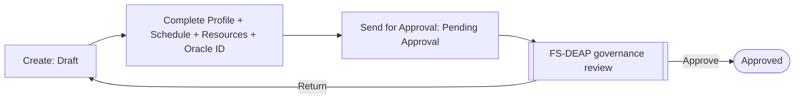

# 04 — Functional Specification

**Document type:** Product-Brain Reference
**Product:** ProjectGovernance (working title)
**Status:** Draft — generated 2026-08-29, pending review
**Depends on:** product-brain/00, product-brain/01, product-brain/02
**Feeds:** product-brain/05, product-brain/06, product-brain/08, product-brain/17, product-brain/26

> **Purpose of this document.** The module-by-module statement of *what the system does*.
> Each module uses the same 16-part template. Core modules are specified in full; platform
> and cross-cutting modules in condensed form (same headings, less depth). Functional
> Capability IDs (`FC-<MOD>-<NNN>`, numbered in tens) are defined here and referenced by
> `product-brain/08`, `product-brain/17`, and `product-brain/26`. `BR-*` and `N-*` are
> forward references (`<!-- pending -->`) until `product-brain/05` and `09` exist.

**Template (every module):** Purpose · Actors · Preconditions · Functional Capabilities ·
Main Process · Inputs · Outputs · Business Rules · Validations · Status Behaviour ·
Exceptions · Notifications · Integration Points · Reports · Dependencies · Assumptions.

---

## Contents

| FS | Module | Depth |
| --- | --- | --- |
| FS-PROJ | MOD-PROJ Project Charter | Full |
| FS-STATUS | MOD-STATUS Project Status Reporting | Full |
| FS-RAID | MOD-RAID RAID(O) Registers | Full |
| FS-HEALTH | MOD-HEALTH Project Health Declarations | Full |
| FS-MEAS | MOD-MEAS Measurement / Delivery Metrics | Full |
| FS-CONTRACT | MOD-CONTRACT Contractual Compliance | Full |
| FS-DEA | MOD-DEA Delivery Excellence Assessment | Full |
| FS-DEAP | MOD-DEAP DE Governance Approval | Full |
| FS-ACCT | MOD-ACCT Account Reporting & Health | Full |
| FS-GEO | MOD-GEO Geo Reporting & Health | Full |
| FS-ROLLUP | MOD-ROLLUP Rollup & Aggregation | Full |
| FS-REVIEW | MOD-REVIEW Reporting / Review Cascade | Full |
| FS-ACTION | MOD-ACTION Action Tracker | Full |
| FS-EXEC | MOD-EXEC Executive Updates | Full |
| FS-DASH | MOD-DASH Dashboards & Project Health | Full |
| FS-AUTH | MOD-AUTH Authentication & Access | Condensed |
| FS-REF | MOD-REF Reference / Master Data | Condensed |
| FS-USER | MOD-USER User & Role Administration | Condensed |
| FS-TARGET | MOD-TARGET Metric Targets | Condensed |
| FS-DEAL | MOD-DEAL DE Allocation | Condensed |
| FS-DI | MOD-DI Data Integrity Checklist | Condensed |
| FS-AI | MOD-AI AI Assist & Documents | Condensed |
| FS-INTG | MOD-INTG Integrations & Backup | Condensed |
| FS-AUDIT | MOD-AUDIT Audit / Activity Log | Condensed |

---

# FS-PROJ — Project Charter (Full)

- **Purpose:** System of record for a project's identity, contract/engagement attributes, dates, resource allocation, Oracle Project ID mapping, and cached health/approval state; the entry point of the governance lifecycle (BP-01).
- **Actors:** `PROJECT_MANAGER` (create/edit), `DELIVERY_EXCELLENCE` (governance approval via FS-DEAP), `ADMIN`, all roles (read).
- **Preconditions:** Reference data exists (Organization, Geo, Account, Project Type, optionally Product); the caller holds the create/edit permission.
- **Functional Capabilities:**
  - `FC-PROJ-010` Create project (name, Contract Type, Project Type, Organization, Project Owned, Geo, Account, PM, DM, DE owner, Customer Overview, Scope, Revenue, Currency, Critical flag, Product flag/Product, Applicable Phase[s]).
  - `FC-PROJ-020` Edit charter fields while unlocked; lock most fields after `Approved` (Project Type intended to remain changeable — `ASSUMPTION`).
  - `FC-PROJ-030` Capture Planned/Actual Start & End dates; derive Planned/Actual Duration.
  - `FC-PROJ-040` Maintain Oracle Project ID(s) (`GET/POST/DELETE .../oracle-ids`); at least one is required to unlock the right-hand module menu.
  - `FC-PROJ-050` Maintain Resource Allocation (`GET/POST/PUT/DELETE .../resources`); compute Head Count and total FTE (`.../resources/summary`).
  - `FC-PROJ-060` Send for Approval (`Draft` → `Pending Approval`).
  - `FC-PROJ-070` Show DE-Assessed Project Health read-only from the latest DE Assessment.
  - `FC-PROJ-080` Show Delivery-Declared Overall Health (worst-wins across 6 categories) and the effective Overall Project Health.
  - `FC-PROJ-090` Set project lifecycle status (`Hold` / `Closed` / `Open Only for Billing`).
- **Main Process:** Create → complete Profile/Schedule/Resources → add Oracle ID → Send for Approval → DE governance review (FS-DEAP) → `Approved` → recurring reporting.
- **Inputs:** Charter attributes; Oracle Project ID(s); resource list + FTE; lifecycle status changes.
- **Outputs:** `Project` record (with `project_code` `PRJ-YYYY-NNNN`), `ProjectOracleId`, `ProjectResource`; cached health/approval fields consumed by dashboards.
- **Business Rules:** BR-PROJ-* (code uniqueness; Oracle-ID unlock; all-Profile-fields-mandatory on send; post-approval field immutability except Project Type). `<!-- pending: product-brain/05 -->`
- **Validations:** required Profile fields on send; date ordering (start ≤ end); numeric Revenue; FTE ≥ 0.
- **Status Behaviour:** `project_status`: `Draft` → `Pending Approval` → `Approved`; `Hold` / `Closed` / `Open Only for Billing`. `de_review_status` sub-state driven by FS-DEAP. Editability is status-gated.
- **Exceptions:** send with missing fields → blocked; edit after `Approved` → limited to allowed fields; duplicate project code → server rejects (code is generated).
- **Notifications:** N-DEAP-QUEUED on send. `<!-- pending: product-brain/09 -->`
- **Integration Points:** BCT Oracle Application (Project ID mapping stored; resourcing sync **not wired**); MOD-AI (charter field suggestions).
- **Reports:** feeds Project List, RAG, and every Project Health grid; "My Summary" KPI tiles.
- **Dependencies:** MOD-REF, MOD-USER, MOD-DEAL, MOD-DEAP; downstream MOD-STATUS/RAID/HEALTH/MEAS/CONTRACT/DEA.
- **Assumptions:** `ASSUMPTION:` post-approval immutability set and PM self-approval removal are design intent, not yet enforced server-side.

---

# FS-STATUS — Project Status Reporting (Full)

- **Purpose:** One dated narrative status report per project per week, retained as history, with per-item rollup tracking into the Account register.
- **Actors:** `PROJECT_MANAGER` (edit/submit), `ACCOUNT_MANAGER` (review — via FS-REVIEW), all (read).
- **Preconditions:** Project is `Approved`; a `Weekly` reporting period exists.
- **Functional Capabilities:**
  - `FC-STATUS-010` Create the week's report (`POST .../status-reports`); `status` = `Draft`.
  - `FC-STATUS-020` Enter Key Metrics (Revenue, Onsite FTE, Offshore FTE, Projects Count).
  - `FC-STATUS-030` Add/edit/delete per-category **status items** (`.../status-items`): Key Accomplishments, Upcoming Key Releases/Milestones/Actions, Leadership Support/Attention Required, Key Risks/Issues.
  - `FC-STATUS-040` Submit report (`Draft` → `Submitted`).
  - `FC-STATUS-050` Set an item's `account_rollup_status` (`Pending` / `Pulled` / `Ignored` — `PATCH .../rollup-status`).
  - `FC-STATUS-060` Browse report history (list + `/latest`).
- **Main Process:** BP-02 — pick week → create Draft → Key Metrics + items → Submit.
- **Inputs:** report date/period, Key Metrics, status items per category.
- **Outputs:** `ProjectStatusReport`, `ProjectStatusItem`, project→account rollup rows.
- **Business Rules:** BR-STATUS-* (one report per project per period; submit-before-review; item rollup states). `<!-- pending -->`
- **Validations:** period selected; numeric Key Metrics; at least the required sections populated before submit (`ASSUMPTION`).
- **Status Behaviour:** Report `Draft` → `Submitted` → (`Approved` / `Rejected` in FS-REVIEW). Editable only in `Draft`.
- **Exceptions:** duplicate report for a week → rejected/returns existing; review of a `Draft` → `400`.
- **Notifications:** N-STATUS-SUBMITTED; N-STATUS-DEFAULTER (weekly). `<!-- pending -->`
- **Integration Points:** MOD-AI (item pre-fill); MOD-DI (freshness source).
- **Reports:** Top Highlights, governance matrix, Project Health RAG "Reporting Overdue".
- **Dependencies:** MOD-PROJ, MOD-REF; downstream MOD-ROLLUP, MOD-REVIEW, MOD-DASH.
- **Assumptions:** `ASSUMPTION:` the re-open path for a `Submitted` report before review is unconfirmed.

---

# FS-RAID — RAID(O) Registers (Full)

- **Purpose:** Five per-project registers — Risk, Issue, Dependency, Assumption, Opportunity — sharing one list/detail pattern (built from one `RaidConfig`).
- **Actors:** `PROJECT_MANAGER` (full CRUD), `TEAM_MEMBER` (items assigned to them), all (read).
- **Preconditions:** Project exists; project context supplies defaults (Project Name/Type).
- **Functional Capabilities:**
  - `FC-RAID-010` List each register (`GET /projects/{id}/{risks|issues|dependencies|assumptions|opportunities}`) — paged, filter/sort by Status, Category, Owner; search by title.
  - `FC-RAID-020` Create / get / update / delete an entry per register.
  - `FC-RAID-030` Compute derived fields (Risk Score = Probability × Impact; Severity).
  - `FC-RAID-040` Maintain Last/Next Review Date (Risk today; extension to Issue/Dependency/Opportunity is an open item; Assumption uses Validation Date).
  - `FC-RAID-050` Escalation flag/level; Closure Date on terminal states.
  - `FC-RAID-060` Accept AI **row** suggestions (Apply creates a real row via the normal create endpoint).
- **Main Process:** ad-hoc create/edit as items arise; monthly register review (BP-03).
- **Inputs:** per-register field sets (see `docs/ux-requirements.md` §4.5–4.9 for the full lists — Risk, Issue, Dependency, Assumption, Opportunity).
- **Outputs:** `Risk`, `Issue`, `Dependency`, `Assumption`, `Opportunity` rows with `*-YYYY-NNNN` codes.
- **Business Rules:** BR-RAID-* (score computation; monthly review; Opportunity approval authority — open). `<!-- pending -->`
- **Validations:** enum fields against `product-brain/06` value sets; dates; required title/description.
- **Status Behaviour:** per register — Risk `Open/Monitoring/Closed`; Issue `New/Assigned/In Progress/Pending/Resolved/Closed`; Dependency `Not Started/In Progress/Completed/Blocked`; Assumption `Open/Closed/Cancelled` + Validation `Pending/Validated/Invalid`; Opportunity `Identified/Approved/Implemented/Closed`.
- **Exceptions:** invalid enum → `422`; delete of an escalated/closed item → per rules.
- **Notifications:** N-RAID-ESCALATED; N-RAID-REVIEW-DUE. `<!-- pending -->`
- **Integration Points:** MOD-AI (row suggestions).
- **Reports:** Project Health Risks/Issues/Dependencies/Assumptions/Opportunities grids; "Open" and "Escalated" dashboard drill-ins.
- **Dependencies:** MOD-PROJ; downstream MOD-DASH, MOD-DI, MOD-DEA.
- **Assumptions:** `ASSUMPTION:` Opportunity approver role and the Issue/Dependency/Opportunity review-date fields are unresolved.

---

# FS-HEALTH — Project Health Declarations (Full)

- **Purpose:** Dated 6-category RAG self-assessment per project; feeds the overall project health and the worst-wins rollup.
- **Actors:** `PROJECT_MANAGER` (declare), all (read).
- **Preconditions:** Project is `Approved`; the 6 categories are known (Core Delivery, People, Operational, Customer, Financial, Compliance).
- **Functional Capabilities:**
  - `FC-HEALTH-010` Create/update a health declaration (`.../health-declarations`) with a RAG per category + a short description; keep dated history.
  - `FC-HEALTH-020` Maintain the itemised register (`.../health-items`) — one line per category per period.
  - `FC-HEALTH-030` Compute overall project health = worst of the 6 category ratings (`services/health_rollup.py`).
  - `FC-HEALTH-040` Combine Delivery-Declared with latest DE-Assessed health (`compute_overall_project_health`).
  - `FC-HEALTH-050` Set a health item's rollup status (`PATCH .../health-items/{id}/rollup-status`).
- **Main Process:** BP-06 — declare per period → SYSTEM computes overall → parent tiers pull.
- **Inputs:** category ratings + descriptions; period; declared-by.
- **Outputs:** `HealthDeclaration` (with `overall_rating`), `ProjectHealthItem`.
- **Business Rules:** BR-HEALTH-* (worst-wins category→overall; history retained; not overwritten). `<!-- pending -->`
- **Validations:** rating ∈ `{Red, Potential Red, Amber, Green}`; period present.
- **Status Behaviour:** none (RAG is a rating, not a lifecycle). Health item `account_rollup_status`: `Pending` → `Pulled`/`Ignored`.
- **Exceptions:** unrated category → declaration incomplete or overall computed over rated set (`ASSUMPTION`).
- **Notifications:** none intrinsic.
- **Integration Points:** MOD-DEA (DE-Assessed input); cached health on `projects`.
- **Reports:** Project Health RAG grid; governance matrix; account/geo rollups.
- **Dependencies:** MOD-PROJ, MOD-DEA; downstream MOD-ROLLUP, MOD-ACCT, MOD-DASH.
- **Assumptions:** `ASSUMPTION:` the older single-rating model and the newer itemised register **coexist during migration**; both feed the rollup.

---

# FS-MEAS — Measurement / Delivery Metrics (Full)

- **Purpose:** Capture engagement-type-specific delivery metrics per reporting period: entered inputs vs. read-only computed KPIs.
- **Actors:** `PROJECT_MANAGER` (edit), all (read).
- **Preconditions:** Project is `Approved`; its Project Type selects the tab; a reporting period exists.
- **Functional Capabilities:**
  - `FC-MEAS-010` One entry form per type: **Development, Support, Professional Staffing, Testing, Consulting, Cloud Maintenance, Cloud Migration** (`.../measurements/{type}`).
  - `FC-MEAS-020` Create / list / latest / get / update / delete a period record.
  - `FC-MEAS-030` Maintain nested child data: Development defect counts by SDLC stage; Staffing priority metrics.
  - `FC-MEAS-040` Derive computed metrics at write time (`services/measurement_metrics.py`); leave a metric `None` where no raw input exists.
  - `FC-MEAS-050` Show computed metrics visually distinct and non-editable.
- **Main Process:** BP-03 — open Monthly period → enter inputs → SYSTEM computes → view vs. targets.
- **Inputs:** per-type input field sets (see `product-brain/15` for the full list and formulas).
- **Outputs:** `MeasurementDevelopment` (+Defects), `MeasurementSupport`, `MeasurementStaffing` (+PriorityMetrics), `MeasurementTesting`, `MeasurementConsulting`, `MeasurementCloudMaintenance`, `MeasurementCloudMigration`.
- **Business Rules:** BR-MEAS-* (computed fields read-only; one record per period; period history retained). `<!-- pending -->`
- **Validations:** numeric ranges; period present; percentages 0–100.
- **Status Behaviour:** none — period-scoped records.
- **Exceptions:** edit of a computed metric → blocked; missing period → "current period" resolution (`product-brain/14`).
- **Notifications:** N-REVIEW-DEFAULTER (monthly). `<!-- pending -->`
- **Integration Points:** MOD-TARGET (targets); Ticketing tools (future Support feed — registry only).
- **Reports:** Project Health Metrics grid ("Meeting Target %", variance).
- **Dependencies:** MOD-PROJ, MOD-REF, MOD-TARGET; downstream MOD-DASH, MOD-DI.
- **Assumptions:** `ASSUMPTION:` all seven tabs carry an explicit reporting-period selector and history (source data only guarantees this for Development); baselines/formulas for several metrics are "QA to provide" (`product-brain/15`).

---

# FS-CONTRACT — Contractual Compliance (Full)

- **Purpose:** Track SLA/contractual commitments and payment milestones against actuals, with Met/Not-Met and Paid-status derivation.
- **Actors:** `PROJECT_MANAGER` (edit today); intended owner `PMO`; all (read).
- **Preconditions:** Project exists.
- **Functional Capabilities:**
  - `FC-CONTRACT-010` Define commitments (`.../contractual-commitments`): Frequency, Name, Formula, Target, Penalty Applicable (Y/N), Penalty Value.
  - `FC-CONTRACT-020` Record commitment actuals per Frequency (`.../{id}/actuals`); derive `Met` / `Not Met`.
  - `FC-CONTRACT-030` Define payment milestones (`.../milestone-payments`): Name, Description, Expected Payment Date, Expected Payment Value.
  - `FC-CONTRACT-040` Record milestone actual (`.../{id}/actual`): Actual Date, Actual Value; derive `Paid On Time` / `Delayed Payment` / `Yet To Be Paid`.
- **Main Process:** define at project start; record actuals each period (per Frequency for commitments; event-based for milestones).
- **Inputs:** commitment/milestone definitions; per-period/actual values.
- **Outputs:** `ContractualCommitment` (+Actual), `MilestonePayment` (+Actual).
- **Business Rules:** BR-CONTRACT-* (Met/Not-Met derivation; Paid-status derivation; penalty applicability). `<!-- pending -->`
- **Validations:** Frequency enum; numeric Target/Value; date present on actuals.
- **Status Behaviour:** derived `Met`/`Not Met` and Paid-status; no lifecycle beyond that.
- **Exceptions:** no actuals-entry UI on some paths → dashboards show "Not Recorded" (known gap).
- **Notifications:** N-CONTRACT-BREACH; N-MILESTONE-OVERDUE. `<!-- pending -->`
- **Integration Points:** none.
- **Reports:** Dashboard Contractual Commitment and Milestones-Linked-to-Payment tiles; Project Health Commitments / Payment Milestones grids.
- **Dependencies:** MOD-PROJ; downstream MOD-DASH, MOD-DI.
- **Assumptions:** `ASSUMPTION:` `PMO` ownership is intent; today writes are PM/Admin-reachable.

---

# FS-DEA — Delivery Excellence Assessment (Full)

- **Purpose:** Dated per-project DE assessment: DE-Assessed Health (4-state RAG), PCI score, Key Findings, and an Alert when the rating is not Green.
- **Actors:** `DELIVERY_EXCELLENCE` (intended); `PROJECT_MANAGER`/`ADMIN` (current write reality — verify); all (read).
- **Preconditions:** Project is `Approved`; a DE assessor allocated (FS-DEAL).
- **Functional Capabilities:**
  - `FC-DEA-010` Create a dated assessment (`.../de-assessments`); set `assessment_date`, `next_assessment_due_date`.
  - `FC-DEA-020` Record DE-Assessed Health and PCI score.
  - `FC-DEA-030` Manage Key Findings (`.../findings`): sequence #, Classification, description, severity, assigned to, action taken, dates, status.
  - `FC-DEA-040` Raise an Alert (`.../alerts`) when the rating ≠ `Green`: category, brief/detailed description, raised by/on.
  - `FC-DEA-050` Submit; latest rating flows read-only to the Charter and into overall project health.
  - `FC-DEA-060` Browse assessment history (list + `/latest`).
- **Main Process:** BP-04.
- **Inputs:** health rating, PCI, findings, alert; assessment/next-due dates.
- **Outputs:** `DEAssessment`, `DEAssessmentFinding`, `DEAssessmentAlert` (alert code unique).
- **Business Rules:** BR-DEA-* (Alert mandatory when not Green; history retained; latest feeds Charter). `<!-- pending -->`
- **Validations:** rating enum; numeric PCI; finding status enum.
- **Status Behaviour:** DE Assessment `Draft` → `Submitted` ("Not Started" = no row). Finding `Open` → `In Progress` → `Awaiting Closure` → `Closed` (or `Cancelled`).
- **Exceptions:** not Green with no alert → nudge / block (`ASSUMPTION`); overdue vs. `next_assessment_due_date` → flagged.
- **Notifications:** N-DEA-ALERT; N-DEA-OVERDUE. `<!-- pending -->`
- **Integration Points:** none.
- **Reports:** Project Health Assessments / Findings grids; DE "My Summary".
- **Dependencies:** MOD-PROJ, MOD-DEAL; downstream MOD-HEALTH, MOD-DASH, MOD-DI.
- **Assumptions:** `ASSUMPTION:` cadence (monthly/quarterly) undecided; `status` default on create differs by path; the "Alert should be removed; Finding should have Alert" change (`PendingPoints`) is not yet applied.

---

# FS-DEAP — DE Governance Approval (Full)

- **Purpose:** Module-by-module governance review of a project before `Approved`; DE Approves (→ `Approved`) or Returns (→ `Draft`).
- **Actors:** `DELIVERY_EXCELLENCE` (scoped by `require_project_de_scope`).
- **Preconditions:** Project is `Pending Approval`; the signed-in DE is the project's allocated assessor.
- **Functional Capabilities:**
  - `FC-DEAP-010` Approval queue (`GET /de-approval/queue`) scoped to the DE's allocations, with KPIs (awaiting review, in review, returned, approved).
  - `FC-DEAP-020` Review detail (`GET /de-approval/{project_id}`): per-governance-module status + completeness.
  - `FC-DEAP-030` Set a per-module verdict (`PUT /de-approval/{project_id}/modules/{module_key}`): `Not Reviewed` / `Reviewed` / `Gap Identified` + remarks. First verdict moves `de_review_status` null → `In Review`.
  - `FC-DEAP-040` Compute governance completeness (`services/governance_completeness.py`): each module Complete/Incomplete, overall % over the mandatory subset, gap count.
  - `FC-DEAP-050` Submit decision (`PATCH /de-approval/{project_id}/decision`): `Approve` → `project_status` = `Approved`, `de_review_status` = `Approved`; `Return` → `Draft`, `Returned`. Records `de_reviewed_by`/`de_reviewed_at`/`de_review_remarks`.
- **Main Process:** BP-01 steps 5–6.
- **Inputs:** per-module review actions + remarks; decision + remarks + reviewed-by.
- **Outputs:** `DeProjectModuleReview` rows; updated `Project` (`project_status`, `de_review_status`, review metadata).
- **Business Rules:** BR-DEAP-* (DE scope; decision only from `Pending Approval`; first verdict → `In Review`). `<!-- pending -->`
- **Validations:** `module_key` ∈ `GovernanceModuleKey`; `review_action` enum; project state precondition.
- **Status Behaviour:** `de_review_status`: *(null)* → `In Review` → `Approved` \| `Returned`. Drives `project_status` on decision.
- **Exceptions:** decision on a project not `Pending Approval` → `400`; non-allocated DE → `403`.
- **Notifications:** N-DEAP-DECISION to the PM. `<!-- pending -->`
- **Integration Points:** none.
- **Reports:** DE "My Summary" work queue; approval KPIs.
- **Dependencies:** MOD-PROJ, MOD-DEAL, and the governance modules scored (MOD-STATUS/RAID/HEALTH/MEAS/CONTRACT).
- **Assumptions:** `ASSUMPTION:` this replaces PM/Admin self-approval; verify no other path can set `project_status = Approved`.

---

# FS-ACCT — Account Reporting & Health (Full)

- **Purpose:** An Account's own self-authored status report and health declaration, independent of any one project; the Reporting surface for the Account tier.
- **Actors:** `ACCOUNT_MANAGER` (scoped to owned accounts), `ADMIN`.
- **Preconditions:** The user holds `ACCOUNT_MANAGER` and the account scope; a reporting period exists.
- **Functional Capabilities:**
  - `FC-ACCT-010` Create/update the Account status report (`/accounts/{id}/status-reports`) + per-category items (`/status-items`); Submit.
  - `FC-ACCT-020` Create/update the Account health declaration (`/accounts/{id}/health-declarations`) + items (`/health-items`).
  - `FC-ACCT-030` Capture / pre-fill Account Key Metrics (summed from projects via FS-ROLLUP).
  - `FC-ACCT-040` Pull / Ignore / Undo project status items and health items into the Account registers.
  - `FC-ACCT-050` View the read-only Account Dashboard.
- **Main Process:** BP-05 (Account hop).
- **Inputs:** account narrative items, Key Metrics, health ratings; pull/ignore decisions.
- **Outputs:** `AccountStatusReport`, `AccountStatusItem`, `AccountHealthDeclaration`, `AccountHealthItem`.
- **Business Rules:** BR-ACCT-* / BR-REVIEW-* (submit-before-review; scope; worst-wins). `<!-- pending -->`
- **Validations:** scope; period; rating enums.
- **Status Behaviour:** Account report `Draft` → `Submitted` → `Approved` \| `Rejected` (Geo Head reviews).
- **Exceptions:** out-of-scope account → `403`; pull of a non-`Pending` item → error.
- **Notifications:** N-REVIEW-PENDING to the Geo Head. `<!-- pending -->`
- **Integration Points:** MOD-AI (document processing under `/account-reporting/[id]/ai-hub`).
- **Reports:** Account Governance Matrix, Top Highlights on Geo/CXO/Admin dashboards.
- **Dependencies:** MOD-ROLLUP, MOD-REF; downstream MOD-GEO, MOD-REVIEW, MOD-DASH.
- **Assumptions:** `ASSUMPTION:` none material.

---

# FS-GEO — Geo Reporting & Health (Full)

- **Purpose:** A Geo's own self-authored status report and health declaration; the Reporting surface for the Geo tier.
- **Actors:** `GEO_HEAD` (scoped to owned geos), `ADMIN`.
- **Preconditions:** The user holds `GEO_HEAD` and the geo scope; a reporting period exists.
- **Functional Capabilities:**
  - `FC-GEO-010` Create/update the Geo status report (`/geos/{id}/status-reports`) + items; Submit.
  - `FC-GEO-020` Create/update the Geo health declaration (`/geos/{id}/health-declarations`, + `/latest`).
  - `FC-GEO-030` Pull account status items / metrics into the Geo registers (via FS-ROLLUP).
  - `FC-GEO-040` Access the Executive Update builder (FS-EXEC) and the read-only Geo Dashboard.
- **Main Process:** BP-05 (Geo hop).
- **Inputs:** geo narrative items, Key Metrics, health rating; pull decisions.
- **Outputs:** `GeoStatusReport`, `GeoStatusItem`, `GeoHealthDeclaration`.
- **Business Rules:** BR-GEO-* / BR-REVIEW-*. `<!-- pending -->`
- **Validations:** scope; period; rating enum.
- **Status Behaviour:** Geo report `Draft` → `Submitted` → `Approved` \| `Rejected` (CXO reviews).
- **Exceptions:** out-of-scope geo → `403`.
- **Notifications:** N-REVIEW-PENDING to the CXO. `<!-- pending -->`
- **Integration Points:** MOD-AI; MOD-EXEC.
- **Reports:** feeds CXO dashboard governance matrix and Top Highlights.
- **Dependencies:** MOD-ROLLUP, MOD-REF; downstream MOD-REVIEW, MOD-EXEC, MOD-DASH.
- **Assumptions:** `ASSUMPTION:` **no geo RAG-status screen exists** — geo health is entered via the API until built (known gap).

---

# FS-ROLLUP — Rollup & Aggregation (Full)

- **Purpose:** Compute worst-wins health rollup and period-scoped Key Metric sums up the tier chain, and surface lower-tier items for pull into the parent register.
- **Actors:** `ACCOUNT_MANAGER` (project→account), `GEO_HEAD` (account→geo).
- **Preconditions:** Lower-tier records exist for the period; the caller holds the parent role + scope.
- **Functional Capabilities:**
  - `FC-ROLLUP-010` Compute the account rollup for a period (`GET /accounts/{id}/rollup`): each project's `Pending` status items + Key Metric sums.
  - `FC-ROLLUP-020` Pull / Ignore / Undo a project status item (`POST /accounts/{id}/rollup`).
  - `FC-ROLLUP-030` Compute the account **health** rollup (`GET /accounts/{id}/health-rollup`); Pull/Ignore/Undo health items.
  - `FC-ROLLUP-040` Compute the geo rollup one level up (`GET /geos/{id}/rollup`): account items + metrics.
  - `FC-ROLLUP-050` Apply worst-wins for health at every hop (`services/health_rollup.py`).
- **Main Process:** invoked from FS-ACCT / FS-GEO reporting screens (BP-05, BP-06).
- **Inputs:** account/geo id, period id; pull/ignore/undo actions on specific item ids.
- **Outputs:** rollup response DTOs; project→account and account→geo rollup rows (`RollupStatus`); pre-filled parent Key Metrics.
- **Business Rules:** BR-ROLLUP-* (pull idempotency — only from `Pending`; undo reverts; worst-wins; sum-of-children for Key Metrics). `<!-- pending -->`
- **Validations:** item exists and belongs to the parent's children; item in `Pending` for pull.
- **Status Behaviour:** item `Pending` → `Pulled` \| `Ignored`; Undo → `Pending`.
- **Exceptions:** `RollupItemNotFoundError`; `RollupItemAlreadyHandledError`.
- **Notifications:** none intrinsic.
- **Integration Points:** none.
- **Reports:** feeds account/geo dashboards and the governance matrix.
- **Dependencies:** MOD-STATUS, MOD-HEALTH (project); MOD-ACCT (account); downstream MOD-ACCT, MOD-GEO, MOD-DASH.
- **Assumptions:** `ASSUMPTION:` metric sums are period-scoped; the exact set of summed Key Metrics is defined in `product-brain/13`.

---

# FS-REVIEW — Reporting / Review Cascade (Full)

- **Purpose:** The read-only, one-tier-up review of a submitted report with an Approve / Reject action per report: `ACCOUNT_MANAGER` reviews Projects, `GEO_HEAD` reviews Accounts, `CXO` reviews Geos.
- **Actors:** `ACCOUNT_MANAGER`, `GEO_HEAD`, `CXO`, `ADMIN`.
- **Preconditions:** The target report is `Submitted`; the reviewer holds the role and (except `ADMIN`, and `CXO` at geo level) the Account/Geo scope.
- **Functional Capabilities:**
  - `FC-REVIEW-010` Review a project status report (`PATCH /projects/{id}/status-reports/{rid}/review`, `_account_manager_review`).
  - `FC-REVIEW-020` Review an account status report (`PATCH /accounts/{id}/status-reports/{rid}/review`, `_geo_head_review`).
  - `FC-REVIEW-030` Review a geo status report (`PATCH /geos/{id}/status-reports/{rid}/review`, `_cxo_review`).
  - `FC-REVIEW-040` Record `decision` ∈ {`Approved`, `Rejected`}, a comment, `reviewed_by`, `reviewed_at`.
  - `FC-REVIEW-050` Present the tier-below data read-only (Overview quadrants, RAG Status) on the review screen.
- **Main Process:** BP-05 review steps.
- **Inputs:** report id; decision; comment; reviewed-by.
- **Outputs:** updated report (`ReportStatus` → `Approved` \| `Rejected`) with review metadata.
- **Business Rules:** BR-REVIEW-* (only `Submitted` reviewable; one tier up; scope enforcement; identical pattern per tier). `<!-- pending -->`
- **Validations:** report belongs to the entity; report is `Submitted`; role + scope.
- **Status Behaviour:** `Submitted` → `Approved` \| `Rejected`. A `Rejected` report returns to the author (`ASSUMPTION`).
- **Exceptions:** non-`Submitted` → `400`; out-of-scope → `403`.
- **Notifications:** N-REVIEW-DECISION to the author. `<!-- pending -->`
- **Integration Points:** none.
- **Reports:** Pending Approvals KPI; governance matrix.
- **Dependencies:** MOD-STATUS, MOD-ACCT, MOD-GEO.
- **Assumptions:** `ASSUMPTION:` **Work Context ("act as")** lets an `ACCOUNT_MANAGER` operate as `PROJECT_MANAGER` and a `GEO_HEAD` as `ACCOUNT_MANAGER`/`PROJECT_MANAGER` within their own scope; menu + list scoping is client-side, backend enforces the lower-role writes independently.

---

# FS-ACTION — Action Tracker (Full)

- **Purpose:** One action-tracking implementation across GEO / ACCOUNT / PROJECT levels with a full history and an assignee-driven lifecycle.
- **Actors:** PROJECT: `PROJECT_MANAGER`/`ACCOUNT_MANAGER`/`ADMIN`; ACCOUNT: `ACCOUNT_MANAGER`/`GEO_HEAD`/`ADMIN`; GEO: `GEO_HEAD`/`CXO`/`ADMIN`; **the assignee** (any role) for transitions.
- **Preconditions:** The user can reach the entity; for create/edit, the level's write role.
- **Functional Capabilities:**
  - `FC-ACTION-010` List / get actions for an entity (`GET /{geos|accounts|projects}/{id}/actions`).
  - `FC-ACTION-020` Create an action (title, description, `action_by_id`, priority, due date); SYSTEM generates `ACT-*`.
  - `FC-ACTION-030` Update editable fields (`PUT`) — owner / due date / priority changes logged.
  - `FC-ACTION-040` Transition: `PATCH .../start|complete|close|cancel`.
  - `FC-ACTION-050` Comment (`POST .../comments`) — `COMMENT` history event.
  - `FC-ACTION-060` Read action history (`GET .../history`) — `CREATED`, `COMMENT`, `STATUS_CHANGE`, `OWNER_CHANGE`, `DUE_DATE_CHANGE`, `PRIORITY_CHANGE`.
- **Main Process:** BP-08.
- **Inputs:** action fields; transition calls; comments.
- **Outputs:** `Action`, `ActionHistory`.
- **Business Rules:** BR-ACTION-* (assignee always transitions; `close` only from `COMPLETED`; `cancel` only from `OPEN`/`IN_PROGRESS`). `<!-- pending -->`
- **Validations:** `level` ∈ {`GEO`,`ACCOUNT`,`PROJECT`}; `priority` ∈ {`CRITICAL`,`HIGH`,`MEDIUM`,`LOW`}; due date present.
- **Status Behaviour:** `OPEN` → `IN_PROGRESS` → `COMPLETED` → `CLOSED`; `OPEN`/`IN_PROGRESS` → `CANCELLED`.
- **Exceptions:** `close` before `COMPLETED` → rejected; `cancel` from terminal → rejected.
- **Notifications:** N-ACTION-ASSIGNED; N-ACTION-DUE. `<!-- pending -->`
- **Integration Points:** none.
- **Reports:** Project Health Actions grid (Open / In Progress / Overdue / Due This Week).
- **Dependencies:** MOD-PROJ, MOD-ACCT, MOD-GEO; downstream MOD-DASH.
- **Assumptions:** `ASSUMPTION:` none material — the design is fully specified in `design-reference/Action-Table-Design.md`.

---

# FS-EXEC — Executive Updates (Full)

- **Purpose:** Structured CXO-facing content prepared by a Geo Head (Delivery / People / Financials / Operations sections; rich-text / image / table blocks). Draft only.
- **Actors:** `GEO_HEAD` (edit); `CXO`, `ADMIN` (view).
- **Preconditions:** The user holds `GEO_HEAD` and the geo scope.
- **Functional Capabilities:**
  - `FC-EXEC-010` Create an Executive Update for the geo/period (`POST /geos/{id}/executive-updates`).
  - `FC-EXEC-020` Add / rename / reorder / delete sections.
  - `FC-EXEC-030` Add / reorder / delete blocks: **rich text** (TipTap — headings, bold, italic, lists, links), **image** (upload / paste / caption), **table** (editable cells, add/remove row/column).
  - `FC-EXEC-040` Paste a screenshot into an image block (`Ctrl+V`) → upload; paste an Excel range into a table block → build a rectangular table (merged cells flattened, no rowspan/colspan).
  - `FC-EXEC-050` Save Draft (`PUT`); serve images (`GET .../images/{filename}`).
- **Main Process:** BP-07.
- **Inputs:** section/block structure as JSON; pasted images/tables.
- **Outputs:** `ExecutiveUpdate` (sections + blocks with stable IDs, stored as structured JSON — not one HTML blob).
- **Business Rules:** BR-EXEC-* (Geo-Head-only; draft-only; structured storage). `<!-- pending -->`
- **Validations:** section title present; block type ∈ {`rich_text`,`image`,`table`}.
- **Status Behaviour:** none — saved/unsaved only.
- **Exceptions:** non-Geo-Head write → `403`; empty clipboard on paste → no-op.
- **Notifications:** none.
- **Integration Points:** local filesystem (image storage).
- **Reports:** Executive Updates view on the CXO dashboard.
- **Dependencies:** MOD-GEO; downstream MOD-DASH.
- **Assumptions:** `ASSUMPTION:` no approval workflow is planned for Executive Updates.

---

# FS-DASH — Dashboards & Project Health (Full)

- **Purpose:** Role-scoped "My Summary" dashboards and a portfolio-wide Project Health view; live aggregation over every module.
- **Actors:** all roles (own "My Summary"); `PMO`/`CXO`/`ADMIN` (Project Health portfolio).
- **Preconditions:** authenticated; underlying module data exists.
- **Functional Capabilities:**
  - `FC-DASH-010` `GET /dashboard/summary` — KPI tiles scoped to the caller (Active Projects, Projects by Type, Delayed, Open Risks/Issues, Pending Approvals, Contractual status, Milestones Linked to Payment).
  - `FC-DASH-020` Role sections: PM, Account Manager, Geo Head, CXO, Admin, PMO, DE "My Summary" (each with its own API section).
  - `FC-DASH-030` Governance / Account Matrix (one row per project or account with RAG per dimension) + Top Highlights (most recent status items).
  - `FC-DASH-040` Project Health portfolio — 14 paged, filterable grids (`/dashboard/project-health/{projects,rag,risks,issues,dependencies,assumptions,opportunities,metrics,commitments,payment-milestones,assessments,findings,actions,data-integrity}`), filter by Geo / Account / Project.
  - `FC-DASH-050` Drill-in from a tile/row to the source screen.
- **Main Process:** on load, aggregate current module data (not stored figures).
- **Inputs:** filters (Geo / Account / Project / Project Type / Health status); pagination.
- **Outputs:** DTOs only — no entities owned.
- **Business Rules:** BR-DASH-* (scope-filtered output; live aggregation; financial-sensitive tiles role-gated). `<!-- pending -->`
- **Validations:** `_project_health_role` gate on the portfolio grids; scope applied to every query.
- **Status Behaviour:** none.
- **Exceptions:** empty scope → empty dashboard, not an error.
- **Notifications:** none.
- **Integration Points:** reads every module.
- **Reports:** *is* the reporting surface — see `product-brain/09`.
- **Dependencies:** every module.
- **Assumptions:** `ASSUMPTION:` PM "My Summary" is still on mock data; a "data as of" freshness indicator per tile is proposed, not built.

---

# Condensed modules

For each: Purpose · Actors · Capabilities (`FC-*`) · Status Behaviour · Key rules & exceptions · Dependencies. Other headings are subsumed.

## FS-AUTH — Authentication & Access (Condensed)

- **Purpose:** Authenticate users; enforce a valid session and role/scope on every API call.
- **Actors:** all (principals); `ADMIN` (mode config).
- **Capabilities:** `FC-AUTH-010` `GET /auth/config` (mode); `FC-AUTH-020` `POST /auth/login` (no-password identifier); `FC-AUTH-030` `GET /auth/onelogin/login` + `/callback` (OIDC); `FC-AUTH-040` `GET /auth/me`; `FC-AUTH-050` `POST /auth/logout`; `FC-AUTH-060` two request gates (`X-API-Key` + `get_current_user`) + `touch_project_on_write`.
- **Status Behaviour:** session valid/expired; `401` clears client session.
- **Key rules & exceptions:** BR-AUTH-* — pre-provisioned users only under OneLogin; email is the join key; `no_password` is a prototype (no password check). `<!-- pending -->`
- **Dependencies:** MOD-USER, MOD-INTG (OneLogin connection).

## FS-REF — Reference / Master Data (Condensed)

- **Purpose:** Govern shared reference data and the org hierarchy.
- **Actors:** `ADMIN` (write); all (read).
- **Capabilities:** `FC-REF-010` CRUD for `/organizations`, `/geos`, `/regions`, `/project-types`, `/products`, `/accounts`, `/reporting-periods` (via `build_crud_router`); `FC-REF-020` bulk Excel import (`app/master_data/`, CLI).
- **Status Behaviour:** active/inactive per entity (`ASSUMPTION` — verify).
- **Key rules & exceptions:** BR-REF-* — code uniqueness; referenced records not hard-deletable. `<!-- pending -->`
- **Dependencies:** consumed by every module with a dropdown/period.

## FS-USER — User & Role Administration (Condensed)

- **Purpose:** Manage users, roles, and the Account/Geo scope that drives every reporting/review screen.
- **Actors:** `ADMIN`.
- **Capabilities:** `FC-USER-010` user CRUD + role assignment; `FC-USER-020` `GET/PUT /users/{id}/accounts`; `FC-USER-030` `GET/PUT /users/{id}/geos`; `FC-USER-040` `GET /roles`; `FC-USER-050` `GET /geos/{id}/geo-head`.
- **Status Behaviour:** user active/inactive (inactive → `401` on next request).
- **Key rules & exceptions:** BR-USER-* — one role per user; scope assignment is the mechanism behind Account/Geo Head visibility; user reads are `ADMIN`-only. `<!-- pending -->`
- **Dependencies:** MOD-REF (Accounts, Geos); every module (enforcement).

## FS-TARGET — Metric Targets (Condensed)

- **Purpose:** Per-project-type target values for computed measurement KPIs.
- **Actors:** `PROJECT_MANAGER` (set); all (read).
- **Capabilities:** `FC-TARGET-010` get / upsert (`PUT`) / delete per type (`/projects/{id}/metric-targets/{type}`); `FC-TARGET-020` staffing priority-level targets.
- **Status Behaviour:** none.
- **Key rules & exceptions:** BR-TARGET-* — targets drive variance / "Meeting Target %" on dashboards; baselines/formulas are QA-provided (`product-brain/15`). `<!-- pending -->`
- **Dependencies:** MOD-MEAS (mirrors its type set); MOD-DASH.

## FS-DEAL — DE Allocation (Condensed)

- **Purpose:** Assign a DE assessor to a project (`projects.delivery_excellence_id`), typically pre-approval.
- **Actors:** `DELIVERY_EXCELLENCE`, `ADMIN`.
- **Capabilities:** `FC-DEAL-010` `GET /de-allocation` (grid of projects + current assessor); `FC-DEAL-020` `PATCH /de-allocation/allocations` (bulk assign).
- **Status Behaviour:** none (sets a field).
- **Key rules & exceptions:** BR-DEAL-* — allocation gates FS-DEAP and FS-DEA `require_project_de_scope`. `<!-- pending -->`
- **Dependencies:** MOD-PROJ, MOD-USER; downstream MOD-DEA, MOD-DEAP.

## FS-DI — Data Integrity Checklist (Condensed)

- **Purpose:** Per-project, per-period "updated / not updated" view across every module, each row judged against its own cadence.
- **Actors:** `PMO` (intended), `ADMIN` (catalog), all (read).
- **Capabilities:** `FC-DI-010` maintain the checklist catalog (`data_integrity_checklist_items`); `FC-DI-020` compute freshness at query time (`services/data_integrity_rollup.py` — `module_name` → source table/column); `FC-DI-030` filter "Not Updated" per project or portfolio, drill in.
- **Status Behaviour:** each row `Updated` / `Not Updated` (computed).
- **Key rules & exceptions:** BR-DI-* — per-item cadence; indeterminate when no source is mapped. `<!-- pending -->` See `product-brain/16`.
- **Dependencies:** every project-scoped module; MOD-DASH.

## FS-AI — AI Assist & Documents (Condensed)

- **Purpose:** Store/serve LLM-extracted structured suggestions for Project Creation / Reporting; hold uploaded project documents. **The AI never writes to business tables.**
- **Actors:** `PROJECT_MANAGER` (apply/ignore); external vLLM pipeline (POST suggestions in).
- **Capabilities:** `FC-AI-010` document upload/list/process/delete/download (`/projects/{id}/documents`); `FC-AI-020` field suggestions (`/ai-suggestions` list/create/`{id}/ignore`/`resolve`); `FC-AI-030` row suggestions for RAID grids (`/ai-row-suggestions` list/create/`{id}/ignore`/`{id}/apply` — Apply creates the real row via the entity's normal create endpoint).
- **Status Behaviour:** Document `Not Processed` → `Processing` → `Processed` \| `Excluded`; field suggestion `pending` → `resolved` \| `ignored`; row suggestion `pending` → `applied` \| `ignored`.
- **Key rules & exceptions:** BR-AI-* — never writes to business tables; indicator stripped on edit/save/create; AI button disabled when no AI data exists for the screen. `<!-- pending -->` See `product-brain/22`.
- **Dependencies:** MOD-PROJ; external vLLM; local filesystem.

## FS-INTG — Integrations & Backup (Condensed)

- **Purpose:** Registry of external-system connections and their status; trigger and log DB backup/restore.
- **Actors:** `ADMIN`.
- **Capabilities:** `FC-INTG-010` integration-connection registry (Microsoft 365, BCT Oracle Application, Ticketing Tools, Project Management Tools) with status; `FC-INTG-020` `GET /backup-restore-log`; `FC-INTG-030` `POST` backup/restore trigger.
- **Status Behaviour:** connection `Connected` / `Error` / `Not Configured`; Backup/Restore `In Progress` → `Completed` \| `Failed`.
- **Key rules & exceptions:** BR-INTG-* — **nothing syncs live today**; backup end-to-end operation unverified. `<!-- pending -->`
- **Dependencies:** MOD-AUTH (OneLogin), MOD-REF/MOD-PROJ (Oracle).

## FS-AUDIT — Audit / Activity Log (Condensed)

- **Purpose:** Read access to a user activity / audit log of system actions.
- **Actors:** `ADMIN`.
- **Capabilities:** `FC-AUDIT-010` `GET /audit-log` (paged); `FC-AUDIT-020` write side via `touch_project_on_write` + per-endpoint logging (coverage needs confirmation — BRS FR-AUTH-4).
- **Status Behaviour:** none — append-only log.
- **Key rules & exceptions:** BR-AUDIT-* — approvals/rejections/health changes must be attributable and timestamped. `<!-- pending -->`
- **Dependencies:** every module (writes); MOD-USER (actor).

---

## Assumptions (module-wide)

| ID | Assumption |
| --- | --- |
| A-FS-001 | `ASSUMPTION:` `FC-*` capability IDs are defined here for the first time; `product-brain/08`, `17`, `26` must use these exact IDs. |
| A-FS-002 | `ASSUMPTION:` Full-depth "Business Rules" and "Notifications" entries are forward references; `product-brain/05` and `09` are authoritative and may rename/renumber. |
| A-FS-003 | `ASSUMPTION:` Server-side enforcement of several behaviours (post-approval immutability, one-record-per-period, DE-only approval, PMO ownership) is design intent to be verified against code in `product-brain/05` / `07`. |
| A-FS-004 | `ASSUMPTION:` Reference-data active/inactive lifecycle is assumed present; confirm in `product-brain/12`. |
| A-FS-005 | `ASSUMPTION:` The itemised vs. legacy health models coexist (FS-HEALTH); the reporting-period selector is guaranteed only for Development measurement (FS-MEAS). |
