# 06 — Status & Workflow Catalogue

**Document type:** Product-Brain Reference — **CRITICAL**
**Product:** ProjectGovernance (working title)
**Status:** Draft — generated 2026-08-30, pending review
**Depends on:** product-brain/00, product-brain/01, product-brain/02, product-brain/04, product-brain/05
**Feeds:** product-brain/07, product-brain/08, product-brain/17, product-brain/25, product-brain/26

> **Purpose of this document.** ProjectGovernance is status-driven: what a user can do, what
> the system does automatically, and which review path applies all depend on an entity's
> current status. This catalogue is the authoritative definition of every status-bearing
> entity, its statuses, and its legal transitions. Each transition cites the Business Rule
> IDs (`BR-*`, `product-brain/05`) it enforces and the notification (`N-*`,
> `product-brain/09`) it raises (`<!-- pending -->` until `09` exists). Value sets come from
> `backend/app/schemas/enums.py` — the only enforcement point (no DB CHECK constraints).

---

## 1. Conventions

- **Status Definitions** columns: `Status | Description | Entry Condition | Allowed Actions | Exit Condition | Terminal?`
- **Status Transitions** columns: `From | Action | To | Actor | Preconditions | Business Rules | System Actions | Notification | Reversible?`
- **Actor** values: role codes from `product-brain/00` §3, or `SYSTEM` (automatic), or `AI-PIPELINE` (external).
- **Transition type:** *Manual* — a user performs an explicit action. *Automatic* — `SYSTEM` performs it on an event or on save.
- **Reversible?** `Yes` (a defined reverse transition exists) · `No` (one-way) · `Restricted` (a reverse exists but is limited / unconfirmed).
- **Terminal?** `Yes` if no further transition is allowed from that status.
- **Flags vs statuses.** Some conditions travel alongside a status rather than being one: on **Project** — `Critical` (Yes/No), `Product` (Yes/No), and the DE review metadata (`de_review_remarks`, `de_reviewed_by`, `de_reviewed_at`). Derived indicators (`MetStatus`, `MilestonePaymentStatus`) are computed, not lifecycles — see §17.

### Status-bearing entity index

| # | Entity | Field(s) | Section |
| --- | --- | --- | --- |
| 1 | Project (lifecycle) | `project_status` | §2 |
| 2 | Project (DE governance sub-state) | `de_review_status` | §3 |
| 3 | Project Status Report | `status` (`ReportStatus`) | §4 |
| 4 | Account Status Report | `status` (`ReportStatus`) | §5 |
| 5 | Geo Status Report | `status` (`ReportStatus`) | §6 |
| 6 | DE Assessment | `status` (`DEAssessmentStatus`) | §7 |
| 7 | DE Module Review | `review_action` (`DeModuleReviewAction`) | §8 |
| 8 | Rollup Item (status item / health item) | `account_rollup_status` (`RollupStatus`) | §9 |
| 9 | Action + Action History | `status` (`ActionStatus`), `event_type` | §10 |
| 10 | Risk | `current_status` (`RiskStatus`) | §11 |
| 11 | Issue | `status` (`IssueStatus`) | §12 |
| 12 | Dependency | `dependency_status` (`DependencyStatus`) | §13 |
| 13 | Assumption | `current_status` (`AssumptionStatus`) + `validation_status` (`ValidationStatus`) | §14 |
| 14 | Opportunity | `status` (`OpportunityStatus`) | §15 |
| 15 | DE Finding | `status` (`FindingStatus`) | §16 |
| 16 | AI Field Suggestion | `status` (`AiSuggestionStatus`) | §18 |
| 17 | AI Row Suggestion | `status` (`AiRowSuggestionStatus`) | §18 |
| 18 | Project Document (AI) | `ai_status` (`DocumentAiStatus`) | §18 |
| 19 | Backup / Restore | `status` (`BackupRestoreStatus`) | §19 |

---

## 2. Project — `project_status`

### Status Definitions

| Status | Description | Entry Condition | Allowed Actions | Exit Condition | Terminal? |
| --- | --- | --- | --- | --- | --- |
| `Draft` | Charter being prepared; fully editable. | On create; or on DE **Return**. | Edit Charter, add Oracle IDs / resources, Send for Approval | Send for Approval | No |
| `Pending Approval` | Sent for DE governance review; Charter locked. | Send for Approval with all Profile fields present | DE per-module review, DE decision, PM "Edit Project" (reverts to `Draft`) | DE decision | No |
| `Approved` | Governance-approved; recurring reporting enabled. | DE decision `Approve` | Set `Hold` / `Closed` / `Open Only for Billing`; edit Project Type only (`ASSUMPTION`) | lifecycle status change | No |
| `Hold` | Delivery paused. | Manual set from `Approved` | Resume to `Approved` (`ASSUMPTION`) | manual | No |
| `Closed` | Delivery complete. | Manual set | — | — | Yes (`ASSUMPTION`) |
| `Open Only for Billing` | Delivery done, billing ongoing. | Manual set | Close | Close | No |

### Status Transitions

| From | Action | To | Actor | Preconditions | Business Rules | System Actions | Notification | Reversible? |
| --- | --- | --- | --- | --- | --- | --- | --- | --- |
| *(none)* | Create project | `Draft` | `PROJECT_MANAGER` / `ACCOUNT_MANAGER` / `GEO_HEAD` / `ADMIN` | role (+ patch) | BR-PROJ-010, BR-PROJ-030 | Generate `PRJ-YYYY-NNNN` | — | No |
| `Draft` | Send To Approval | `Pending Approval` | `PROJECT_MANAGER` (+ act-as) | all Profile fields present; Oracle ID exists | BR-PROJ-050, BR-PROJ-060, BR-PROJ-090 | Enqueue for DE | N-DEAP-QUEUED `<!-- pending -->` | Yes (Edit Project) |
| `Pending Approval` | Edit Project | `Draft` | `PROJECT_MANAGER` | — | BR-PROJ-040 | Unlock the Charter | — | — |
| `Pending Approval` | DE decision `Approve` | `Approved` | `DELIVERY_EXCELLENCE` / `ADMIN` | allocated DE; project is `Pending Approval` | BR-DEAP-010, BR-DEAP-030, BR-PROJ-070 | Set `de_review_status = Approved`; record reviewer + time | N-DEAP-DECISION `<!-- pending -->` | No |
| `Pending Approval` | DE decision `Return` | `Draft` | `DELIVERY_EXCELLENCE` / `ADMIN` | as above | BR-DEAP-030 | Set `de_review_status = Returned` | N-DEAP-DECISION `<!-- pending -->` | Yes (re-send) |
| `Approved` | Put on hold | `Hold` | `PROJECT_MANAGER` / `ADMIN` | — | BR-PROJ (lifecycle) | Update status | — | Yes |
| `Approved` / `Hold` | Close | `Closed` | `PROJECT_MANAGER` / `ADMIN` | — | BR-PROJ (lifecycle) | Update status | — | `ASSUMPTION` |
| `Approved` | Open only for billing | `Open Only for Billing` | `PROJECT_MANAGER` / `ADMIN` | — | BR-PROJ (lifecycle) | Update status | — | Restricted |

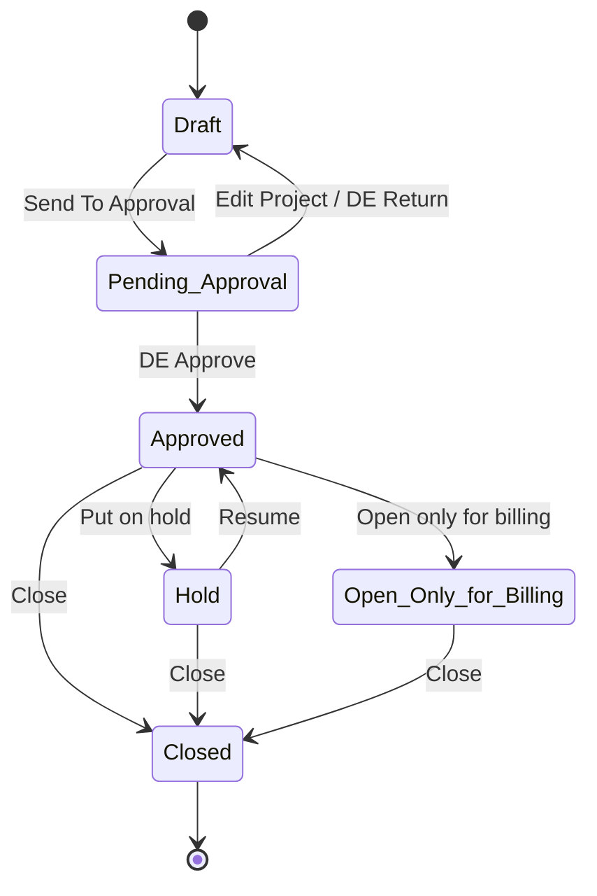

---

## 3. Project — `de_review_status` (DE governance sub-state)

Independent of `project_status`; used only during governance approval (BP-01).

| Status | Description | Entry | Exit | Terminal? |
| --- | --- | --- | --- | --- |
| *(null)* | Allocated to a DE assessor but the governance workspace has not been opened. "Awaiting Review" is derived from `project_status = Pending Approval` + `de_review_status is null`. | On DE allocation | first per-module verdict | No |
| `In Review` | DE has recorded at least one per-module verdict. | First `PUT .../modules/{key}` while `Pending Approval` | DE decision | No |
| `Returned` | DE returned the project for correction. | DE decision `Return` | re-send → *(null)* on next allocation cycle (`ASSUMPTION`) | No |
| `Approved` | DE approved the project. | DE decision `Approve` | — | Yes |

| From | Action | To | Actor | Preconditions | Business Rules | System Actions | Reversible? |
| --- | --- | --- | --- | --- | --- | --- | --- |
| *(null)* | First per-module verdict | `In Review` | `DELIVERY_EXCELLENCE` / `ADMIN` | `project_status = Pending Approval` | BR-DEAP-020 | Upsert `DeProjectModuleReview` | No |
| `In Review` / *(null)* | DE decision `Approve` | `Approved` | `DELIVERY_EXCELLENCE` / `ADMIN` | allocated DE | BR-DEAP-030 | Set `project_status = Approved` | No |
| `In Review` / *(null)* | DE decision `Return` | `Returned` | `DELIVERY_EXCELLENCE` / `ADMIN` | allocated DE | BR-DEAP-030 | Set `project_status = Draft` | Yes (re-send) |

---

## 4. Project Status Report — `status` (`ReportStatus`)

| Status | Description | Entry | Allowed Actions | Exit | Terminal? |
| --- | --- | --- | --- | --- | --- |
| `Draft` | Being authored by the PM. | On create | Edit items / Key Metrics, Submit | Submit | No |
| `Submitted` | Sent to the Account tier for review. | Submit | Account Manager review | review decision | No |
| `Approved` | Account Manager approved. | Review `Approved` | — | — | Yes |
| `Rejected` | Account Manager rejected. | Review `Rejected` | re-open to `Draft` for revision (`ASSUMPTION` — no auto-revert in code) | re-open | Restricted |

| From | Action | To | Actor | Preconditions | Business Rules | System Actions | Notification | Reversible? |
| --- | --- | --- | --- | --- | --- | --- | --- | --- |
| *(none)* | Create report | `Draft` | `PROJECT_MANAGER` (+ act-as) | project `Approved`; period selected | BR-STATUS-010, BR-STATUS-040 | Attach to project + period | — | No |
| `Draft` | Submit | `Submitted` | `PROJECT_MANAGER` | report is `Draft` | BR-STATUS-020 | Report appears on Account Review | N-STATUS-SUBMITTED `<!-- pending -->` | Restricted |
| `Submitted` | Review `Approved` | `Approved` | `ACCOUNT_MANAGER` / `GEO_HEAD` / `ADMIN` (not the PM) | report is `Submitted`; reviewer holds patch | BR-STATUS-030, BR-REVIEW-010, BR-REVIEW-020 | Set `reviewed_by` / `reviewed_at` / `review_comment` | N-REVIEW-DECISION `<!-- pending -->` | No |
| `Submitted` | Review `Rejected` | `Rejected` | as above | as above | BR-STATUS-030, BR-REVIEW-050 | Set review metadata | N-REVIEW-DECISION `<!-- pending -->` | Restricted |
| `Rejected` | Re-open | `Draft` | `PROJECT_MANAGER` | — | `ASSUMPTION` | Unlock for edit | — | — |

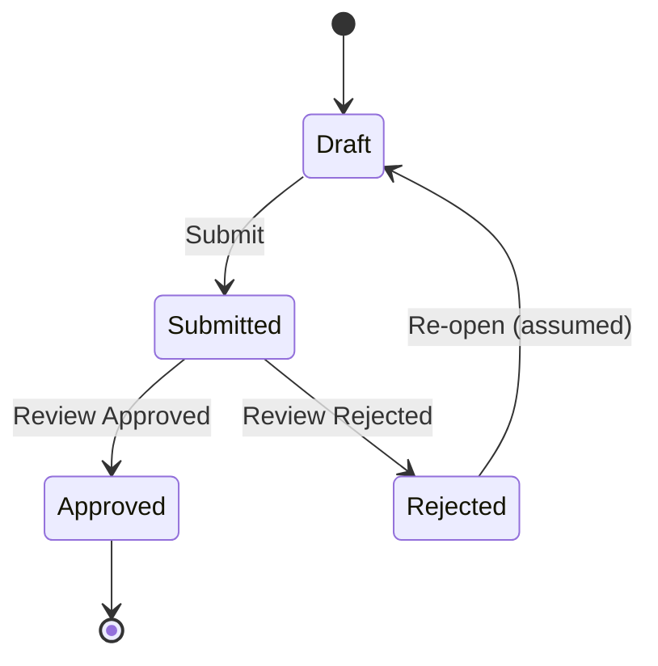

---

## 5. Account Status Report — `status` (`ReportStatus`)

Same lifecycle as §4. Differences:

| Aspect | Account report |
| --- | --- |
| Author | `ACCOUNT_MANAGER` (owned account) or `ADMIN` |
| Reviewer | `GEO_HEAD` whose geo contains the account (`require_account_geo_scope`), or `ADMIN` |
| Rules | BR-ACCT-010, BR-ACCT-020, BR-REVIEW-010, BR-REVIEW-030 |
| Notification | N-REVIEW-PENDING to the Geo Head; N-REVIEW-DECISION to the author `<!-- pending -->` |

Transitions mirror §4 with `ACCOUNT_MANAGER` as author and `GEO_HEAD` as reviewer.

---

## 6. Geo Status Report — `status` (`ReportStatus`)

Same lifecycle as §4. Differences:

| Aspect | Geo report |
| --- | --- |
| Author | `GEO_HEAD` (owned geo) or `ADMIN` |
| Reviewer | any `CXO` or `ADMIN` — **not ownership-scoped** (BR-REVIEW-040) |
| Rules | BR-GEO-010, BR-ACCT-020, BR-REVIEW-010, BR-REVIEW-040 |
| Notification | N-REVIEW-PENDING to the CXO `<!-- pending -->` |

---

## 7. DE Assessment — `status` (`DEAssessmentStatus`)

| Status | Description | Entry | Allowed Actions | Exit | Terminal? |
| --- | --- | --- | --- | --- | --- |
| *(no row)* | "Not Started" — never stored as a value. | — | Create assessment | create | — |
| `Draft` | Being prepared by DE. | On create (some paths default to `Submitted`) | Set health / PCI, add findings / alert, Submit | Submit | No |
| `Submitted` | Finalised for the period. | Submit | (findings continue to be updated across periods) | — | Yes |

| From | Action | To | Actor | Preconditions | Business Rules | System Actions | Notification | Reversible? |
| --- | --- | --- | --- | --- | --- | --- | --- | --- |
| *(no row)* | Create assessment | `Draft` | `DELIVERY_EXCELLENCE` / `PROJECT_MANAGER` / `ACCOUNT_MANAGER` / `GEO_HEAD` / `ADMIN` | project `Approved` | BR-DEA-010, BR-DEA-050 | Set `assessment_date`, `next_assessment_due_date` | — | No |
| `Draft` | Add / raise Alert | `Draft` | as above | health ≠ `Green` for an alert | BR-DEA-020, BR-DEA-030 | Generate `ALT-YYYY-NNNN` | N-DEA-ALERT `<!-- pending -->` | Yes (delete alert) |
| `Draft` | Submit | `Submitted` | as above | required fields set | BR-DEA-040 | `_finalize_assessment` pushes the rating to the Charter + overall health | — | No |
| `Submitted` | *(next period)* | new `Draft` row | `DELIVERY_EXCELLENCE` | cadence due | BR-DEA-040 | New dated row; prior retained | N-DEA-OVERDUE if late `<!-- pending -->` | — |

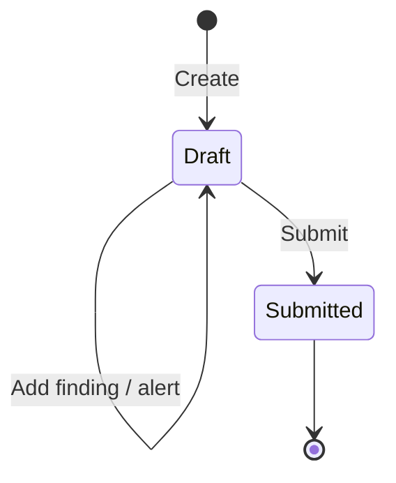

---

## 8. DE Module Review — `review_action` (`DeModuleReviewAction`)

One row per governance module per project (`de_project_module_reviews`).

| Status | Description | Entry | Terminal? |
| --- | --- | --- | --- |
| `Not Reviewed` | Default — DE has not assessed this module. | Implicit until a verdict is set | No |
| `Reviewed` | DE checked the module and it is acceptable. | `PUT .../modules/{key}` | No (can change) |
| `Gap Identified` | DE found a governance gap. | `PUT .../modules/{key}` | No (can change) |

| From | Action | To | Actor | Preconditions | Business Rules | System Actions | Reversible? |
| --- | --- | --- | --- | --- | --- | --- | --- |
| `Not Reviewed` | Set verdict | `Reviewed` \| `Gap Identified` | `DELIVERY_EXCELLENCE` / `ADMIN` | allocated DE; project `Pending Approval` | BR-DEAP-020, BR-DEAP-050 | Upsert row; first verdict moves `de_review_status` → `In Review`; recompute completeness | Yes |
| `Reviewed` ⇄ `Gap Identified` | Change verdict | the other | as above | — | BR-DEAP-050 | Update row + `updated_by/at` | Yes |

---

## 9. Rollup Item — `account_rollup_status` (`RollupStatus`)

Applies to `ProjectStatusItem` (project→account), `ProjectHealthItem` (project→account), and `AccountStatusItem` (account→geo).

| Status | Description | Entry | Allowed Actions | Exit | Terminal? |
| --- | --- | --- | --- | --- | --- |
| `Pending` | Not yet decided by the parent tier. | On item create | Pull, Ignore | Pull / Ignore | No |
| `Pulled` | Adopted into the parent register (a parent copy exists). | Pull | Undo | Undo | No |
| `Ignored` | Dismissed by the parent tier. | Ignore | Undo | Undo | No |

| From | Action | To | Actor | Preconditions | Business Rules | System Actions | Reversible? |
| --- | --- | --- | --- | --- | --- | --- | --- |
| `Pending` | Pull | `Pulled` | `ACCOUNT_MANAGER` (project→account) / `GEO_HEAD` (account→geo) / `ADMIN` | item is `Pending`; item belongs to a child of the parent | BR-ROLLUP-010, BR-ROLLUP-020 | Create the parent status/health item | No | 
| `Pending` | Ignore | `Ignored` | as above | item is `Pending` | BR-ROLLUP-030 | — | Yes |
| `Pulled` | Undo | `Pending` | as above | — | BR-ROLLUP-030 | Delete the parent copy | Yes |
| `Ignored` | Undo | `Pending` | as above | — | BR-ROLLUP-030 | — | Yes |

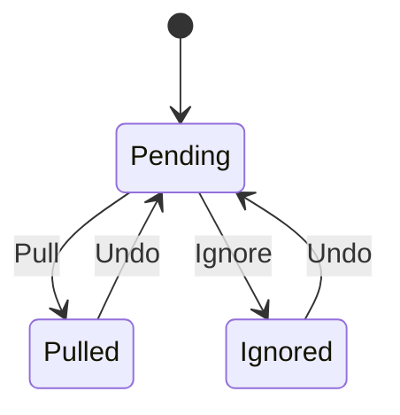

---

## 10. Action — `status` (`ActionStatus`)

| Status | Description | Entry | Allowed Actions | Exit | Terminal? |
| --- | --- | --- | --- | --- | --- |
| `OPEN` | Raised, not started. | On create | start, cancel, edit, comment | start / cancel | No |
| `IN_PROGRESS` | Being worked. | `start` | complete, cancel, edit, comment | complete / cancel | No |
| `COMPLETED` | Work done, awaiting sign-off. | `complete` | close, comment | close | No |
| `CLOSED` | Signed off. | `close` | comment | — | Yes |
| `CANCELLED` | Abandoned without completing. | `cancel` | comment | — | Yes |

| From | Action | To | Actor | Preconditions | Business Rules | System Actions | Notification | Reversible? |
| --- | --- | --- | --- | --- | --- | --- | --- | --- |
| *(none)* | Create | `OPEN` | level write role (PROJECT: PM/AM/ADMIN; ACCOUNT: AM/GH/ADMIN; GEO: GH/CXO/ADMIN) | role (+ scope) | BR-ACTION-010 | Generate `ACT-*`; `CREATED` history | N-ACTION-ASSIGNED `<!-- pending -->` | No |
| `OPEN` | start | `IN_PROGRESS` | assignee **or** level write role | — | BR-ACTION-020, BR-ACTION-030 | `STATUS_CHANGE` history | — | No |
| `IN_PROGRESS` | complete | `COMPLETED` | assignee or write role | — | BR-ACTION-030 | `STATUS_CHANGE` history; set `completed_at` | — | No |
| `COMPLETED` | close | `CLOSED` | write role or assignee | status is `COMPLETED` | BR-ACTION-040 | Set `closed_at` / `closed_by` | — | No |
| `OPEN` / `IN_PROGRESS` | cancel | `CANCELLED` | write role or assignee | status ∈ {`OPEN`,`IN_PROGRESS`} | BR-ACTION-050 | `STATUS_CHANGE` history | — | No |
| any editable | edit owner / due date / priority | *(same)* | write role | — | BR-ACTION-060 | `OWNER_CHANGE` / `DUE_DATE_CHANGE` / `PRIORITY_CHANGE` history | — | — |
| any | comment | *(same)* | anyone who can reach the entity | — | BR-ACTION-060 | `COMMENT` history | — | — |

**Action History `event_type`:** `CREATED`, `COMMENT`, `STATUS_CHANGE`, `OWNER_CHANGE`, `DUE_DATE_CHANGE`, `PRIORITY_CHANGE` — append-only.

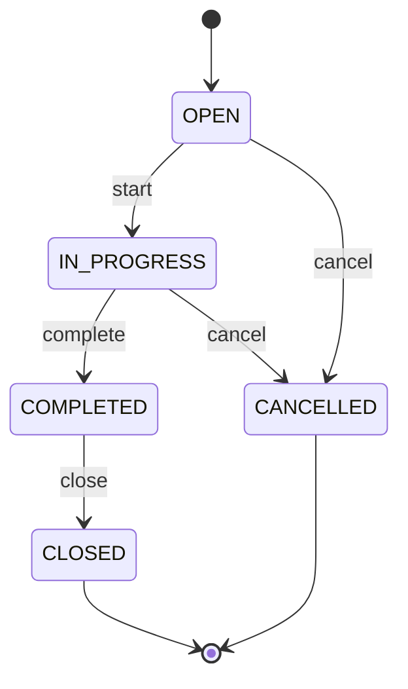

---

## 11. Risk — `current_status` (`RiskStatus`)

| Status | Description | Entry | Exit | Terminal? |
| --- | --- | --- | --- | --- |
| `Open` | Active risk. | On create | mitigate / monitor / close | No |
| `Monitoring` | Being watched; not yet closed. | Manual | close / re-open to `Open` | No |
| `Closed` | Realised or no longer relevant. | Manual (with Closure Date) | re-open (`Restricted`) | Yes |

| From | Action | To | Actor | Preconditions | Business Rules | Reversible? |
| --- | --- | --- | --- | --- | --- | --- |
| *(none)* | Create | `Open` | `PROJECT_MANAGER` / `TEAM_MEMBER` (assigned) / `ADMIN` | role (+ patch) | BR-RAID-010, BR-RAID-020, BR-RAID-030 | No |
| `Open` | Move to monitoring | `Monitoring` | `PROJECT_MANAGER` | — | BR-RAID-040 | Yes |
| `Open` / `Monitoring` | Close | `Closed` | `PROJECT_MANAGER` | Closure Date set | BR-RAID-040 | Restricted |
| `Closed` | Re-open | `Open` | `PROJECT_MANAGER` / `ADMIN` | — | `ASSUMPTION` | — |

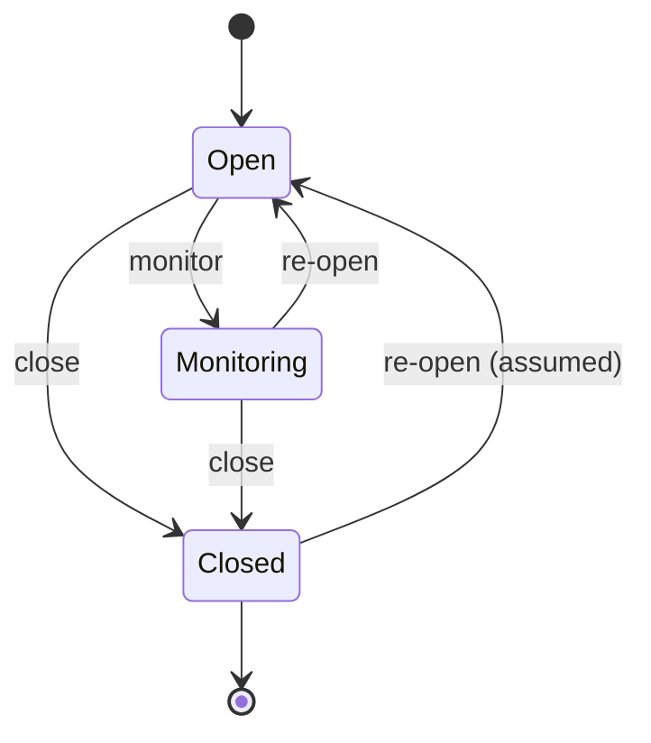

---

## 12. Issue — `status` (`IssueStatus`)

| Status | Description | Entry | Terminal? |
| --- | --- | --- | --- |
| `New` | Just raised. | On create | No |
| `Assigned` | Owner assigned. | Manual | No |
| `In Progress` | Being resolved. | Manual | No |
| `Pending` | Blocked / awaiting input. | Manual | No |
| `Resolved` | Fix applied, awaiting confirmation. | Manual (Actual Resolution Date) | No |
| `Closed` | Confirmed resolved. | Manual (Closure Date) | Yes |

| From | Action | To | Actor | Business Rules | Reversible? |
| --- | --- | --- | --- | --- | --- |
| *(none)* | Create | `New` | `PROJECT_MANAGER` / `TEAM_MEMBER` / `ADMIN` | BR-RAID-010, BR-RAID-040 | No |
| `New` | Assign | `Assigned` | `PROJECT_MANAGER` | BR-RAID-040 | Yes |
| `Assigned` / `Pending` | Start | `In Progress` | owner | BR-RAID-040 | Yes |
| `In Progress` | Block | `Pending` | owner | BR-RAID-040 | Yes |
| `In Progress` | Resolve | `Resolved` | owner | BR-RAID-040 | Yes |
| `Resolved` | Close | `Closed` | `PROJECT_MANAGER` | BR-RAID-040 | Restricted |
| `Resolved` | Reopen | `In Progress` | `PROJECT_MANAGER` | BR-RAID-040 | — |

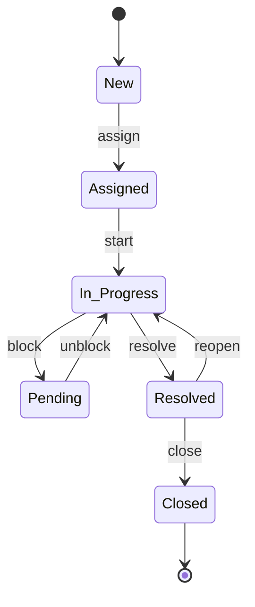

---

## 13. Dependency — `dependency_status` (`DependencyStatus`)

| Status | Description | Entry | Terminal? |
| --- | --- | --- | --- |
| `Not Started` | Awaited, not begun. | On create | No |
| `In Progress` | Being delivered by the provider. | Manual | No |
| `Blocked` | Delivery stalled. | Manual | No |
| `Completed` | Dependency satisfied (Actual Completion Date). | Manual | Yes |

| From | Action | To | Actor | Business Rules | Reversible? |
| --- | --- | --- | --- | --- | --- |
| *(none)* | Create | `Not Started` | `PROJECT_MANAGER` / `TEAM_MEMBER` / `ADMIN` | BR-RAID-010, BR-RAID-040 | No |
| `Not Started` / `Blocked` | Start | `In Progress` | `PROJECT_MANAGER` | BR-RAID-040 | Yes |
| `In Progress` | Block | `Blocked` | `PROJECT_MANAGER` | BR-RAID-040 | Yes |
| `In Progress` | Complete | `Completed` | `PROJECT_MANAGER` | BR-RAID-040 | Restricted |

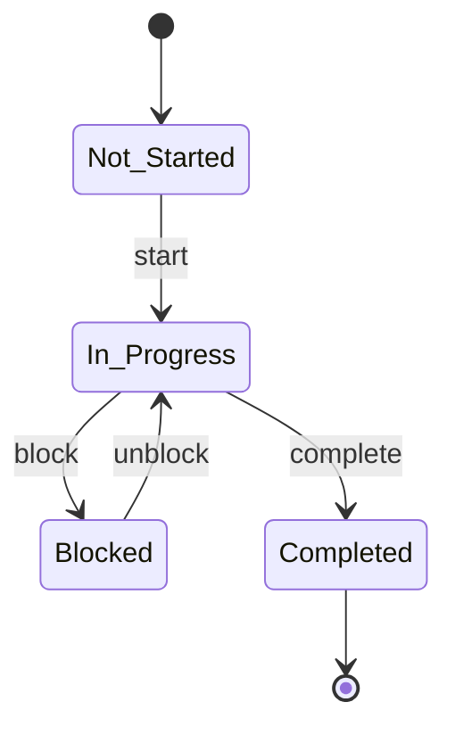

---

## 14. Assumption — `current_status` (`AssumptionStatus`) + `validation_status` (`ValidationStatus`)

Two independent fields. `current_status` is the record lifecycle; `validation_status` tracks whether the assumption has been checked.

| `current_status` | Description | Terminal? |
| --- | --- | --- |
| `Open` | Live assumption. | No |
| `Closed` | Resolved (validated or superseded). | Yes |
| `Cancelled` | Withdrawn. | Yes |

| `validation_status` | Description | Terminal? |
| --- | --- | --- |
| `Pending` | Not yet checked. | No |
| `Validated` | Confirmed true. | No |
| `Invalid` | Confirmed false — feeds risk/issue creation. | No |

| From | Action | To | Actor | Business Rules | Reversible? |
| --- | --- | --- | --- | --- | --- |
| *(none)* | Create | `Open` / `validation_status = Pending` | `PROJECT_MANAGER` / `TEAM_MEMBER` / `ADMIN` | BR-RAID-010, BR-RAID-040 | No |
| `Pending` | Validate | `validation_status = Validated` | `PROJECT_MANAGER` (Validation Date) | BR-RAID-040 | Yes |
| `Pending` | Invalidate | `validation_status = Invalid` | `PROJECT_MANAGER` | BR-RAID-040 | Yes |
| `Open` | Close | `current_status = Closed` | `PROJECT_MANAGER` | BR-RAID-040 | Restricted |
| `Open` | Cancel | `current_status = Cancelled` | `PROJECT_MANAGER` | BR-RAID-040 | No |

---

## 15. Opportunity — `status` (`OpportunityStatus`)

| Status | Description | Entry | Terminal? |
| --- | --- | --- | --- |
| `Identified` | Logged, not yet approved. | On create | No |
| `Approved` | Approved for pursuit (Approved By recorded). | Manual — approver role **unresolved** (`ASSUMPTION`) | No |
| `Implemented` | Exploitation actions done (Actual Benefit recorded). | Manual | No |
| `Closed` | Concluded (Closure Date). | Manual | Yes |

| From | Action | To | Actor | Business Rules | Reversible? |
| --- | --- | --- | --- | --- | --- |
| *(none)* | Create | `Identified` | `PROJECT_MANAGER` / `TEAM_MEMBER` / `ADMIN` | BR-RAID-010, BR-RAID-040 | No |
| `Identified` | Approve | `Approved` | *TBD* (`ASSUMPTION` — likely Delivery Manager / `ACCOUNT_MANAGER`) | BR-RAID-060 | Yes |
| `Approved` | Implement | `Implemented` | `PROJECT_MANAGER` | BR-RAID-040 | Yes |
| `Implemented` / `Approved` | Close | `Closed` | `PROJECT_MANAGER` | BR-RAID-040 | Restricted |

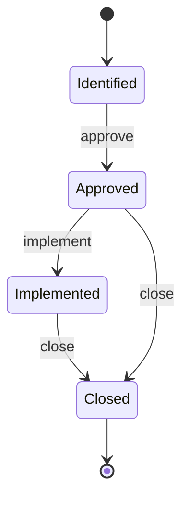

---

## 16. DE Finding — `status` (`FindingStatus`)

Lifecycle mirrors the Action Tracker. `On Hold` / `Deferred` remain valid for legacy rows.

| Status | Description | Entry | Terminal? |
| --- | --- | --- | --- |
| `Open` | Raised in an assessment. | On create | No |
| `In Progress` | Being addressed. | Manual | No |
| `Awaiting Closure` | Action taken; awaiting DE sign-off. | Manual | No |
| `Closed` | DE confirmed closed. | Manual | Yes |
| `Cancelled` | Withdrawn. | Manual from `Open` / `In Progress` | Yes |
| `On Hold` / `Deferred` | *(legacy)* — accepted but not part of the current flow. | Legacy rows | No |

| From | Action | To | Actor | Business Rules | Reversible? |
| --- | --- | --- | --- | --- | --- |
| *(none)* | Add finding | `Open` | `DELIVERY_EXCELLENCE` (+ `_write_roles`) | BR-DEA-060 | No |
| `Open` | Start | `In Progress` | assignee / DE | BR-DEA-060 | Yes |
| `In Progress` | Action complete | `Awaiting Closure` | assignee / DE | BR-DEA-060 | Yes |
| `Awaiting Closure` | Close | `Closed` | `DELIVERY_EXCELLENCE` | BR-DEA-060 | Restricted |
| `Open` / `In Progress` | Cancel | `Cancelled` | `DELIVERY_EXCELLENCE` | BR-DEA-060 | No |

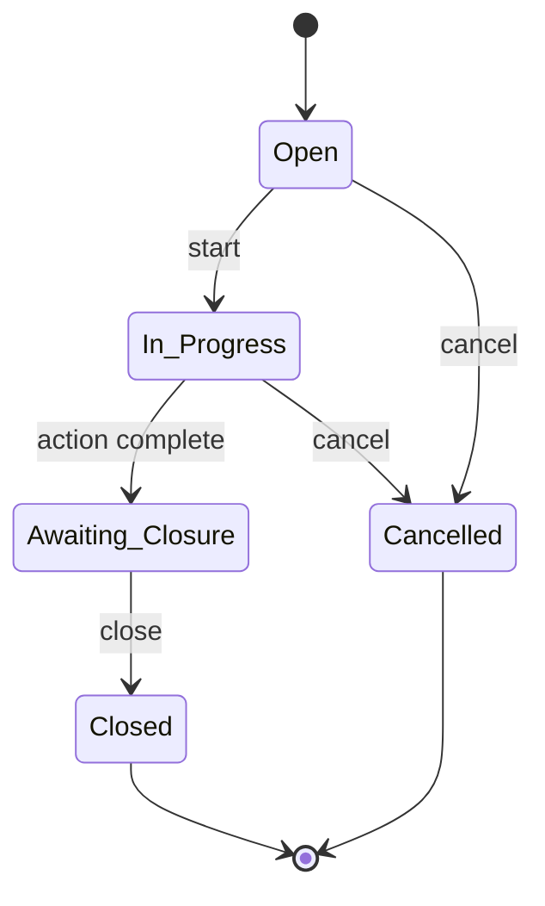

---

## 17. Derived indicators (not lifecycles)

| Indicator | Field / Enum | Values | Derivation |
| --- | --- | --- | --- |
| Commitment met | `met_status` (`MetStatus`) | `Met` \| `Not Met` | actual vs. Target on the commitment actual (BR-CONTRACT-020) |
| Milestone payment | `status` (`MilestonePaymentStatus`) | `Paid On Time` \| `Delayed Payment` \| `Yet To Be Paid` | Actual Date vs. Expected Date; `Yet To Be Paid` until an Actual Date exists (BR-CONTRACT-030) |
| Overall project health | `HealthRating` (cached on `projects`) | `Red` / `Potential Red` / `Amber` / `Green` | worst-wins over categories, then over {Delivery-Declared, DE-Assessed} (BR-HEALTH-010/020) |
| Data Integrity row | computed | `Updated` \| `Not Updated` \| *(indeterminate)* | last-updated vs. the item's cadence (BR-DI-010/020) |

These have no transitions — they are recomputed whenever their inputs change.

---

## 18. AI subsystem statuses

### AI Field Suggestion — `status` (`AiSuggestionStatus`)

| Status | Description | Entry | Terminal? |
| --- | --- | --- | --- |
| `pending` | Extracted, awaiting user action. | On ingest from the pipeline | No |
| `ignored` | User dismissed it. | Ignore action | Yes |
| `resolved` | User saved/edited/created on its screen — the value is now ordinary manual data. | Implicit on save/edit/create | Yes |

| From | Action | To | Actor | Business Rules | Reversible? |
| --- | --- | --- | --- | --- | --- |
| *(none)* | Pipeline posts suggestions | `pending` | `AI-PIPELINE` | BR-AI-010 | No |
| `pending` | Ignore | `ignored` | `PROJECT_MANAGER` | BR-AI-020 | No |
| `pending` | Save / edit / create on screen | `resolved` | `PROJECT_MANAGER` | BR-AI-020, BR-AI-040 | No |

### AI Row Suggestion — `status` (`AiRowSuggestionStatus`)

| Status | Description | Entry | Terminal? |
| --- | --- | --- | --- |
| `pending` | Candidate RAID(O) row, awaiting user action. | On ingest | No |
| `ignored` | Dismissed. | Ignore | Yes |
| `applied` | User applied it — the real row was created via the entity's normal create endpoint. | Apply | Yes |

| From | Action | To | Actor | Business Rules | Reversible? |
| --- | --- | --- | --- | --- | --- |
| *(none)* | Pipeline posts row suggestions | `pending` | `AI-PIPELINE` | BR-AI-010 | No |
| `pending` | Ignore | `ignored` | `PROJECT_MANAGER` | BR-AI-020 | No |
| `pending` | Apply | `applied` | `PROJECT_MANAGER` | BR-AI-030 | No |

### Project Document — `ai_status` (`DocumentAiStatus`)

| Status | Description | Entry | Terminal? |
| --- | --- | --- | --- |
| `Not Processed` | Uploaded, not yet sent to the pipeline. | On upload | No |
| `Processing` | Sent to the vLLM extraction service. | `POST .../documents/process` | No |
| `Processed` | Suggestions stored. | Pipeline returns | No (re-processable) |
| `Excluded` | Marked not for AI processing. | Manual | No |

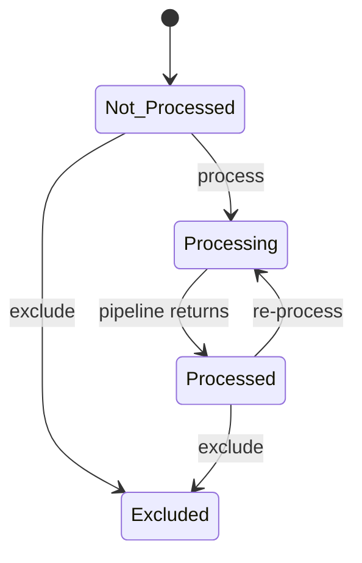

---

## 19. Backup / Restore — `status` (`BackupRestoreStatus`)

| Status | Description | Entry | Terminal? |
| --- | --- | --- | --- |
| `In Progress` | Operation running. | `ADMIN` triggers a `Backup` or `Restore` | No |
| `Completed` | Finished successfully. | Operation ends OK | Yes |
| `Failed` | Operation errored. | Operation errors | Yes |

| From | Action | To | Actor | Business Rules | Reversible? |
| --- | --- | --- | --- | --- | --- |
| *(none)* | Trigger backup / restore | `In Progress` | `ADMIN` | BR-INTG-010 | No |
| `In Progress` | Success | `Completed` | `SYSTEM` | BR-INTG-020 | No |
| `In Progress` | Error | `Failed` | `SYSTEM` | BR-INTG-020 | No (retry = new row) |

---

## 20. Assumptions

| ID | Assumption |
| --- | --- |
| A-WF-001 | `ASSUMPTION:` A `Rejected` status report has **no automatic revert** in code (`obj.status = payload.decision`); the re-open-to-`Draft` path is inferred and unconfirmed. |
| A-WF-002 | `ASSUMPTION:` Project `Closed` is treated as terminal and `Hold`↔`Approved` as reversible; the exact set of allowed `project_status` transitions after `Approved` is not guarded in code. |
| A-WF-003 | `ASSUMPTION:` DE Assessment `status` default on create differs by path (`Draft` vs. `Submitted`); to be normalised. |
| A-WF-004 | `ASSUMPTION:` RAID(O) sub-transitions (assign/start/block/resolve/validate) are UI conventions over a free `StrEnum` field — the server accepts any valid enum value in any order; only the value set is enforced. |
| A-WF-005 | `ASSUMPTION:` The Opportunity `Approve` actor is unresolved (BR-RAID-060 / BRS Open Item 8). |
| A-WF-006 | `ASSUMPTION:` `de_review_status` returning from `Returned` to *(null)* on re-allocation is inferred; there may be no reset. |
