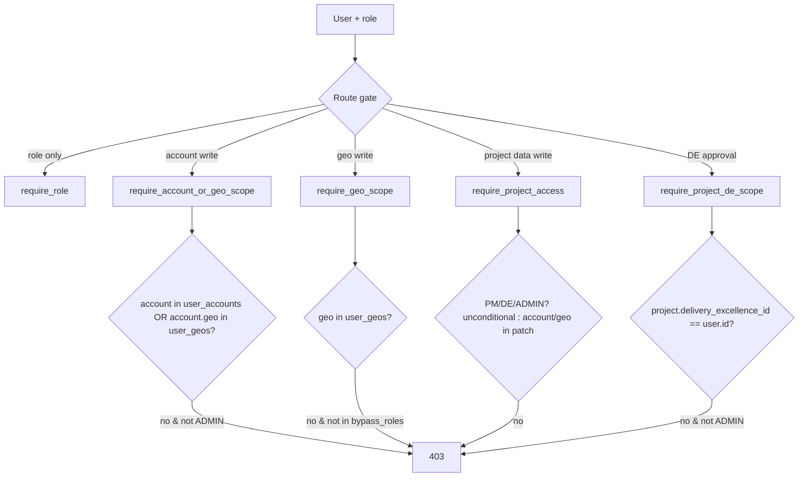

# 07 — Roles & Permissions Matrix

**Document type:** Product-Brain Reference
**Product:** ProjectGovernance (working title)
**Status:** Draft — generated 2026-08-30, pending review
**Depends on:** product-brain/00, product-brain/01, product-brain/05, product-brain/06
**Feeds:** product-brain/08, product-brain/17, product-brain/19, product-brain/25, product-brain/26

> **Purpose of this document.** Who can do what — per module, per action, and where it
> matters per entity status and per Account/Geo scope. It is the reference the API layer
> enforces (`product-brain/05` §3 SEC rules) and the UI uses to show/hide actions
> (`product-brain/21`). **This document supersedes `roles-actions.md`**, which is now stale
> on the Delivery Excellence role. Permissions are assigned to roles; a user holds exactly
> one role plus an Account/Geo scope.

---

## 1. Roles

`RoleCode` values are exact, from `backend/app/schemas/enums.py`.

| Role | Code | Who they are | Typical scope |
| --- | --- | --- | --- |
| Admin | `ADMIN` | IT / system owner. Superset of every permission; bypasses all scope checks. | Instance |
| CXO | `CXO` | Top of the review chain. Reviews/approves every Geo's rolled-up status. Lightest write footprint. | Enterprise (unscoped); bypasses geo scope for geo review + GEO-level Actions |
| Geo Head | `GEO_HEAD` | Owns one or more Geos. Reviews Accounts, authors Geo status/health, builds the Executive Update. | One or more Geos (`user_geos`) |
| Account Manager ("Account Head") | `ACCOUNT_MANAGER` | Owns one or more Accounts. Reviews Projects, authors Account status/health, runs project→account rollup. | One or more Accounts (`user_accounts`) |
| Project Manager | `PROJECT_MANAGER` | Owns project delivery data. **Currently any PM can edit any project** (role-only, no per-project assignment). | All projects (no per-project scope in the schema) |
| Team Member | `TEAM_MEMBER` | Updates RAID items assigned to them; read-only elsewhere. | Assigned project(s) — thin in implementation (dashboard-only menu) |
| Delivery Excellence | `DELIVERY_EXCELLENCE` | Performs the DE Assessment and DE Governance Approval. | Cross-project; write-scoped to projects **allocated** to them (`projects.delivery_excellence_id`) |
| PMO | `PMO` | Intended owner of Contractual Compliance, Milestone Payments, and the Data Integrity checklist. | Cross-project (read); **no distinguishing write permission today** |

---

## 2. Permission Verbs

| Verb | Meaning |
| --- | --- |
| **View** | Read a record / list within scope |
| **Create** | Create a new record |
| **Edit** | Modify an existing record (almost always status-gated) |
| **Delete** | Remove a record |
| **Submit** | Move a report `Draft` → `Submitted` |
| **Review** | Approve / Reject a `Submitted` report, one tier up |
| **Allocate** | Assign a DE assessor to a project |
| **Decide** | DE governance decision (Approve / Return) on a `Pending Approval` project |
| **Pull / Ignore / Undo** | Rollup item promotion decisions |
| **Transition** | Move an Action / Finding through its lifecycle |
| **Comment** | Add a comment / history note |
| **Configure** | Reference data, integrations, backup, checklist catalog |
| **Administer** | Users, roles, Account/Geo scope assignment |

---

## 3. Role × Module Matrix

**Legend:** `✔` full · `●` write (create/edit/delete) · `(S)` status-gated (see §4) · `(P)` limited to the caller's patch (owned Accounts/Geos) · `(O)` own / assigned records only · `R` read-only · `–` no access · `Ω` review authority.

Reads: **every authenticated role can View every module's data** unless a stricter gate is noted (Users, Project Health portfolio). The grid shows **write / action** capability.

| Module | `ADMIN` | `CXO` | `GEO_HEAD` | `ACCOUNT_MANAGER` | `PROJECT_MANAGER` | `TEAM_MEMBER` | `DELIVERY_EXCELLENCE` | `PMO` |
| --- | --- | --- | --- | --- | --- | --- | --- | --- |
| MOD-PROJ Charter | ✔ | – | ●(P)(S) | ●(P)(S) | ●(S) | R | R | R |
| MOD-STATUS Project Status | ✔ | – | ●(P)(S) | ●(P)(S) | ●(S) | R | R | R |
| MOD-RAID RAID(O) | ✔ | – | ●(P) | ●(P) | ● | (O) items | R | R |
| MOD-HEALTH Project Health | ✔ | – | ●(P) | ●(P) | ● | R | R | R |
| MOD-MEAS Measurement | ✔ | – | ●(P) | ●(P) | ● | R | R | R |
| MOD-TARGET Metric Targets | ✔ | – | ●(P) | ●(P) | ● | R | R | R |
| MOD-CONTRACT Contractual | ✔ | – | ●(P) | ●(P) | ● | R | R | R *(intended owner)* |
| MOD-DEA DE Assessment | ✔ | – | ●(P) | ●(P) | ● | R | ● | R |
| MOD-DEAL DE Allocation | ✔ | – | – | – | – | – | ✔ | – |
| MOD-DEAP DE Gov. Approval | ✔ | – | – | – | – | – | Decide (allocated) | – |
| MOD-ACCT Account Reporting | ✔ | R | ●(P)(S) | ●(P)(S) | – | – | – | – |
| MOD-GEO Geo Reporting | ✔ | R | ●(P)(S) | – | – | – | – | – |
| MOD-ROLLUP Rollup | ✔ | – | Pull/Ignore/Undo (P) | Pull/Ignore/Undo (P) | – | – | – | – |
| MOD-REVIEW Review | ✔ Ω | Ω geo *(unscoped)* | Ω account (P) | Ω project (P) | – *(SoD)* | – | – | – |
| MOD-EXEC Executive Updates | ✔ | R | ●(P) | – | – | – | – | – |
| MOD-ACTION Action Tracker | ✔ | ●(GEO) | ●(GEO+ACCOUNT, P) | ●(ACCOUNT+PROJECT, P) | ●(PROJECT) | Transition (O) | – | – |
| MOD-DI Data Integrity | ✔ (catalog) | R | R | R | R | R | R | R *(intended owner)* |
| MOD-DASH Dashboards | ✔ | ✔ + Project Health | own My Summary | own My Summary | own My Summary *(mock)* | generic | own My Summary | own My Summary + Project Health |
| MOD-AI AI Assist & Documents | ✔ | – | ●(P) | ●(P) | ● | – | – | – |
| MOD-REF Reference Data | ✔ Configure | – | – | – | – | – | – | – |
| MOD-USER User & Role Admin | ✔ Administer | – | – | – | – | – | – | – |
| MOD-INTG Integrations & Backup | ✔ Configure | – | – | – | – | – | – | – |
| MOD-AUDIT Audit Log | ✔ | – | – | – | – | – | – | – |

Notes:
- **`GEO_HEAD` / `ACCOUNT_MANAGER` writing project data** (`●(P)` on MOD-PROJ/STATUS/RAID/…) is only via **Work Context** (§6): the backend gate is `require_project_access`, which lets an Account/Geo Head do PM work on projects in their own patch.
- **`DELIVERY_EXCELLENCE`** is in the DE Assessment write gate (`_write_roles` includes `DELIVERY_EXCELLENCE`) and the DE Allocation/Approval gates — but **not** the generic project-data gate `_pm_write` (MOD-STATUS/RAID/HEALTH/MEAS/CONTRACT).
- **`PMO`** is in **no write or approve gate** anywhere. Its intended ownership of MOD-CONTRACT and MOD-DI is not implemented.
- **`TEAM_MEMBER`** is in no write gate; the BRS assigns it "update RAID items assigned to me", which has no server enforcement today.

---

## 4. Status-Dependent Permissions

| Entity | Status | What changes |
| --- | --- | --- |
| Project (`project_status`) | `Draft` | Charter editable by PM (+ act-as); Send for Approval available. |
| Project | `Pending Approval` | Charter locked; only DE per-module review + decision, or PM "Edit Project" (→ `Draft`). |
| Project | `Approved` | Recurring reporting enabled; Charter fields immutable except Project Type (`ASSUMPTION`, BR-PROJ-080). |
| Project Status Report | `Draft` | Editable by the author; **Submit** available. |
| Project Status Report | `Submitted` | Author cannot edit; **Review** (Approve/Reject) available to the tier above (not the PM — BR-REVIEW-020). |
| Project Status Report | `Approved` / `Rejected` | Terminal for that cycle; `Rejected` re-open path assumed. |
| DE Assessment | `Draft` | DE edits, adds findings/alerts, **Submit**. |
| DE Assessment | `Submitted` | Rating pushed to the Charter; findings still updatable across periods. |
| Action | `COMPLETED` | Only then is **close** allowed (BR-ACTION-040). |
| Action | `OPEN` / `IN_PROGRESS` | Only from here is **cancel** allowed (BR-ACTION-050). |
| Rollup item | `Pending` | Only from here can it be **Pulled** / **Ignored** (BR-ROLLUP-010). |
| DE governance | `de_review_status = null` + `Pending Approval` | First per-module verdict moves it to `In Review` (BR-DEAP-020). |

---

## 5. Scope Model & Dependency Factories

**Scope data:** `user_accounts` (Account Manager patch), `user_geos` (Geo Head patch).
`user_projects` exists but is largely unused. `regions` is reference data only — **not**
part of the scope model. `ADMIN` owns all Accounts and Geos implicitly.

**Enforcement:** every non-auth route passes `verify_api_key` (`X-API-Key`) +
`get_current_user` (session) — BR-SEC-010/020. On top, one of the following FastAPI
dependency factories from `backend/app/api/deps.py` guards writes:

| Factory | Check | Bypass | Used by |
| --- | --- | --- | --- |
| `require_role(*roles)` | `role.code` ∈ `roles` | — | Reference data, Users, Integrations, DE Allocation/Approval queue, Dashboard sections, PROJECT-level Actions |
| `require_account_scope(*roles)` | `{account_id}` ∈ `user_accounts` | `ADMIN` | *(available; superseded by the two below in practice)* |
| `require_account_or_geo_scope(*roles)` | account owned directly **or** its `geo_id` ∈ `user_geos` | `ADMIN` | Account status/health writes; account rollup; ACCOUNT-level Actions |
| `require_account_geo_scope(*roles)` | the account's `geo_id` ∈ `user_geos` | `ADMIN` | Account report **review** (Geo Head) |
| `require_geo_scope(*roles, bypass_roles=(ADMIN,))` | `{geo_id}` ∈ `user_geos` | `ADMIN`; Actions pass `bypass_roles=(ADMIN, CXO)` | Geo status/health writes; Executive Updates; geo rollup; GEO-level Actions |
| `require_project_account_scope(*roles)` | the project's `account_id` ∈ `user_accounts` | `ADMIN` | *(available)* |
| `require_project_de_scope(*roles)` | `project.delivery_excellence_id == current_user.id` | `ADMIN` | DE Governance Approval scoped writes |
| `require_project_access(*roles)` | `PM`/`DE`/`ADMIN` unconditional; `ACCOUNT_MANAGER` only if the project's account is owned; `GEO_HEAD` only if the project's (or its account's) geo is owned | — | **All project-data writes** (`_pm_write` on MOD-PROJ/STATUS/RAID/HEALTH/MEAS/TARGET/CONTRACT/AI/documents); DE Assessment (`_write_roles`, also allows `DELIVERY_EXCELLENCE`) |

---

## 6. Work Context ("act as")

Config: `frontend/src/lib/menu-config.ts` — `WORK_CONTEXTS`.

| Real role | May act as | Effect |
| --- | --- | --- |
| `ACCOUNT_MANAGER` | `ACCOUNT_MANAGER` (default), `PROJECT_MANAGER` | Menu, list scoping, and landing route switch to the lower role. |
| `GEO_HEAD` | `GEO_HEAD` (default), `ACCOUNT_MANAGER`, `PROJECT_MANAGER` | As above. |
| all others | *(no combo)* | — |

- `useEffectiveRole()` = `workContext ?? realRole`; the sidebar renders `ROLE_MENUS[effectiveRole]`.
- `realRole` still bounds **data scope** — the user's `user_accounts` / `user_geos` "patch".
- The client menu is **not** the security boundary: the backend independently permits the
  lower-role writes within the caller's patch via `require_project_access` /
  `require_account_or_geo_scope` (§5).
- `ROLE_LANDING_ROUTE` maps each role to its `/dashboard/<role>` "My Summary".

`ROLE_MENUS` (sidebar entries per role, from `menu-config.ts`):

| Role | Menu entries |
| --- | --- |
| `PROJECT_MANAGER` | project-manager-dashboard, project-review, new-project, maintain-project, view-amend-projects, project-reporting |
| `TEAM_MEMBER` | dashboard *(only)* |
| `DELIVERY_EXCELLENCE` | delivery-excellence-dashboard, de-allocation, de-approval, de-assessment |
| `PMO` | pmo-dashboard, project-health |
| `ACCOUNT_MANAGER` | account-manager-dashboard, account-review, account-reporting, project-review |
| `GEO_HEAD` | geo-head-dashboard, geo-review, geo-reporting, account-review |
| `CXO` | cxo-dashboard, project-health, geo-review |
| `ADMIN` | union of all + system-health *(dead link)*, admin-users-roles, admin-integrations |

---

## 7. Segregation of Duties

| Guard | Rule |
| --- | --- |
| **A PM cannot review their own project's report** | `_account_manager_review` = `require_project_access(ACCOUNT_MANAGER, GEO_HEAD, ADMIN)` — `PROJECT_MANAGER` is excluded (BR-REVIEW-020). |
| **Review is exactly one tier up** | Account Manager → Project; Geo Head → Account; CXO → Geo (BR-REVIEW-010). |
| **DE governance approval is separate from project authoring** | Only the allocated `DELIVERY_EXCELLENCE` (or `ADMIN`) may Decide (BR-DEAL-020, BR-DEAP-030). |
| **Reference / user / integration config is `ADMIN`-only** | BR-REF-010, BR-USER-010, BR-INTG-010. |
| **Assignee override on Actions** | The assignee may always transition their own action regardless of role (BR-ACTION-020) — a deliberate exception, not a gap. |

---

## 8. Known Gaps

These are recorded as `GAD` entries in `product-brain/23`.

| Gap | Detail | Impact |
| --- | --- | --- |
| **PM self-approval** | No server gate stops a `PROJECT_MANAGER` / `ADMIN` moving a project to `Approved` outside the DE flow (BR-PROJ-070 is Advisory). The Charter historically exposed an Approve action. | DE Governance Approval can be bypassed. |
| **`DELIVERY_EXCELLENCE` write coverage** | DE is in the DE Assessment gate but **not** the generic `_pm_write` gate; its intended authority to log Findings against *any* project's context and to be the sole approver is only partly wired. `roles-actions.md` §5 (now stale) described DE as having no path at all — the menu, routes, and DE dashboard now exist. | DE's day-to-day authority is inconsistent across modules. |
| **`PMO` has no write permission** | `PMO` appears in no write or approve gate. Its intended ownership of Contractual Compliance, Milestone Payments, and the Data Integrity checklist is unrealised — `PMO` is read-only + dashboard/Project-Health menu. | PMO cannot perform its specified job in the app. |
| **`TEAM_MEMBER` "update assigned RAID items"** | No per-item assignment enforcement; `TEAM_MEMBER` is in no write gate. | The role is effectively read-only. |
| **`user_projects` unused** | A per-project scope join table exists but nothing enforces against it; PM access is role-only. | "Any PM can edit any project." |
| **Region not scoped** | `regions` reference data has no RBAC role or scope. | Region cannot yet gate visibility. |

---

## 9. Assumptions

| ID | Assumption |
| --- | --- |
| A-RP-001 | `ASSUMPTION:` The matrix's `●(P)` cells for `GEO_HEAD` / `ACCOUNT_MANAGER` on project-data modules reflect `require_project_access` behaviour, not a distinct role permission. |
| A-RP-002 | `ASSUMPTION:` "Every authenticated role can View every module" is the observed default (reads are not role-gated except Users and the Project Health portfolio); a per-module read gate has not been audited. |
| A-RP-003 | `ASSUMPTION:` The Work Context map is client-side only; the backend's independent enforcement is via the scope factories, so an Account/Geo Head's project writes are bounded by their patch regardless of the combo. |
| A-RP-004 | `ASSUMPTION:` `DELIVERY_EXCELLENCE` as sole project approver and `PMO` as owner of Contractual/Data-Integrity are design intent (BRS §3.1) not yet enforced. |
