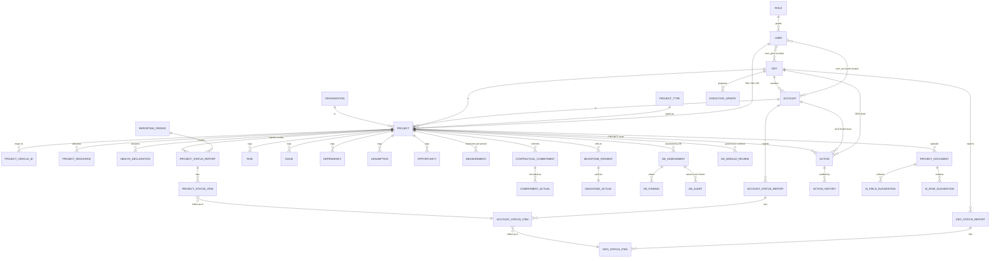

# 10 — Data / Entity Catalogue

**Document type:** Product-Brain Reference
**Product:** ProjectGovernance (working title)
**Status:** Draft — generated 2026-08-30, pending review
**Depends on:** product-brain/00, product-brain/01, product-brain/06
**Feeds:** product-brain/11, product-brain/13, product-brain/17, product-brain/26

> **Purpose of this document.** The conceptual data model — **business entities**, not
> database tables. Each entity has a purpose, a key, its major attributes, its
> relationships, its owning module (`product-brain/01`), its lifecycle
> (`product-brain/06`), and retention notes. The physical schema (the 47 `db/tables/*.sql`)
> is `product-brain/11`; `ENT-*` ↔ table mapping is given there. `ENT-*` IDs are defined
> here.

---

## 1. Conventions

- **Entity ID:** `ENT-<NAME>`.
- **Key:** most entities use a surrogate `id` (UUID, `UUIDPrimaryKey` mixin). A **business
  key** (human-readable) is called out where one exists (`project_code`, `RSK-*`, …).
- **Relationship notation:** `N–1` (this entity → parent), `1–N` (this entity → children),
  `N–M` (via a join entity). Foreign keys are `*_id`.
- **Timestamps:** most entities carry `created_at` / `updated_at` (`TimestampColumns` mixin)
  maintained by a `set_updated_at()` DB trigger. `created_by` / `*_by` reference `ENT-USER`.
- **Lifecycle:** the status entity it follows in `product-brain/06`, or "no status
  (append-only / reference)".
- **Retention:** `ASSUMPTION:` no archival or purge policy is defined anywhere in the code
  or DDL. The product principle (BRS NFR-5) is **history is retained, never overwritten** —
  dated records (declarations, reports, assessments) accumulate indefinitely.
- **Join / child entities** are listed but not given a full block where they only carry a
  parent FK + a few columns.

---

## 2. Entity Index

| Group | Entities |
| --- | --- |
| Reference / Org | ENT-ORG, ENT-GEO, ENT-REGION, ENT-ACCOUNT, ENT-PROJTYPE, ENT-PRODUCT, ENT-PERIOD |
| Identity & Scope | ENT-ROLE, ENT-USER, ENT-USERACCOUNT *(join)*, ENT-USERGEO *(join)*, ENT-USERPROJECT *(join, unused)* |
| Project | ENT-PROJECT, ENT-PROJORACLEID *(child)*, ENT-PROJRESOURCE *(child)* |
| Health | ENT-HEALTHDECL, ENT-PROJHEALTHITEM, ENT-ACCTHEALTHDECL, ENT-ACCTHEALTHITEM, ENT-GEOHEALTHDECL |
| Status reporting | ENT-PROJSTATUSREPORT, ENT-PROJSTATUSITEM, ENT-ACCTSTATUSREPORT, ENT-ACCTSTATUSITEM, ENT-GEOSTATUSREPORT, ENT-GEOSTATUSITEM |
| RAID(O) | ENT-RISK, ENT-ISSUE, ENT-DEPENDENCY, ENT-ASSUMPTION, ENT-OPPORTUNITY |
| Measurement | ENT-MEAS-DEV (+ ENT-MEAS-DEV-DEFECT *child*), ENT-MEAS-SUPPORT, ENT-MEAS-STAFFING (+ ENT-MEAS-STAFFING-PRI *child*), ENT-MEAS-TESTING, ENT-MEAS-CONSULTING, ENT-MEAS-CLOUDMAINT, ENT-MEAS-CLOUDMIG |
| Metric targets | ENT-METRICTARGET *(family, per type + staffing-priority child)* |
| Contractual | ENT-COMMITMENT, ENT-COMMITMENTACTUAL, ENT-MILESTONE, ENT-MILESTONEACTUAL |
| Delivery Excellence | ENT-DEASSESSMENT, ENT-DEFINDING, ENT-DEALERT, ENT-DEMODULEREVIEW |
| Governance & rollup | *(rollup is not a separate entity — see §rollup note)* |
| Executive | ENT-EXECUPDATE |
| Action tracking | ENT-ACTION, ENT-ACTIONHISTORY *(child)* |
| Data integrity | ENT-DICHECKITEM |
| AI & documents | ENT-AIFIELDSUGG, ENT-AIROWSUGG, ENT-PROJDOC |
| Integrations | ENT-INTEGRATION, ENT-BACKUPLOG |
| Audit & system | ENT-ACTIVITYLOG, ENT-IDSEQUENCE |

---

## 3. Reference / Org

### ENT-ORG — Organization
Purpose: BCT legal entity a project belongs to (BCTPL / BCTC / FT). · Key: `id`, `code` unique. · Attributes: code, name. · Relationships: `1–N` ENT-PROJECT. · Owning module: MOD-REF. · Lifecycle: no status (reference). · Retention: permanent.

### ENT-GEO — Geo
Purpose: geography tier (APAC / MEA / US) between Account and CXO; a scope dimension. · Key: `id`, `code`. · Attributes: code, name. · Relationships: `1–N` ENT-ACCOUNT, `1–N` ENT-PROJECT, `N–M` ENT-USER via ENT-USERGEO, `1–N` ENT-GEOSTATUSREPORT, `1–N` ENT-GEOHEALTHDECL, `1–N` ENT-EXECUPDATE. · Owning module: MOD-REF. · Lifecycle: no status. · Retention: permanent.

### ENT-REGION — Region
Purpose: reference tier added after Geo; **not used in RBAC scoping**. · Key: `id`, `code`. · Attributes: code, name. · Relationships: `1–N` ENT-PROJECT (`region_id`). · Owning module: MOD-REF. · Lifecycle: no status. · Retention: permanent. `ASSUMPTION:` role of Region vs Geo unresolved.

### ENT-ACCOUNT — Account
Purpose: client account tier between Project and Geo; a scope dimension. · Key: `id`; name. · Attributes: name, `geo_id`. · Relationships: `N–1` ENT-GEO; `1–N` ENT-PROJECT; `N–M` ENT-USER via ENT-USERACCOUNT; `1–N` ENT-ACCTSTATUSREPORT, ENT-ACCTHEALTHDECL, ENT-ACCTSTATUSITEM. · Owning module: MOD-REF. · Lifecycle: no status. · Retention: permanent.

### ENT-PROJTYPE — Project Type
Purpose: delivery model selecting a project's Measurement tab (Development, Support, Professional Staffing, Testing, Consulting, Cloud Maintenance, Cloud Migration). · Key: `id`; name. · Attributes: name, description. · Relationships: `1–N` ENT-PROJECT. · Owning module: MOD-REF. · Lifecycle: no status. · Retention: permanent.

### ENT-PRODUCT — Product
Purpose: named product a project delivers, chosen when `product_flag = Yes`. · Key: `id`; name. · Attributes: name, description. · Relationships: `1–N` ENT-PROJECT (`product_id`). · Owning module: MOD-REF. · Lifecycle: no status. · Retention: permanent.

### ENT-PERIOD — Reporting Period
Purpose: a `Weekly` / `Monthly` / `Baseline` bucket that scopes period data; weeks keyed to a Monday date. · Key: `id`; (type, date) unique-ish. · Attributes: period type, start/end or key date, label. · Relationships: referenced by nearly every period-scoped entity (`period_id`). · Owning module: MOD-REF. · Lifecycle: no status. · Retention: permanent. See `product-brain/14`.

---

## 4. Identity & Scope

### ENT-ROLE — Role
Purpose: one of the eight `RoleCode` values; gates endpoint access. · Key: `id`, `code` unique. · Attributes: code, name, description. *(The DDL comment lists a legacy "EXECUTIVE" code; the enum is authoritative — see `product-brain/00` §3.)* · Relationships: `1–N` ENT-USER. · Owning module: MOD-USER. · Lifecycle: no status. · Retention: permanent (seeded).

### ENT-USER — User
Purpose: an authenticatable person with a role and an Account/Geo scope. · Key: `id`; `ldap_username`, `email` unique. · Attributes: `ldap_username`, `full_name`, `email`, `role_id`, `is_active`, `mfa_enrolled`. · Relationships: `N–1` ENT-ROLE; `N–M` ENT-ACCOUNT via ENT-USERACCOUNT; `N–M` ENT-GEO via ENT-USERGEO; author of most records (`created_by`, `declared_by`, `reviewed_by`, `action_by_id`, …). · Owning module: MOD-USER. · Lifecycle: active / inactive (BR-USER-030). · Retention: permanent; deactivate, do not delete.

### ENT-USERACCOUNT / ENT-USERGEO — Scope joins
Purpose: assign a user to an Account (`ACCOUNT_MANAGER` patch) or a Geo (`GEO_HEAD` patch). · Key: composite (`user_id`, `account_id` / `geo_id`). · Relationships: `N–M` between ENT-USER and ENT-ACCOUNT / ENT-GEO. · Owning module: MOD-USER. · Lifecycle: none. · Retention: current membership only.

### ENT-USERPROJECT — User↔Project join *(unused)*
Purpose: a per-project scope join table that exists but is **not enforced** anywhere — PM access is role-only. · Owning module: MOD-USER. · Lifecycle: none. See `product-brain/07` §8.

---

## 5. Project

### ENT-PROJECT — Project
Purpose: the master project record — identity, contract/engagement attributes, dates, cached health, DE-review metadata. Entry point of the governance lifecycle. · Key: `id`; **business key `project_code` (`PRJ-YYYY-NNNN`) unique**. · Major attributes: `project_name`, `contract_type`, `project_type_id`, `organization_id`, `project_owned`, `geo_id`, `region_id`, `account_id`, `project_manager_id`, `delivery_manager_id`, `delivery_excellence_id`, `customer_overview`, `project_scope_description`, `project_revenue`, `project_currency`, `billing_type` *(deprecated — `PendingPoints` #6)*, `engagement_type` *(deprecated — `PendingPoints` #12)*, `critical_flag`, `product_flag`, `product_id`, planned/actual start & end dates, `planned_duration_days` / `actual_duration_days` *(DB-generated)*, `applicable_phase`, `project_status`, `delivery_declared_overall_health`, `de_assessed_project_health`, `overall_project_health` *(all three cached)*, `de_review_status`, `de_review_remarks`, `de_reviewed_by`, `de_reviewed_at`, `de_allocated_at`, `created_by`. · Relationships: `N–1` ENT-ORG / ENT-GEO / ENT-REGION / ENT-ACCOUNT / ENT-PROJTYPE / ENT-PRODUCT; `N–1` ENT-USER ×3 (PM, DM, DE); `1–N` ENT-PROJORACLEID, ENT-PROJRESOURCE, ENT-HEALTHDECL, ENT-PROJHEALTHITEM, ENT-PROJSTATUSREPORT, ENT-PROJSTATUSITEM, all RAID entities, all Measurement entities, ENT-COMMITMENT, ENT-MILESTONE, ENT-DEASSESSMENT, ENT-DEMODULEREVIEW, ENT-AIFIELDSUGG, ENT-AIROWSUGG, ENT-PROJDOC. · Owning module: MOD-PROJ. · Lifecycle: `product-brain/06` §2 (`project_status`) + §3 (`de_review_status`). · Retention: permanent.

### ENT-PROJORACLEID — Project Oracle ID *(child)*
Purpose: links a project to one or more BCT Oracle Application project identifiers. ≥ 1 required to unlock the module menu (BR-PROJ-090). · Key: `id`; (`project_id`, oracle id) unique. · Relationships: `N–1` ENT-PROJECT. · Owning module: MOD-PROJ. · Lifecycle: none. · Retention: with the project.

### ENT-PROJRESOURCE — Project Resource *(child)*
Purpose: a named resource with an FTE allocation; feeds Head Count / total FTE. Intended source: BCT Oracle Application (not synced). · Key: `id`. · Attributes: resource name / code, FTE, role. · Relationships: `N–1` ENT-PROJECT. · Owning module: MOD-PROJ. · Lifecycle: none. · Retention: with the project.

---

## 6. Health

### ENT-HEALTHDECL — Project Health Declaration
Purpose: dated 6-category RAG self-assessment (legacy single-rating model). · Key: `id`; (`project_id`, `period_id`). · Attributes: `{core_delivery,people,operational,customer,financial,compliance}_rating` + `_description`, `overall_rating` *(computed)*, `declared_by`. · Relationships: `N–1` ENT-PROJECT, `N–1` ENT-PERIOD. · Owning module: MOD-HEALTH. · Lifecycle: no status (dated, retained). · Retention: permanent history.

### ENT-PROJHEALTHITEM — Project Health Item
Purpose: one line per category per period in the newer itemised register; coexists with ENT-HEALTHDECL during migration. · Key: `id`; (`project_id`, `period_id`, `category`). · Attributes: `category`, `description`, rating, `account_rollup_status` *(default `Pending`)*, `rolled_up_account_item_id`. · Relationships: `N–1` ENT-PROJECT, `N–1` ENT-PERIOD; `1–1?` ENT-ACCTHEALTHITEM via `rolled_up_account_item_id`. · Owning module: MOD-HEALTH. · Lifecycle: `product-brain/06` §9 (`RollupStatus`). · Retention: permanent history.

### ENT-ACCTHEALTHDECL / ENT-ACCTHEALTHITEM — Account Health Declaration / Item
Same shape as project-level, scoped to `account_id`. Account Health Items are the pull targets from ENT-PROJHEALTHITEM. Owning module: MOD-ACCT. Lifecycle: `RollupStatus` on items (account→geo). Retention: permanent history.

### ENT-GEOHEALTHDECL — Geo Health Declaration
Purpose: a Geo's 6-category RAG declaration. **Backend only — no UI** (known gap). · Key: `id`; (`geo_id`, `period_id`). · Attributes: as ENT-HEALTHDECL, scoped to `geo_id`. · Owning module: MOD-GEO. · Lifecycle: no status (dated). · Retention: permanent history.

---

## 7. Status Reporting

### ENT-PROJSTATUSREPORT — Project Status Report
Purpose: dated weekly narrative report per project. · Key: `id`; (`project_id`, `period_id`). · Attributes: `status` (`ReportStatus`), Key Metrics (`revenue`, `onsite_fte`, `offshore_fte`, `projects_count`), legacy free-text (`key_accomplishments`, `upcoming_key_releases`, `leadership_support_required` — superseded by items), `created_by`, `reviewed_by`, `reviewed_at`, `review_comment`. · Relationships: `N–1` ENT-PROJECT, `N–1` ENT-PERIOD; `1–N` ENT-PROJSTATUSITEM. · Owning module: MOD-STATUS. · Lifecycle: `product-brain/06` §4. · Retention: permanent history.

### ENT-PROJSTATUSITEM — Project Status Item
Purpose: one categorised line of a status report (`ProjectStatusCategory`: Key Accomplishments / Upcoming Key Releases / Leadership Support / Key Risks & Issues). · Key: `id`; (`project_id`, `period_id`, `category`). · Attributes: `category`, `description`, `account_rollup_status`, `rolled_up_account_item_id`. · Relationships: `N–1` ENT-PROJECT, `N–1` ENT-PERIOD; `1–1?` ENT-ACCTSTATUSITEM via `rolled_up_account_item_id`. · Owning module: MOD-STATUS. · Lifecycle: `RollupStatus` (`06` §9). · Retention: permanent history.

### ENT-ACCTSTATUSREPORT / ENT-ACCTSTATUSITEM — Account Status Report / Item
Same shape as project-level, scoped to `account_id`; the pull targets from project status items; items carry `rolled_up_geo_item_id`. Owning module: MOD-ACCT. Lifecycle: `06` §5 (report), `RollupStatus` (item, account→geo). Retention: permanent history.

### ENT-GEOSTATUSREPORT / ENT-GEOSTATUSITEM — Geo Status Report / Item
Same shape, scoped to `geo_id`; reviewed by CXO. Owning module: MOD-GEO. Lifecycle: `06` §6. Retention: permanent history.

---

## 8. RAID(O)

All five share: `N–1` ENT-PROJECT, system business key (`RSK-`/`ISS-`/`DEP-`/`ASM-`/`OPP-` + `YYYY-NNNN`), owning module MOD-RAID, lifecycle in `product-brain/06` §11–15, permanent retention.

### ENT-RISK — Risk
Attributes: title, description, `risk_category` (`Category`), `risk_type` (Internal/External), identified by/date, owner, `trigger`, `probability`, `impact`, `risk_score` *(computed)*, `severity`, affected deliverables/milestone, `response_strategy`, mitigation/contingency/residual, target resolution date, `current_status` (`RiskStatus`), escalation flag/target, `last_review_date`, `next_review_date`, closure date, remarks.

### ENT-ISSUE — Issue
Attributes: title, description, category, `priority`, `severity`, raised by/date, assigned to, root cause, business impact, affected deliverables/milestone, resolution plan, due date, actual resolution date, `status` (`IssueStatus`), `escalation_level` (PM/Delivery Manager/Steering Committee), escalation date, resolution summary, lessons learned, closure date, remarks.

### ENT-DEPENDENCY — Dependency
Attributes: title, description, `dependency_type` (Internal/External/Vendor/Customer/Infrastructure/Regulatory/Third Party), category, depends on, related task/milestone, required-by date, owner, `dependency_status` (`DependencyStatus`), `criticality`, impact if delayed, probability of delay, mitigation plan, escalation flag/level, actual completion date, remarks.

### ENT-ASSUMPTION — Assumption
Attributes: title, description, category, raised by/date, owner, optional dependency reference, impact if invalid, probability of failure, impact rating, `validation_date`, `validation_status` (`ValidationStatus`), mitigation/contingency plan, `current_status` (`AssumptionStatus`), remarks.

### ENT-OPPORTUNITY — Opportunity
Attributes: title, description, category, identified by/date, owner, `impact` (`OpportunityImpact`), `expected_benefit` (`ExpectedBenefit`), estimated benefit value, `benefit_type` (`BenefitType`), `exploitation_strategy` (`ExploitationStrategy`), action plan, target implementation date, `status` (`OpportunityStatus`), approval required (Y/N), approved by *(role unresolved)*, actual benefit, closure date, remarks.

---

## 9. Measurement & Metric Targets

Each Measurement entity: `N–1` ENT-PROJECT, `N–1` ENT-PERIOD, owning module MOD-MEAS, **no status** (period-scoped), permanent history. Entered inputs + read-only computed metrics (`services/measurement_metrics.py`, formulas in `product-brain/15`).

| Entity | Notes |
| --- | --- |
| ENT-MEAS-DEV | Development metrics; child **ENT-MEAS-DEV-DEFECT** — defect counts by `SdlcStage` (URD…SIT), internal/external. |
| ENT-MEAS-SUPPORT | Support metrics — incidents by priority (count + person-days), SRs, clarifications, re-opened/aging tickets, first-time resolutions. |
| ENT-MEAS-STAFFING | Professional Staffing metrics; child **ENT-MEAS-STAFFING-PRI** — per-`StaffingPriority` request/response/lead-time metrics. |
| ENT-MEAS-TESTING | Testing metrics — designed/executed/passed/automated, design/execution effort. |
| ENT-MEAS-CONSULTING | Consulting metrics — Effort Variation, SPI, CPI (`PendingPoints` #10). |
| ENT-MEAS-CLOUDMAINT | Cloud Maintenance — uptime, scheduled time, downtime. |
| ENT-MEAS-CLOUDMIG | Cloud Migration — planned/actual apps migrated, attempts, start/end time. |

### ENT-METRICTARGET — Metric Target *(family)*
Purpose: per-project-type target values for the computed KPIs (`metric_target_{type}` tables + a staffing-priority child). Upsert semantics — one per project per type. · Key: `id`; (`project_id`, type). · Relationships: `N–1` ENT-PROJECT; mirrors the Measurement type set. · Owning module: MOD-TARGET. · Lifecycle: none. · Retention: current values.

---

## 10. Contractual

### ENT-COMMITMENT — Contractual Commitment
Purpose: an SLA / contractual obligation. · Key: `id`. · Attributes: `frequency` (`CommitmentFrequency`), `commitment_name`, `formula`, `target`, `penalty_applicable` (bool), `penalty_value`. · Relationships: `N–1` ENT-PROJECT; `1–N` ENT-COMMITMENTACTUAL. · Owning module: MOD-CONTRACT. · Lifecycle: none (its actuals derive a status). · Retention: with the project.

### ENT-COMMITMENTACTUAL — Commitment Actual
Purpose: a period reading against a commitment. · Key: `id`; (`commitment_id`, `period_date`). · Attributes: `period_date`, `actual_value`, `met_status` (`MetStatus` — derived), `recorded_by`. · Relationships: `N–1` ENT-COMMITMENT. · Owning module: MOD-CONTRACT. · Lifecycle: derived `Met`/`Not Met`. · Retention: permanent history.

### ENT-MILESTONE — Milestone Payment
Purpose: a defined payment milestone. · Key: `id`. · Attributes: `milestone_name`, `milestone_description`, `expected_date_of_payment`, `expected_payment_value`. · Relationships: `N–1` ENT-PROJECT; `1–1` ENT-MILESTONEACTUAL. · Owning module: MOD-CONTRACT. · Lifecycle: none. · Retention: with the project.

### ENT-MILESTONEACTUAL — Milestone Payment Actual
Purpose: the actual against a milestone. · Key: `id`; `milestone_id`. · Attributes: `actual_date_of_payment`, `actual_payment_value`, `status` (`MilestonePaymentStatus` — derived), `remarks`. · Relationships: `1–1` ENT-MILESTONE. · Owning module: MOD-CONTRACT. · Lifecycle: derived Paid status. · Retention: permanent.

---

## 11. Delivery Excellence

### ENT-DEASSESSMENT — DE Assessment
Purpose: a dated per-project DE assessment. · Key: `id`. · Attributes: `assessment_date`, `de_assessed_project_health` (`HealthRating`), `pci_score`, `remarks`, `status` (`DEAssessmentStatus`), `next_assessment_due_date`, `assessed_by`. · Relationships: `N–1` ENT-PROJECT; `1–N` ENT-DEFINDING, ENT-DEALERT. · Owning module: MOD-DEA. · Lifecycle: `product-brain/06` §7. · Retention: permanent history.

### ENT-DEFINDING — DE Assessment Finding
Purpose: a Key Finding within an assessment. · Key: `id`; `sequence_no`. · Attributes: `classification` (`FindingClassification`), `description`, `severity`, `assigned_to`, `action_taken`, `finding_date`, `due_date`, `status` (`FindingStatus`), remarks. · Relationships: `N–1` ENT-DEASSESSMENT. · Owning module: MOD-DEA. · Lifecycle: `06` §16. · Retention: permanent.

### ENT-DEALERT — DE Assessment Alert
Purpose: raised when DE-Assessed Health ≠ `Green`. · Key: `id`; **business key `alert_code` (`ALT-YYYY-NNNN`) unique**. · Attributes: `alert_category` (`Category`), `brief_description`, `detailed_description`, `raised_by`, `raised_on`. · Relationships: `N–1` ENT-DEASSESSMENT. · Owning module: MOD-DEA. · Lifecycle: no status. · Retention: permanent.

### ENT-DEMODULEREVIEW — DE Project Module Review
Purpose: one row per governance module per project, holding the DE verdict during approval. · Key: `id`; (`project_id`, `module_key`). · Attributes: `module_key` (`GovernanceModuleKey`), `review_action` (`DeModuleReviewAction`), `remarks`, `updated_by`. · Relationships: `N–1` ENT-PROJECT. · Owning module: MOD-DEAP. · Lifecycle: `06` §8. · Retention: with the project.

---

## 12. Rollup note

There is **no dedicated rollup entity**. Rollup state lives on the item rows:
`account_rollup_status` (`RollupStatus`) plus a `rolled_up_<parent>_item_id` back-pointer on
ENT-PROJSTATUSITEM, ENT-PROJHEALTHITEM, and ENT-ACCTSTATUSITEM. A "Pull" creates the parent
item and links it; an "Undo" deletes the parent item and clears the link. See
`product-brain/13` §Part B.

---

## 13. Executive, Action, Data Integrity

### ENT-EXECUPDATE — Executive Update
Purpose: structured CXO-facing content for a geo/period. · Key: `id`; (`geo_id`, `period_id`). · Attributes: `status` *(stays `Draft`)*, `content` (JSON — sections + typed blocks with stable IDs), `created_by`. · Relationships: `N–1` ENT-GEO, `N–1` ENT-PERIOD. · Owning module: MOD-EXEC. · Lifecycle: none beyond saved/unsaved (`06` §1 flags no approval). · Retention: permanent history.

### ENT-ACTION — Action
Purpose: a tracked task against a GEO / ACCOUNT / PROJECT. · Key: `id`; **business key `action_code` (`ACT-YYYY-NNNN`) unique**. · Attributes: `level` (`ActionLevel`), `level_value` (Geo/Account/Project code), `title`, `description`, `action_by_id` (assignee), `priority` (`ActionPriority`), `status` (`ActionStatus`), `due_date`, `raised_by`, `raised_at`, `completed_at`, `closed_at`, `closed_by`. · Relationships: `N–1` ENT-USER ×3 (assignee, raiser, closer); scoped to a Geo/Account/Project by `level` + `level_value`; `1–N` ENT-ACTIONHISTORY. · Owning module: MOD-ACTION. · Lifecycle: `06` §10. · Retention: permanent.

### ENT-ACTIONHISTORY — Action History *(child)*
Purpose: append-only audit of an action. · Key: `id`. · Attributes: `event_type` (`ActionHistoryEventType`), `comment`, `old_value`, `new_value`, `created_by`. · Relationships: `N–1` ENT-ACTION. · Owning module: MOD-ACTION. · Lifecycle: append-only. · Retention: permanent.

### ENT-DICHECKITEM — Data Integrity Checklist Item
Purpose: a catalog row defining a data point to check for freshness. · Key: `id`. · Attributes: `module_name`, `item_name`, `expected_cadence` (`PeriodType`-like: Weekly/Monthly/Quarterly/Ad Hoc), `is_active`. · Relationships: referenced by the computed freshness rollup (no FK to source data — mapped by `module_name` in the service). · Owning module: MOD-DI. · Lifecycle: active/inactive. · Retention: permanent (catalog).

---

## 14. AI & Documents

### ENT-AIFIELDSUGG — AI Field Suggestion
Purpose: an LLM-extracted value for one form control, awaiting user review. · Key: `id`; (`project_id`, `screen`, `period_id`, `field_key`). · Attributes: `screen`, `field_key`, `value`, `confidence` (float), `source_document`, `source_location`, `evidence`, `status` (`AiSuggestionStatus`). · Relationships: `N–1` ENT-PROJECT, `N–1` ENT-PERIOD. · Owning module: MOD-AI. · Lifecycle: `06` §18. · Retention: `ASSUMPTION:` purge after resolution not defined.

### ENT-AIROWSUGG — AI Row Suggestion
Purpose: an LLM-extracted candidate RAID(O) row. · Key: `id`; (`project_id`, `screen`, `period_id`). · Attributes: `screen`, `row_values` (JSON), `match_key`, `matched_entity_id`, `confidence`, `source_document`, `source_location`, `evidence`, `status` (`AiRowSuggestionStatus`). · Relationships: `N–1` ENT-PROJECT, `N–1` ENT-PERIOD; `1–1?` the real RAID row via `matched_entity_id` after Apply. · Owning module: MOD-AI. · Lifecycle: `06` §18. · Retention: as above.

### ENT-PROJDOC — Project Document
Purpose: an uploaded source document for AI extraction. · Key: `id`. · Attributes: `file_name`, `file_type` (DOCX/PDF/XLSX/OTHER), `storage_path` *(local filesystem)*, `context` (`create` / `reporting`), `period_id`, `ai_status` (`DocumentAiStatus`), `created_by`. · Relationships: `N–1` ENT-PROJECT, `N–1?` ENT-PERIOD. · Owning module: MOD-AI. · Lifecycle: `06` §18 (`DocumentAiStatus`). · Retention: file on disk; no purge policy.

---

## 15. Integrations, Audit, System

### ENT-INTEGRATION — Integration Connection
Purpose: a registry row for an external system connection. · Key: `id`; `integration_name` unique (`IntegrationName`). · Attributes: `connection_status` (`ConnectionStatus`), `last_sync_at`, `config` (JSON), `updated_by`. · Relationships: none. · Owning module: MOD-INTG. · Lifecycle: `Connected` / `Error` / `Not Configured`. · Retention: current. **No integration syncs live data.**

### ENT-BACKUPLOG — Backup / Restore Log
Purpose: a record of an admin-triggered backup or restore. · Key: `id`. · Attributes: `action` (Backup/Restore), `status` (`BackupRestoreStatus`), `triggered_by`, `started_at`, `completed_at`, `details`. · Relationships: `N–1` ENT-USER. · Owning module: MOD-INTG. · Lifecycle: `06` §19. · Retention: permanent log.

### ENT-ACTIVITYLOG — User Activity Log
Purpose: an append-only audit entry. · Key: `id`. · Attributes: `user_id`, `action`, `entity_type`, `entity_id`, `details` (JSON), `ip_address`. · Relationships: `N–1` ENT-USER. · Owning module: MOD-AUDIT. · Lifecycle: append-only. · Retention: permanent; coverage across modules unconfirmed (BRS FR-AUTH-4).

### ENT-IDSEQUENCE — ID Sequence
Purpose: per-prefix counter backing human-readable codes (`PRJ`, `RSK`, `ISS`, `DEP`, `ASM`, `OPP`, `ALT`, `ACT`). · Key: prefix + year. · Attributes: current number. Locked `FOR UPDATE` on issue (`services/code_generator.py`). · Owning module: MOD-PROJ (shared). · Lifecycle: none. · Retention: permanent.

---

## 16. Conceptual ER Diagram (core lifecycle + rollup)

---

## 17. Assumptions

| ID | Assumption |
| --- | --- |
| A-ENT-001 | `ASSUMPTION:` `ENT-*` IDs are defined here; `product-brain/11` maps them to physical tables and `13`/`17`/`26` reference them. |
| A-ENT-002 | `ASSUMPTION:` No retention, archival, or purge policy exists for any entity; dated history accumulates indefinitely (BRS NFR-5 says "retained, never overwritten"). |
| A-ENT-003 | `ASSUMPTION:` `ENT-PROJECT.billing_type` and `.engagement_type` columns still exist though `PendingPoints` #6/#12 call for their removal; treat as deprecated. |
| A-ENT-004 | `ASSUMPTION:` `ENT-USERPROJECT` and `ENT-REGION` are present but not wired into access control. |
| A-ENT-005 | `ASSUMPTION:` The legacy free-text columns on the status-report entities (`key_accomplishments` etc.) are superseded by `*_STATUS_ITEM` rows but not dropped. |
