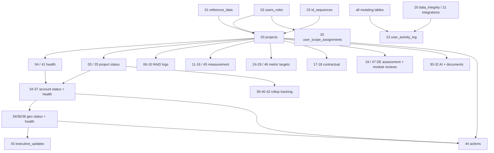

# 11 — Database Schema Reference

**Document type:** Product-Brain Reference
**Product:** ProjectGovernance (working title)
**Status:** Draft — generated 2026-08-30, pending review
**Depends on:** product-brain/01, product-brain/06, product-brain/10
**Feeds:** product-brain/13, product-brain/17, product-brain/19, product-brain/23, product-brain/25

> **Purpose of this document.** The physical schema of record. ProjectGovernance has **no
> ORM migration framework** — the schema is the set of hand-written DDL scripts under
> `db/`. This document lists every script, its tables, keys, foreign keys, generated
> columns and triggers, maps them to the `ENT-*` entities of `product-brain/10`, and calls
> out the structural risks (no migrations, no CHECK constraints).

---

## 1. How the schema is managed

- **Authoring:** hand-written PostgreSQL DDL in `db/tables/00_*.sql … 47_*.sql`.
- **Apply:** `psql -d <database> -f db/run_all.sql`. `run_all.sql` `\ir`-includes the 48
  scripts in dependency order (§3). It creates tables only; it is **not** idempotent
  (`CREATE TABLE` without `IF NOT EXISTS`) — it is a from-empty build.
- **Local dev / tests:** SQLite. `backend/app/core/db.py` builds the async engine
  (`asyncpg` for Postgres, `aiosqlite` for SQLite); SQLite FK enforcement is turned on per
  connection (`PRAGMA foreign_keys=ON`). Tables for tests stand up from `Base.metadata`
  (via `scripts/bootstrap_sqlite.py` / `scripts/seed_sqlite_dev.py`) — **the ORM models,
  not the DDL scripts, define the test schema.** The two can drift.
- **"Migrations":** there is **no Alembic or any migration tool**. Schema changes since the
  initial build are captured as:
  - **Patch scripts** in `db/` (`ALTER TABLE … ADD COLUMN …`, mostly `IF NOT EXISTS`-guarded):
    `add_regions.sql`, `add_consulting_project_type.sql`, `add_consulting_measurements.sql`,
    `add_critical_product_flags.sql`, `add_de_approval_fields.sql`,
    `add_de_assessment_workspace_fields.sql`.
  - **One dated migration** `backend/scripts/migrate_2026_08_review.sql` — adds the 3 review
    columns (`reviewed_by`, `reviewed_at`, `review_comment`) to the three `*_status_reports`
    tables and creates `geo_health_declarations`.
  - **Seed data:** `db/seed_dev.sql`, `db/seed_ai_sample_data.sql`.
- There is **no versioned migration chain** for how Postgres schema changes reach
  shared/prod environments (BACKEND_CODE_REVIEW §0). This is a `RISK` (§7, `product-brain/23`).

---

## 2. Extensions & shared functions — `00_extensions_and_functions.sql`

| Object | Definition | Use |
| --- | --- | --- |
| `pgcrypto` extension | `CREATE EXTENSION IF NOT EXISTS pgcrypto` | UUID / crypto helpers |
| `set_updated_at()` | `plpgsql` trigger function: `NEW.updated_at = now(); RETURN NEW;` | attached as a `BEFORE UPDATE` trigger on every table that has an `updated_at` column (**36 of the 48 files** create at least one such trigger; `01_reference_data.sql` creates 5 — one per reference table). |

There are **no other database functions, no stored procedures, no packages** — all
business logic is Python (`product-brain/13`).

---

## 3. Include order (`db/run_all.sql`)

```
00 extensions_and_functions        24 metric_target_development
01 reference_data                  25 metric_target_support
02 users_roles                     26 metric_target_staffing
03 projects                        27 metric_target_testing
04 health_declarations             28 metric_target_cloud_maintenance
05 project_status_reports          29 metric_target_cloud_migration
06 risk_log                        30 ai_field_suggestions
07 issue_log                       31 ai_row_suggestions
08 dependency_log                  32 project_documents
09 assumption_log                  33 user_scope_assignments
10 opportunity_log                 34 account_geo_status_reports
11 measurement_development         35 project_status_items
12 measurement_support             36 account_geo_status_items
13 measurement_staffing            37 account_health_declarations
14 measurement_testing             38 geo_health_declarations
15 measurement_cloud_maintenance   39 project_status_item_rollup
16 measurement_cloud_migration     40 account_status_item_rollup
17 contractual_commitments         41 health_items
18 milestone_payments              42 project_health_item_rollup
19 de_assessments                  43 executive_updates
20 data_integrity_checklist        44 actions
21 integrations                    45 measurement_consulting
22 audit_activity_log              46 metric_target_consulting
23 id_sequences                    47 de_project_module_reviews
```

The **numbering is the migration trail**: files 34–47 were added after the initial 00–33
build (review cascade, itemised health, rollup tracking, executive updates, actions,
consulting, DE module reviews). New tables are appended, never renumbered.

---

## 4. Per-file / per-table summary

Columns: **File · Table(s) · Purpose · Key / business key · Foreign keys · Notes** (generated
columns, `set_updated_at` trigger `T`, `ENT-*` from `product-brain/10`).

| File | Table(s) | Purpose | Key | FKs | Notes |
| --- | --- | --- | --- | --- | --- |
| 00 | *(functions only)* | `pgcrypto`, `set_updated_at()` | — | — | — |
| 01 | `organizations`, `geos`, `project_types`, `products`, `accounts`, `reporting_periods` | Reference / org hierarchy | `id`; `code`/`name` unique per table | `accounts.geo_id → geos` | `T` on all 5 mutable tables. `ENT-ORG/GEO/PROJTYPE/PRODUCT/ACCOUNT/PERIOD`. |
| 02 | `roles`, `users` | Identity | `roles.code` unique; `users.ldap_username`, `users.email` unique | `users.role_id → roles` | `T` on `users`. Legacy DDL comment lists an "EXECUTIVE" role code; enum is authoritative. `ENT-ROLE/USER`. |
| 03 | `projects` | Project Charter — system of record | `project_code` unique (business key) | `project_type_id, organization_id, geo_id, region_id, account_id, product_id`; `project_manager_id, delivery_manager_id, delivery_excellence_id, de_reviewed_by, created_by → users` | **Generated:** `planned_duration_days`, `actual_duration_days` (`GENERATED ALWAYS AS (end − start) STORED`). `T`. Denormalised health caches (`delivery_declared_overall_health`, `de_assessed_project_health`, `overall_project_health`) kept in sync by the app. `billing_type`, `engagement_type` present but deprecated. `ENT-PROJECT`. |
| 04 | `health_declarations` | Project 6-category RAG (legacy model) | `id` | `project_id → projects (CASCADE)`, `period_id → reporting_periods`, `declared_by → users` | `overall_rating` app-computed. Dated history. `ENT-HEALTHDECL`. |
| 05 | `project_status_reports` | Weekly narrative report | `id` | `project_id (CASCADE)`, `period_id`, `created_by`, `reviewed_by → users` | `T`. `status` free TEXT. Review columns added by `migrate_2026_08_review.sql`. Legacy free-text section columns retained. `ENT-PROJSTATUSREPORT`. |
| 06 | `risk_log` | Risk register | `id`; `RSK-YYYY-NNNN` business code | `project_id (CASCADE)`, owner/identified-by → `users` | `T`. `risk_score` app-computed. `ENT-RISK`. |
| 07 | `issue_log` | Issue register | `id`; `ISS-*` | `project_id (CASCADE)` | `T`. `ENT-ISSUE`. |
| 08 | `dependency_log` | Dependency register | `id`; `DEP-*` | `project_id (CASCADE)` | `T`. `ENT-DEPENDENCY`. |
| 09 | `assumption_log` | Assumption register | `id`; `ASM-*` | `project_id (CASCADE)`; optional dependency ref | `T`. Two status fields (`current_status`, `validation_status`). `ENT-ASSUMPTION`. |
| 10 | `opportunity_log` | Opportunity register | `id`; `OPP-*` | `project_id (CASCADE)` | `T`. `ENT-OPPORTUNITY`. |
| 11 | `measurement_development` (+ `measurement_development_defects`) | Development metrics + SDLC-stage defects | `id` | `project_id (CASCADE)`, `period_id`; defects → parent | `T`. Child: defect counts by `SdlcStage`, internal/external. `ENT-MEAS-DEV(-DEFECT)`. |
| 12 | `measurement_support` | Support metrics | `id` | `project_id (CASCADE)`, `period_id` | `T`. `ENT-MEAS-SUPPORT`. |
| 13 | `measurement_staffing` (+ `measurement_staffing_priority_metrics`) | Professional Staffing metrics + per-priority | `id` | `project_id (CASCADE)`, `period_id`; child → parent | `T`. `ENT-MEAS-STAFFING(-PRI)`. |
| 14 | `measurement_testing` | Testing metrics | `id` | `project_id (CASCADE)`, `period_id` | `T`. `ENT-MEAS-TESTING`. |
| 15 | `measurement_cloud_maintenance` | Cloud Maintenance metrics | `id` | `project_id (CASCADE)`, `period_id` | `T`. `ENT-MEAS-CLOUDMAINT`. |
| 16 | `measurement_cloud_migration` | Cloud Migration metrics | `id` | `project_id (CASCADE)`, `period_id` | `T`. `ENT-MEAS-CLOUDMIG`. |
| 17 | `contractual_commitments` (+ `contractual_commitment_actuals`) | SLA commitments + period actuals | `id`; actual keyed by `(commitment_id, period_date)` | `commitment.project_id (CASCADE)`; `actual.commitment_id (CASCADE)`, `recorded_by` | `T` on commitments. `met_status` derived. `ENT-COMMITMENT(-ACTUAL)`. |
| 18 | `milestone_payments` (+ `milestone_payment_actuals`) | Payment milestones + actual | `id` | `milestone.project_id (CASCADE)`; `actual.milestone_id` | `T`. `status` (Paid On Time / Delayed / Yet To Be Paid) derived. `ENT-MILESTONE(-ACTUAL)`. |
| 19 | `de_assessments`, `de_assessment_alerts`, `de_assessment_findings` | DE assessment + alerts + findings | `id`; `de_assessment_alerts.alert_code` (`ALT-*`) unique | `project_id (CASCADE)`; alerts/findings → `assessment_id (CASCADE)`; `assessed_by`, `raised_by`, `assigned_to → users` | `T` on assessments + findings. Extended by `add_de_assessment_workspace_fields.sql`. `ENT-DEASSESSMENT/DEALERT/DEFINDING`. |
| 20 | `data_integrity_checklist_items` | Freshness-check catalog | `id` | — | `item_name`, `module_name`, `expected_cadence`, `is_active`. No FK to source data — mapped by `module_name` in the service. `ENT-DICHECKITEM`. |
| 21 | `integration_connections`, `backup_restore_log` | Integration registry + backup log | `id`; `integration_name` unique | `updated_by`, `triggered_by → users` | `T` on connections. `config` JSON. `ENT-INTEGRATION/BACKUPLOG`. |
| 22 | `user_activity_log` | Audit / activity log | `id` | `user_id → users` | Append-only. `details` JSON, `ip_address` INET. `ENT-ACTIVITYLOG`. |
| 23 | `id_sequences` | Human-readable code counters | `(entity_code, period_key)` unique | — | `last_number`; read+incremented `FOR UPDATE` by `code_generator` in the record's transaction. `ENT-IDSEQUENCE`. See §6. |
| 24–29 | `metric_target_development` / `_support` / `_staffing` (+`_priority`) / `_testing` / `_cloud_maintenance` / `_cloud_migration` | Per-type metric targets | `id`; one per `(project_id, type)` | `project_id (CASCADE)` | `T`. Upsert semantics. `ENT-METRICTARGET`. |
| 30 | `ai_field_suggestions` | AI field extractions | `id` | `project_id (CASCADE)`, `period_id` | `T`. `confidence` FLOAT; `status` (`AiSuggestionStatus`). `ENT-AIFIELDSUGG`. |
| 31 | `ai_row_suggestions` | AI candidate RAID rows | `id` | `project_id (CASCADE)`, `period_id`; `matched_entity_id` (no FK) | `T`. `row_values` JSON. `ENT-AIROWSUGG`. |
| 32 | `project_documents` | Uploaded source docs | `id` | `project_id (CASCADE)`, `period_id`, `created_by` | `T`. `storage_path` = local filesystem; `ai_status` (`DocumentAiStatus`). `ENT-PROJDOC`. |
| 33 | `user_accounts`, `user_geos`, `user_projects` | RBAC scope joins | composite `(user_id, *_id)` | `→ users`, `→ accounts` / `geos` / `projects` (CASCADE) | `user_projects` **unused** by enforcement. `ENT-USERACCOUNT/USERGEO/USERPROJECT`. |
| 34 | `account_status_reports`, `geo_status_reports` | Account & Geo narrative reports | `id` | `account_id` / `geo_id (CASCADE)`, `period_id`, `created_by`, `reviewed_by` | `T`. Review columns via `migrate_2026_08_review.sql`. `ENT-ACCTSTATUSREPORT/GEOSTATUSREPORT`. |
| 35 | `project_status_items` | Categorised project status lines | `id`; `(project_id, period_id, category)` | `project_id (CASCADE)`, `period_id`; `rolled_up_account_item_id → account_status_items` | `T`. `account_rollup_status` default `Pending`. `ENT-PROJSTATUSITEM`. |
| 36 | `account_status_items`, `geo_status_items` | Categorised account/geo status lines | `id` | `account_id` / `geo_id (CASCADE)`, `period_id`; `account_status_items.rolled_up_geo_item_id` | `T`. `ENT-ACCTSTATUSITEM/GEOSTATUSITEM`. |
| 37 | `account_health_declarations` (+ `account_health_items` — see 41) | Account 6-category RAG | `id`; `(account_id, period_id)` | `account_id (CASCADE)`, `period_id`, `declared_by` | `overall_rating` app-computed. `ENT-ACCTHEALTHDECL`. |
| 38 | `geo_health_declarations` | Geo 6-category RAG | `id`; `(geo_id, period_id)` | `geo_id (CASCADE)`, `period_id`, `declared_by` | Created by `migrate_2026_08_review.sql`. **No UI.** `ENT-GEOHEALTHDECL`. |
| 39 | `project_status_item_rollup` | project→account status-item rollup tracking | *(link table / columns on items)* | `project_status_items`, `account_status_items` | Materialises the Pull link (see also `rolled_up_account_item_id`). |
| 40 | `account_status_item_rollup` | account→geo status-item rollup tracking | *(as above)* | `account_status_items`, `geo_status_items` | — |
| 41 | `project_health_items`, `account_health_items` | Itemised health register (one line per category per period) | `id`; `(scope_id, period_id, category)` | `project_id` / `account_id (CASCADE)`, `period_id`; `rolled_up_account_item_id` | `T`. Coexists with 04/37 legacy model. `ENT-PROJHEALTHITEM/ACCTHEALTHITEM`. |
| 42 | `project_health_item_rollup` | health-item rollup tracking | *(link)* | `project_health_items`, `account_health_items` | — |
| 43 | `executive_updates` | CXO-facing structured content | `id`; `(geo_id, period_id)` | `geo_id (CASCADE)`, `period_id`, `created_by` | `T`. `content` JSON (sections + typed blocks). `status` stays `Draft`. `ENT-EXECUPDATE`. |
| 44 | `actions`, `action_history` | Action Tracker + audit | `id`; `action_code` (`ACT-*`) unique | `action_by_id`, `raised_by`, `closed_by → users`; `action_history.action_id (CASCADE)` | `T` on `actions`. Scoped by `level` + `level_value` (Geo/Account/Project code — **not a FK**). `ENT-ACTION/ACTIONHISTORY`. |
| 45 | `measurement_consulting` | Consulting metrics | `id` | `project_id (CASCADE)`, `period_id` | `T`. Added by `add_consulting_measurements.sql`. `ENT-MEAS-CONSULTING`. |
| 46 | `metric_target_consulting` | Consulting targets | `id` | `project_id (CASCADE)` | `T`. `ENT-METRICTARGET`. |
| 47 | `de_project_module_reviews` | DE per-governance-module verdicts | `id`; `(project_id, module_key)` | `project_id (CASCADE)`, `updated_by` | `T`. `review_action` (`DeModuleReviewAction`). Added by `add_de_approval_fields.sql`. `ENT-DEMODULEREVIEW`. |

**Patch scripts (`db/add_*.sql`) — what each alters:**

| Script | Change |
| --- | --- |
| `add_regions.sql` | `regions` table + `projects.region_id` |
| `add_consulting_project_type.sql` | seeds the Consulting project type |
| `add_consulting_measurements.sql` | `measurement_consulting`, `metric_target_consulting` (= files 45/46) |
| `add_critical_product_flags.sql` | `projects.critical_flag`, `projects.product_flag`, `projects.product_id`, `products` table |
| `add_de_approval_fields.sql` | `projects.de_review_*` columns + `de_project_module_reviews` (= file 47) |
| `add_de_assessment_workspace_fields.sql` | extra `de_assessments` / `de_assessment_findings` columns for the workspace UI |

---

## 5. Value-set enforcement

**There are zero `CHECK` constraints in the schema** (`grep -rc "CHECK (" db/tables/*.sql`
→ 0). Every status / category / enum-like column is plain `TEXT`. The **only** enforcement
of allowed values is the Pydantic `StrEnum` layer in `backend/app/schemas/enums.py`
(`product-brain/06` names them). Consequences:

- A direct SQL write, a data fix, or a bug in a code path that bypasses the schema can
  store any string in a status column.
- `NOT NULL` and `UNIQUE` and `FOREIGN KEY` **are** used and enforced (Postgres natively;
  SQLite via the per-connection `PRAGMA`).
- Referential integrity uses `ON DELETE CASCADE` from child rows to `projects` /
  `accounts` / `geos` throughout, so deleting a project removes all its reporting data.

This is a `RISK` (§7).

---

## 6. `id_sequences` mechanism

- One row per `(entity_code, period_key)` — `period_key` is the calendar year, so codes
  reset annually (`PRJ-2026-0042`, `RSK-2026-0001`).
- `entity_code` ∈ `PROJECT`, `RISK`, `ISSUE`, `DEPENDENCY`, `ASSUMPTION`, `OPPORTUNITY`,
  `DE_ALERT` (`ACTION` uses the same mechanism — `ACT-*`).
- `services/code_generator.py` runs `SELECT … FOR UPDATE` on the sequence row, increments
  `last_number`, and formats the code — **inside the same transaction** as the record being
  numbered, so concurrent creates serialise on that row (BR-PROJ-020, BR-RAID-010).

---

## 7. Known schema risks

Each is a `GAD` entry in `product-brain/23`.

| Risk | Detail | Impact |
| --- | --- | --- |
| **No migration framework** | No Alembic; no versioned migration chain. Postgres schema changes reach shared/prod via ad-hoc `db/add_*.sql` and one `migrate_*.sql`, applied by hand. | Environment drift; risky manual changes; no rollback story; `run_all.sql` is from-empty only. |
| **DDL vs. ORM drift** | Tests build from `Base.metadata` (the models), not the DDL scripts. A column added to a model but not a `db/tables/*.sql` (or vice versa) passes tests but breaks Postgres, or vice versa. | Schema of record is ambiguous. |
| **No CHECK constraints** | Status/category columns are unconstrained `TEXT`; only Pydantic guards values. | Invalid states possible via any non-API write. |
| **`run_all.sql` not idempotent** | `CREATE TABLE` without `IF NOT EXISTS`. | Cannot be re-run to "top up" an existing DB; patch scripts must be tracked separately. |
| **Deprecated columns retained** | `projects.billing_type`, `projects.engagement_type`, and the legacy free-text section columns on `*_status_reports` are still present (`PendingPoints` #6/#12). | Ambiguity about the source of truth. |
| **Rollup tracking split** | Rollup state is held both as a back-pointer column (`rolled_up_*_item_id`) and via files 39/40/42 link tables. | Two representations of the same link. |
| **Local dev on SQLite** | Postgres-only features (generated columns, `INET`, JSON operators) are approximated on SQLite; behaviour can differ from prod. | Bugs found only in prod. |

---

## 8. Table-group map



---

## 9. Assumptions

| ID | Assumption |
| --- | --- |
| A-DB-001 | `ASSUMPTION:` Files 39, 40, 42 (`*_rollup` link tables) exist per `run_all.sql` but their exact columns were not read line-by-line; they are described from the `rolled_up_*_item_id` back-pointers and the rollup service behaviour. |
| A-DB-002 | `ASSUMPTION:` `account_health_items` is created in file 41 alongside `project_health_items` (grouped by the models); confirm the split between files 37 and 41. |
| A-DB-003 | `ASSUMPTION:` `set_updated_at` trigger coverage is "36 of 48 files create ≥ 1 trigger" (grep); a per-table audit is needed to confirm every `updated_at` column has its trigger. |
| A-DB-004 | `ASSUMPTION:` The DDL scripts are the schema of record for **Postgres**; the ORM models are authoritative for **SQLite/tests**. Reconciling the two is out of scope for this pack (a `GAD`). |
