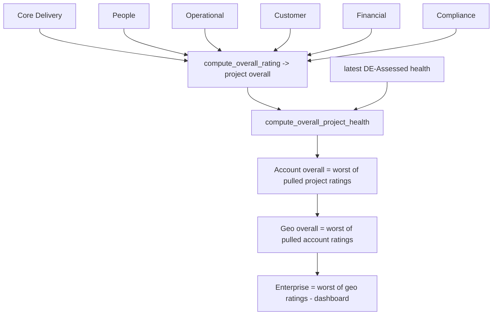
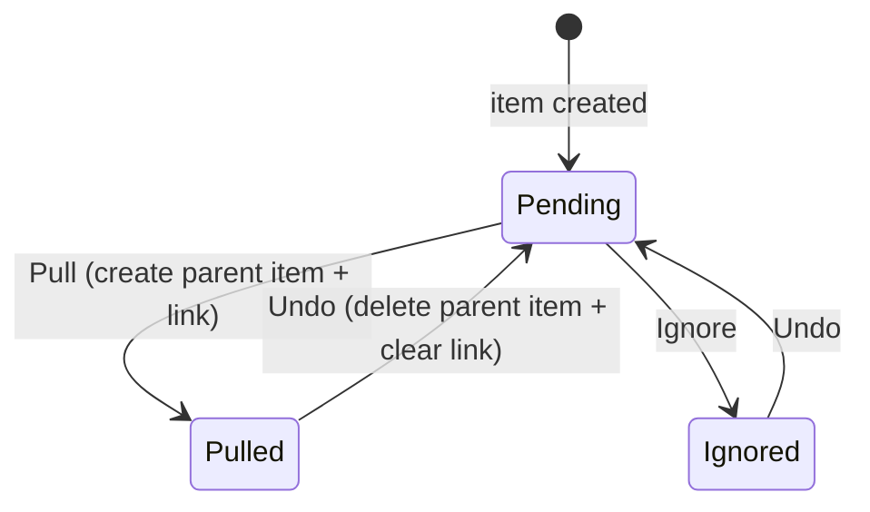

# 13 — Domain Logic & Rollup Specification

**Document type:** Product-Brain Specification
**Product:** ProjectGovernance (working title)
**Status:** Draft — generated 2026-08-30, pending review
**Depends on:** product-brain/01, product-brain/05, product-brain/06, product-brain/10, product-brain/11
**Feeds:** product-brain/15, product-brain/16, product-brain/17, product-brain/25, product-brain/26

> **Purpose of this document.** ProjectGovernance has **no stored procedures** — the proven
> logic the TransFlow sample kept in `PKG_*` lives here in `backend/app/services/*` and
> `backend/app/crud/*`. This document specifies each service as a **contract** (what it
> does, its inputs/outputs, the rules it enforces, the status transitions it drives) and
> then, in Part B, specifies the **rollup and aggregation semantics** — worst-wins health,
> period-scoped metric sums, and the Pull/Ignore/Undo state machine — precisely enough to
> re-implement. `SVC-*` IDs are defined here.

---

# PART A — Service Contracts

## A1. Conventions

- **Service ID:** `SVC-<NAME>` — one per `app/services/*.py` public function group.
- **Callers** are FastAPI endpoints (`product-brain/17`) or other services. Services take an
  `AsyncSession` (`db`) plus scalar parameters; they **do not open their own transaction**
  — `get_db()` (`app/core/db.py`) commits on success / rolls back on exception, so a
  service's `db.flush()` participates in the request's single transaction.
- **CRUD layer.** `app/crud/base.py` (`CRUDBase`) provides generic `get` / `list` /
  `create` / `update` / `delete`; `app/api/v1/factory.py` (`build_crud_router`) turns a
  `CRUDBase` + schemas into a REST router (used for reference data). Business services
  wrap or bypass `CRUDBase` where they need extra logic (status guards, code generation,
  cross-entity writes).
- **Error modes** are Python exceptions mapped to HTTP by the endpoint (`404` / `400` /
  `409` / `422`).

## A2. `SVC-HEALTH-ROLLUP` — worst-wins health reducer

| Field | Value |
| --- | --- |
| Source | `app/services/health_rollup.py` |
| Purpose | Reduce a set of RAG ratings to the single worst rating; combine Delivery-Declared and DE-Assessed into the overall project health. |
| Callers | health-declaration writes (project/account), DE assessment finalise, `SVC-ACCOUNT-HEALTH-ROLLUP`, `SVC-GEO-ROLLUP`, dashboard aggregation. |
| Inputs | `compute_overall_rating(ratings: list[HealthRating])`; `compute_overall_project_health(delivery_declared: HealthRating\|None, de_assessed: HealthRating\|None)`. |
| Outputs | one `HealthRating`, or `None` only when `compute_overall_project_health` gets two `None`s. |
| Logic | Iterate `HEALTH_RATING_SEVERITY = [Red, Potential Red, Amber, Green]` in order; return the **first** value present in the input. `compute_overall_rating([])` → `Green`. `compute_overall_project_health` filters out `None`s then calls `compute_overall_rating`. |
| Rules enforced | BR-HEALTH-010, BR-HEALTH-020, BR-ROLLUP-040. |
| Status transitions | none (a rating is not a lifecycle). |
| Error modes | none — total function. |
| Remarks | Pure; the single source of the worst-wins rule. Deterministic — a good regression anchor (`product-brain/25`). |

## A3. `SVC-ACCOUNT-ROLLUP` — project → account rollup

| Field | Value |
| --- | --- |
| Source | `app/services/account_rollup.py` |
| Purpose | For an account + period, compute the summed Key Metrics and list every child project's `Pending` status items; execute Pull/Ignore/Undo. |
| Callers | `GET/POST /accounts/{id}/rollup` (MOD-ROLLUP); the Account Reporting screen pre-fills Key Metrics from the result. |
| Inputs | `compute_account_rollup(db, account_id, period_id)`; `pull_rollup_item(db, account_id, project_item_id)`. |
| Outputs | `AccountRollupResponse` = `metrics` (`revenue`, `onsite_fte`, `offshore_fte`, `projects_count` — each `_sum()` over the account's project status reports for the period) + `items` (each project `ProjectStatusItem` with its `account_rollup_status`). `pull_rollup_item` → the created `AccountStatusItem`. |
| Logic — `_sum(values)` | `None` if **all** inputs are `None`; otherwise the sum of the non-`None` values (a partially-reported account still sums). |
| Logic — `pull_rollup_item` | (1) load the `ProjectStatusItem`; **`RollupItemNotFoundError`** if missing or not a child of this account. (2) **`RollupItemAlreadyHandledError`** if `account_rollup_status != Pending`. (3) create an `AccountStatusItem` (same category + description, `account_id`, `period_id`), (4) set the source item `account_rollup_status = Pulled` and `rolled_up_account_item_id = <new id>`, (5) `db.flush()`. |
| Rules enforced | BR-ROLLUP-010, BR-ROLLUP-020, BR-ROLLUP-050. |
| Status transitions | `ProjectStatusItem.account_rollup_status`: `Pending → Pulled` (`product-brain/06` §9). |
| Error modes | `RollupItemNotFoundError` → `404`; `RollupItemAlreadyHandledError` → `409`. |
| Remarks | **Ignore** sets `Ignored` without creating a parent; **Undo** deletes the parent `AccountStatusItem` and resets the source to `Pending` (endpoint logic over the same service surface). |

## A4. `SVC-ACCOUNT-HEALTH-ROLLUP` — project → account health rollup

| Field | Value |
| --- | --- |
| Source | `app/services/account_health_rollup.py` |
| Purpose | Same Pull/Ignore/Undo mechanism as A3 but for **health items** — no metric summation. |
| Callers | `GET/POST /accounts/{id}/health-rollup`. |
| Inputs | `compute_account_health_rollup(db, account_id, period_id)`; `pull_health_rollup_item(db, account_id, project_item_id)`. |
| Outputs | `AccountHealthRollupResponse` = `items` (project `ProjectHealthItem`s with rollup status). `pull_health_rollup_item` → the created `AccountHealthItem`. |
| Logic | Identical guard sequence to A3 (`RollupItemNotFoundError` / `RollupItemAlreadyHandledError`); creates an `AccountHealthItem`; sets source `account_rollup_status = Pulled`. The account's **overall** rating is then `SVC-HEALTH-ROLLUP` over the pulled item ratings. |
| Rules enforced | BR-ROLLUP-010, BR-ROLLUP-040. |
| Status transitions | `ProjectHealthItem.account_rollup_status`: `Pending → Pulled`. |
| Error modes | as A3. |
| Remarks | Reuses A3's exception classes. |

## A5. `SVC-GEO-ROLLUP` — account → geo rollup

| Field | Value |
| --- | --- |
| Source | `app/services/geo_rollup.py` |
| Purpose | One level up from A3: for a geo + period, sum the child **account** status reports' Key Metrics and list `Pending` account status items; Pull creates a `GeoStatusItem`. |
| Callers | `GET/POST /geos/{id}/rollup`. |
| Inputs | `compute_geo_rollup(db, geo_id, period_id)`; `pull_rollup_item(db, geo_id, account_item_id)`. |
| Outputs | `GeoRollupResponse` = `metrics` (`_sum` over account status reports) + `items` (`AccountStatusItem`s). Pull → `GeoStatusItem`. |
| Logic | Same `_sum` semantics; same three-step guard; sets `AccountStatusItem.account_rollup_status = Pulled` and `rolled_up_geo_item_id`. Reuses `RollupItemNotFoundError` / `RollupItemAlreadyHandledError` from `SVC-ACCOUNT-ROLLUP`. |
| Rules enforced | BR-ROLLUP-010/020/050. |
| Status transitions | `AccountStatusItem.account_rollup_status`: `Pending → Pulled`. |
| Error modes | as A3. |
| Remarks | There is no geo → enterprise service — the CXO view is `SVC-HEALTH-ROLLUP` over geos, computed in the dashboard. |

## A6. `SVC-DATA-INTEGRITY-ROLLUP` — freshness evaluation

| Field | Value |
| --- | --- |
| Source | `app/services/data_integrity_rollup.py` |
| Purpose | For each active checklist item, find when the project last updated that data point and decide `Updated` / `Not Updated` / critical against the item's cadence. |
| Callers | `GET /data-integrity-checklist` (per project) and the portfolio grid (bulk variant). |
| Inputs | `compute_status_row(db, project_id, item)`; `compute_status_rows_bulk(db, project_ids, items)`. |
| Outputs | per row: `module_name`, `item_name`, `expected_cadence`, `last_updated`, `is_updated`, `is_critical_gap`. |
| Logic — `MODULE_LOOKUP` | A fixed map from `DataIntegrityChecklistItem.module_name` to a strategy: `_max_updated_at_date` / `_max_created_at_date` / a `_max_date_column` on the source model, or `_contractual_actuals_max_date`. **An item whose `module_name` is not in the map is conservatively reported as not updated** (BR-DI-020 — indeterminate/not-updated). |
| Logic — `_is_updated(last_updated, cadence)` | `None` → `False`; an "always"-style cadence → `True`; otherwise `True` iff `(today − last_updated).days ≤ window(cadence)` where the window is derived from the cadence (Weekly / Monthly / Quarterly). |
| Logic — `is_critical_gap` | `True` iff `(today − last_updated).days > 2 × window(cadence)`. |
| Rules enforced | BR-DI-010, BR-DI-020. |
| Status transitions | none — computed at query time. |
| Error modes | none. |
| Remarks | Bulk variant pre-fetches `MAX(date)` per module across all project ids in one query each. Cadence windows depend on the ratified model in `product-brain/14`. |

## A7. `SVC-GOVERNANCE-COMPLETENESS` — DE approval scoring

| Field | Value |
| --- | --- |
| Source | `app/services/governance_completeness.py` |
| Purpose | Score how ready a project is for governance approval: per-module Complete/Incomplete, an overall %, and a gap count. |
| Callers | `GET /de-approval/queue`, `GET /de-approval/{id}` (MOD-DEAP). |
| Inputs | `compute_governance_completeness(db, project)`. |
| Outputs | `GovernanceCompleteness` = `completion_pct`, `modules` (per-module key, label, complete flag, `review_action`, `last_updated`), `gaps_count`, gap text per incomplete module. |
| Logic — `MODULES` | 6 governance modules with a **mandatory** flag: Project Profile *(mandatory)*, Scope & Schedule *(mandatory)*, Map Oracle Projects *(mandatory)*, Contractual Compliance *(mandatory)*, RAIDO Register *(optional)*, Measurement *(optional)*. |
| Logic — `_module_complete` | Profile / Schedule → `ProjectRead.profile_completion_flag` / `schedule_completion_flag`; Map Oracle → `count(ProjectOracleId) > 0`; Contractual → `commitments > 0 AND milestones > 0`; RAIDO → **all five registers** have ≥ 1 row; Measurement → a measurement record exists. |
| Logic — score | `completion_pct = round(100 × <mandatory modules complete> / <mandatory total>)` — **% is over the mandatory subset only** (4 modules). `gaps_count = <all incomplete modules>` (mandatory + optional). |
| Rules enforced | BR-DEAP-040, BR-RAID-050 (RAIDO not blocking). |
| Status transitions | none directly — informs the DE decision (BR-DEAP-030). |
| Error modes | none. |
| Remarks | RAIDO and Measurement being optional is why a project can be approved with an incomplete RAIDO (`PendingPoints` #15). |

## A8. `SVC-MEASUREMENT-METRICS` — computed KPI derivation

| Field | Value |
| --- | --- |
| Source | `app/services/measurement_metrics.py` |
| Purpose | Derive the read-only computed metrics for each engagement type from the entered inputs, at write time. |
| Callers | measurement create/update endpoints (MOD-MEAS); the read schema returns the stored computed values. |
| Inputs | `compute_{development,support,staffing,testing,consulting,cloud_maintenance,cloud_migration}_metrics(data: dict)`; helpers `_safe_div(num, den, *, pct)`, `_pct_variation(planned, actual)`, `compute_defect_leakage_pct(...)`, `compute_staffing_priority_trailing_averages(db, …)` *(async — averages over prior periods)*. |
| Outputs | a dict of metric → value; **`None` wherever a required input is missing or a denominator is `0`** (`_safe_div` returns `None`). |
| Logic | Per-type formulas — see `product-brain/15` for the full metric list, formula, unit, and baseline. `_pct_variation = (actual − planned) / planned × 100`. `defect_leakage_pct = external / (internal + external) × 100`. |
| Rules enforced | BR-MEAS-010 (computed, read-only), BR-MEAS-020 (`None` not `0`). |
| Status transitions | none. |
| Error modes | none — missing inputs yield `None`, not an error. |
| Remarks | Deterministic per input dict — a regression anchor. Some metrics documented in the BRS are permanently `None` because no raw input feeds them (`product-brain/15` §Gaps). |

## A9. `SVC-CODE-GENERATOR` — human-readable codes

| Field | Value |
| --- | --- |
| Source | `app/services/code_generator.py` |
| Purpose | Issue a unique, sequential, human-readable code for a new record. |
| Callers | project create, RAID(O) create, DE alert create, Action create. |
| Inputs | `generate_code(db, entity_code)` — `entity_code` ∈ `PROJECT`, `RISK`, `ISSUE`, `DEPENDENCY`, `ASSUMPTION`, `OPPORTUNITY`, `DE_ALERT` (and `ACTION`). |
| Outputs | `"{PREFIX}-{period_key}-{last_number:04d}"` — e.g. `PRJ-2026-0042`, `RSK-2026-0001`, `ALT-2026-0007`. Prefixes: `PROJECT→PRJ`, `RISK→RSK`, `ISSUE→ISS`, `DEPENDENCY→DEP`, `ASSUMPTION→ASM`, `OPPORTUNITY→OPP`, `DE_ALERT→ALT`, `ACTION→ACT`. |
| Logic | `SELECT … FROM id_sequences WHERE (entity_code, period_key) FOR UPDATE` → increment `last_number` → format. `period_key` = the calendar year, so sequences reset annually. Runs inside the caller's transaction, so concurrent creates serialise on the sequence row. |
| Rules enforced | BR-PROJ-020, BR-RAID-010, BR-DEA-030, BR-ACTION-010. |
| Status transitions | none. |
| Error modes | if no `id_sequences` row exists for `(entity_code, period_key)` it must be created first (seed / lazy insert). |
| Remarks | The only place row-level locking is used. |

## A10. `SVC-DASHBOARD-AGGREGATION` — portfolio aggregation

| Field | Value |
| --- | --- |
| Source | `app/services/dashboard.py` (~140 KB — the largest service) |
| Purpose | Build every dashboard payload (`product-brain/09`): KPI tiles, governance/account matrices, Top Highlights, and the 14 Project Health grids. |
| Callers | `GET /dashboard/summary` and `/dashboard/*` sections; `/dashboard/project-health/*` grids. |
| Inputs | the caller's user (for scope), plus filters (Geo / Account / Project / Project Type / Health status) and pagination. |
| Outputs | typed DTOs only — **no entities owned or written**. |
| Logic | Narrow SQL queries per source, then grouping and worst-wins reduction **in Python** (via `SVC-HEALTH-ROLLUP`). Every query is scope-filtered (BR-DASH-010). Recomputed on each request — never a stored aggregate (BR-DASH-030). |
| Rules enforced | BR-DASH-010, BR-DASH-020, BR-DASH-030. |
| Status transitions | none. |
| Error modes | empty scope → empty payload (not an error). |
| Remarks | The `/dashboard/project-health/*` grids are `require_role(PMO, ADMIN, CXO)`-gated. Performance target: `product-brain/20`. |

---

# PART B — Rollup & Aggregation Semantics

## B1. Worst-wins health

`HEALTH_RATING_SEVERITY = [Red, Potential Red, Amber, Green]` (worst → best). The reducer
returns the first of these present in the input; an empty input → `Green`.

**Applied at three levels:**

1. **Category → project overall.** `compute_overall_rating([core_delivery, people, operational, customer, financial, compliance])`. One `Red` category ⇒ project overall `Red`.
2. **Delivery-Declared + DE-Assessed → effective overall.** `compute_overall_project_health(delivery_declared_overall, latest_de_assessed)` — worst of the two; `None` only if both absent. Stored on `projects.overall_project_health`.
3. **Child tier → parent tier.** Account overall = worst of the *pulled* project health item ratings; Geo overall = worst of the pulled account ratings; Enterprise = worst of geo ratings (computed in the dashboard).



## B2. Period-scoped Key Metric summation

For a parent (account or geo) and a `period_id`:

```
metric_total = _sum([ child_report.<metric> for child_report in <children's status reports for that period> ])
```

where `<metric>` ∈ {`revenue`, `onsite_fte`, `offshore_fte`, `projects_count`} and
`_sum` returns `None` iff **every** child value is `None`, else the sum of the non-`None`
values. The result **pre-fills** the parent's Key Metrics on its Reporting screen (the
Account/Geo Manager may then override). Children = an account's projects (for account
rollup) or a geo's accounts (for geo rollup).

## B3. Status Item vs Health Item rollup

| | Status items | Health items |
| --- | --- | --- |
| Source entity | `ProjectStatusItem` / `AccountStatusItem` | `ProjectHealthItem` / `AccountHealthItem` |
| Rollup field | `account_rollup_status` (`RollupStatus`) | `account_rollup_status` |
| Back-pointer | `rolled_up_account_item_id` / `rolled_up_geo_item_id` | `rolled_up_account_item_id` |
| Metric summation | yes (B2) | no |
| Parent overall | narrative list only | worst-wins over pulled ratings (B1.3) |
| Service | `SVC-ACCOUNT-ROLLUP` / `SVC-GEO-ROLLUP` | `SVC-ACCOUNT-HEALTH-ROLLUP` |

## B4. Pull / Ignore / Undo state machine



- **Pull** — guard `status = Pending` (`RollupItemAlreadyHandledError` / `409` otherwise);
  guard "item is a child of this parent" (`RollupItemNotFoundError` / `404` otherwise);
  create the parent item copying `category` + `description`; set source `Pulled` +
  `rolled_up_*_item_id`.
- **Ignore** — set `Ignored`; no parent item.
- **Undo** — delete the parent item (if any); set source back to `Pending`; clear the
  back-pointer.
- Idempotency: a repeated Pull on an already-`Pulled` item is a `409`, not a duplicate
  (BR-ROLLUP-010).

## B5. Computed live vs cached on `projects`

| Value | Where it lives | When refreshed |
| --- | --- | --- |
| `projects.delivery_declared_overall_health` | **cached** column | on every health-declaration write for the project |
| `projects.de_assessed_project_health` | **cached** column | on DE assessment finalise (`_finalize_assessment`) |
| `projects.overall_project_health` | **cached** column | whenever either of the above changes (worst-wins of the two) |
| `projects.planned_duration_days` / `actual_duration_days` | **DB-generated** (`GENERATED ALWAYS AS … STORED`) | automatically from the date columns |
| Account / Geo / Enterprise overall health | **live** | computed by `SVC-*-ROLLUP` / dashboard on each request |
| Key Metric sums | **live** | computed on rollup / dashboard request; the *pre-filled* value the parent saves becomes a stored `AccountStatusReport` field |
| All dashboard KPIs and grids | **live** | recomputed every request (BR-DASH-030) |
| Data Integrity `Updated` / `Not Updated` | **live** | computed at query time |
| Governance completeness % | **live** | computed on each DE-approval queue / detail request |

Everything except the four project-level caches and the two DB-generated columns is
recomputed on read.

---

## Assumptions

| ID | Assumption |
| --- | --- |
| A-SVC-001 | `ASSUMPTION:` `SVC-*` IDs are defined here for the first time; `17`/`25`/`26` reference them. |
| A-SVC-002 | `ASSUMPTION:` The Data Integrity cadence **windows** (days per Weekly/Monthly/Quarterly) are read as "derived from the cadence" but not pinned to exact numbers here — `product-brain/14` ratifies them. |
| A-SVC-003 | `ASSUMPTION:` "Undo" and "Ignore" are endpoint logic layered over the rollup services; the exact function names for those two paths were not confirmed (only `pull_rollup_item` / `pull_health_rollup_item` are public). |
| A-SVC-004 | `ASSUMPTION:` `_finalize_assessment` writes the three cached health columns on `projects`; the trigger for refreshing `delivery_declared_overall_health` on a health-declaration write is assumed to be application code, not a DB trigger. |
| A-SVC-005 | `ASSUMPTION:` `governance_completeness` measures `completion_pct` over the 4 mandatory modules only, while `gaps_count` includes the 2 optional ones — confirmed from the code but worth a UX note (a project can show 100% with open gaps). |
