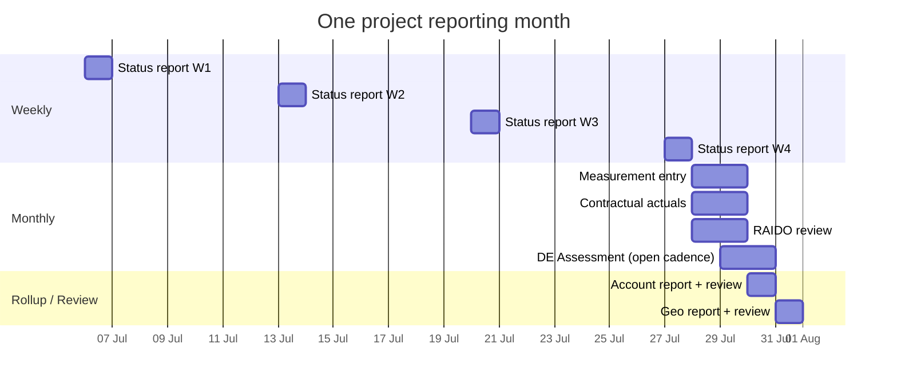

# 14 — Reporting Period & Cadence Model

**Document type:** Product-Brain Specification
**Product:** ProjectGovernance (working title)
**Status:** Draft — generated 2026-08-30, pending review
**Depends on:** product-brain/01, product-brain/05, product-brain/06, product-brain/12, product-brain/13
**Feeds:** product-brain/16, product-brain/23, product-brain/25

> **Purpose of this document.** How ProjectGovernance's time model works — period types, how
> a week is keyed, how "the current period" is resolved on each screen, what cadence each
> module is expected to report on, and how submission / defaulter tracking hangs off that.
> Several cadences are **proposed, not ratified** (BRS §8 Open Items 3–6,
> `docs/ux-requirements.md` §7); those are collected in §8 as `DECISION REQUIRED` for
> `product-brain/23`.

---

## 1. Period types

`reporting_periods` rows carry a `period_type`, a unique `code`, a `label`, a
`[start_date, end_date]` range, and an `is_active` flag (`ENT-PERIOD`, `product-brain/10`).

| Type | `code` example | `label` example | Purpose |
| --- | --- | --- | --- |
| **Weekly** | `2026-W31` | `Week 31, 2026` | Project Status Reporting; the base cadence. |
| **Monthly** | `2026-07` | `Jul 2026` | Monthly Review (Measurements + Contractual + RAIDO); Account/Geo reporting; DE Assessment *(proposed)*. |
| **Baseline** | `BASELINE` (sentinel row) | — | A single seeded row that **project-creation-time** records reference instead of a real Weekly/Monthly period — used by the initial Health Declaration, baseline Measurement, and AI suggestions captured during Create Project. `useBaselinePeriodId()` resolves it by `code = "BASELINE"`. |

`PeriodType` (`schemas/enums.py`) = `Weekly | Monthly | Baseline`. The DB `period_type`
column comment names only `Weekly, Monthly`; **Baseline is realised as the special
`code = "BASELINE"` row**, not as a distinct `period_type` value.

---

## 2. Week keying

- A Weekly period's `code` is `YYYY-Wnn`; its `label` is `Week nn, YYYY`.
- `PendingPoints` #9: **weeks are populated with the Monday date** — i.e. a week is
  identified by its Monday, and `start_date` is that Monday.
- Periods are **pre-seeded** (`db/seed_dev.sql`). There is **no admin screen** to open,
  close, or roll a period (`product-brain/12` §5) — a `GAD`.

---

## 3. "Current period" resolution

Frontend helper `currentPeriod(periods, type)` (`lib/period-utils.ts`):

1. the period of that `type` whose `start_date ≤ today ≤ end_date`; else
2. the most recent **active** period of that type (`is_active`, sorted by `start_date`).

Per surface:

| Surface | Which period | How |
| --- | --- | --- |
| Project Status (`SCR-STATUS-20`) | **Weekly** — user picks the reporting week from a selector; `currentPeriod(_, "Weekly")` is the default offered. | explicit selector; `reporting-period-badge` shows it |
| Measurement / Contractual / RAIDO (Monthly Review) | **Monthly** — `reporting-period-badge` "runs on a monthly cycle; falls back to the current month". | `useReportingPeriod()` → `currentPeriod(_, "Monthly")` |
| Self-Assessment / RAG Status | period selector (Weekly aligned with Status by proposal, `docs/ux-requirements.md` §4.3). | selector |
| DE Assessment | `assessment_date` + `next_assessment_due_date` are free dates; there is **no period picker** — cadence is undecided (§8). | free date fields |
| Account / Geo Reporting | the tier's own period selector (Weekly or Monthly per the report). | selector |
| Dashboards | live aggregation — no single period; grids show a `Period` column per row. A per-tile "data as of" indicator is proposed (§8). | n/a |
| Create Project records (baseline health, baseline measurement, create-context AI) | **Baseline** sentinel. | `useBaselinePeriodId()` |
| AI Hub document upload | `?period=` in the URL, else `currentPeriod` for the context. | URL / default |

The `project-nav` rail filters its checklist into **Weekly** and **Monthly** groups so a PM
sees which artefacts are due this week vs. this month.

---

## 4. Per-module expected cadence

| Module / artefact | Cadence | Status | Source of truth |
| --- | --- | --- | --- |
| Project Charter (setup fields) | Once at creation; edited on change events | **Confirmed** | BRS FR-CHART-1/2; `docs/ux-requirements.md` §4.3 |
| Health Declaration (6-category RAG) | **Weekly**, aligned with Project Status | ⚠ Proposed | `docs/ux-requirements.md` §4.3 control gap #1; BRS FR-CHART-8 |
| Project Status Report | **Weekly** — one dated report per project per week | **Confirmed** | BRS FR-STAT-1/2; `ux` §4.4 |
| Risk / Issue / Dependency / Assumption / Opportunity | Items created ad hoc; **register reviewed Monthly** | Confirmed (review); ⚠ review-date fields inconsistent | BRS FR-RAID-8; `ux` §4.5 |
| RAID Last/Next Review Date fields | Present on **Risk only**; Assumption has `Validation Date` | ⚠ Open — extend to Issue / Dependency / Opportunity? | BRS §8 Open Item 3 |
| Measurement (all 7 types) | **Monthly** snapshot per reporting period | ⚠ Proposed for all types; source data guarantees it only for Development | BRS FR-MEAS-8; `ux` §4.10 |
| Metric Targets | Set at baseline; updated on change | Confirmed | `product-brain/04` FS-TARGET |
| Contractual Commitment actuals | **Per the commitment's own `Frequency`** (One Time / Weekly / Fortnight / Monthly / Quarterly / Half Yearly / Phase Wise) | **Confirmed** (modelled in the data) | BRS FR-CONT-1/2 |
| Milestone Payments | Event-based, tied to each milestone's expected/actual date | **Confirmed** | BRS FR-CONT-3/4 |
| DE Assessment | **Monthly or Quarterly** per project | ⚠ **Open** | BRS §8 Open Item 5 |
| Data Integrity Checklist | **Weekly** run; each row judged against **its own** cadence | ⚠ Proposed (weekly run); per-row cadence confirmed as the mechanism | BRS FR-DI-2; `ux` §4.13; `product-brain/13` A6 / `16` |
| Account Status & Health | Same cadence as the reports it rolls up (Weekly items, Monthly review) | ⚠ Proposed | `ux` §4 |
| Geo Status & Health | As Account | ⚠ Proposed | `ux` §4 |
| Executive Update | Prepared per Geo per period (Monthly assumed) | ⚠ Proposed | `design-reference/executive-content-builder.md` |
| Dashboards | Real-time / on-demand — live aggregation | **Confirmed** | BRS FR-DASH-3 |

`DataIntegrityChecklistItem.expected_cadence` value set: `Weekly | Monthly | Quarterly | Ad Hoc`.
The cadence → freshness-window mapping used by `SVC-DATA-INTEGRITY-ROLLUP` (`product-brain/13`
A6) must be pinned (§8).

---

## 5. Monthly Review composition

`PendingPoints` #22: the Monthly Review comprises **Measurements + Contractual Compliance +
RAIDO** — *"remove others"* (the earlier design also pulled Charter and Status into the
monthly cycle). So:

- **Weekly:** Project Status Report (+ Health Declaration, proposed).
- **Monthly:** Measurement entry, Contractual/Milestone actuals, RAIDO register review
  (Last/Next Review Date refresh), DE Assessment *(cadence open)*.
- The `project-nav` checklist reflects this split.

---

## 6. Submission & defaulter tracking

BRS §7 and `PendingPoints` #25 require tracking whether weekly and monthly reports are
submitted, with a **"view defaulters at all levels"** capability.

| Tier | "Submitted for the period" means | Defaulter surfaced as |
| --- | --- | --- |
| Project (Weekly) | a `ProjectStatusReport` for the current Weekly period with `status ∈ {Submitted, Approved}` | RPT-RAG-10 "Reporting Overdue" KPI; `N-STATUS-DEFAULTER` *(planned)* |
| Project (Monthly) | Measurement + Contractual actuals + RAIDO review present for the current Monthly period | RPT-DI-10 gaps; `N-REVIEW-DEFAULTER` *(planned)* |
| Account | an `AccountStatusReport` `Submitted` for the period | Governance matrix; "Pending Approvals" |
| Geo | a `GeoStatusReport` `Submitted` for the period | as Account |

**Today** this is realised only as **derived KPIs** (`product-brain/09` §B3) — there is no
dedicated cross-tier defaulter screen and no push notification. Both are **Planned** and
depend on ratifying the cadences below.

---

## 7. Interaction with Data Integrity

The Data Integrity checklist (`product-brain/16`) is the machine-readable form of this
model: each `DataIntegrityChecklistItem` names a `module_name` and an `expected_cadence`,
and `SVC-DATA-INTEGRITY-ROLLUP` compares the source data's last-updated date to a window
derived from that cadence (`Updated` if within the window; `is_critical_gap` if beyond
2× the window). **Every ⚠ Proposed cadence in §4 must be ratified before the checklist's
"Not Updated" verdicts are trustworthy** (BRS FR-DI-2 depends on Open Items 3–5).

---

## 8. Open decisions (`DECISION REQUIRED` → `product-brain/23`)

| ID hint | Decision | Why it matters |
| --- | --- | --- |
| GAD (Open Item 3) | Do Issue / Dependency / Opportunity get `Last Review Date` / `Next Review Date` fields to match Risk? | A consistent "due for monthly review" filter and defaulter list across all five registers. |
| GAD (Open Item 4) | Do all 7 Measurement tabs carry an explicit Reporting-Period selector and retain prior periods (not just Development)? | Trend charts and historical comparison; Data Integrity per-row cadence. |
| GAD (Open Item 5) | DE Assessment cadence — **Monthly or Quarterly** per project? | Drives `next_assessment_due_date`, the overdue KPI, and Data Integrity's DE row. |
| GAD (Open Item 6) | A per-tile "data as of / last refreshed" indicator on dashboards? | Modules update on different cadences; users must know how fresh each number is. |
| GAD (new) | Pin the cadence → freshness-window day counts (`Weekly` = ? days, `Monthly` = ?, `Quarterly` = ?) used by `SVC-DATA-INTEGRITY-ROLLUP`. | The `Updated` / critical-gap verdicts are otherwise implementation-defined. |
| GAD (new) | A period-management admin screen (open / close / roll periods; mark "current"). | Periods are seed-only today; a new week/month must be inserted by script. |
| GAD (new) | Whether Health Declaration, Account/Geo reporting, and Executive Update cadences are Weekly or Monthly. | They are all "⚠ Proposed" in `docs/ux-requirements.md`. |

---

## 9. A monthly cycle (illustrative)

---

## 10. Assumptions

| ID | Assumption |
| --- | --- |
| A-PC-001 | `ASSUMPTION:` `reporting_periods` **does** carry an `is_active` column (seen in `models/reference_data.py`) — this corrects `product-brain/12` A-MD-003, which said reference tables have none. |
| A-PC-002 | `ASSUMPTION:` Weekly period `start_date` = the week's Monday (`PendingPoints` #9); the exact week-numbering scheme (ISO vs. other) is unconfirmed. |
| A-PC-003 | `ASSUMPTION:` The `BASELINE` sentinel row is seeded by `db/seed_dev.sql`; in an environment where the seed has not run, baseline-context screens have no period to reference. |
| A-PC-004 | `ASSUMPTION:` Every "⚠ Proposed" cadence in §4 is treated as the working default until ratified; `product-brain/16` and `13` A6 use these. |
