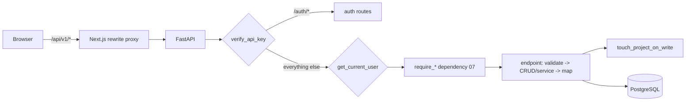

# 17 — API Specification

**Document type:** Product-Brain Specification
**Product:** ProjectGovernance (working title)
**Status:** Draft — generated 2026-08-30, pending review
**Depends on:** product-brain/01, product-brain/05, product-brain/06, product-brain/07, product-brain/08, product-brain/10, product-brain/13
**Feeds:** product-brain/18, product-brain/21, product-brain/25, product-brain/26

> **Purpose of this document.** The REST API contract. Every endpoint is a thin adapter:
> authenticate → authorize (`product-brain/07`) → validate (Pydantic) → call CRUD /
> service (`product-brain/13`) → map the result. `API-<AREA>-<NN>` IDs are defined here.
> This is the narrative reference alongside the live OpenAPI at `/docs`. `BR-*` cite
> `product-brain/05`; status names cite `product-brain/06`; `SVC-*` cite `product-brain/13`.

---

## 1. Conventions

| Aspect | Detail |
| --- | --- |
| Base path | `/api/v1` (relative). `frontend/next.config.ts` `rewrites()` proxies `/api/*` to the FastAPI origin so the browser is always **same-origin** (needed for the session cookie). |
| Media type | `application/json; charset=utf-8`. Dates ISO-8601. UUIDs in path params. |
| Auth headers | **`X-API-Key: <shared static key>`** on every request (BR-SEC-010) + the httpOnly **`pg_session`** cookie (`credentials: "include"`) (BR-SEC-020). |
| Error shape | FastAPI default: `{ "detail": "<message>" }` for `4xx`; `{ "detail": [ {loc, msg, type}, … ] }` for `422` validation errors. |
| Status codes | `200` OK · `201` Created · `204` No Content · `400` bad state/precondition · `401` unauthenticated · `403` not authorized / out of scope · `404` not found · `409` conflict (e.g. rollup already handled) · `422` validation. |
| Pagination | `PaginationParams` (`app/api/deps.py`): `?skip=<int ≥ 0>&limit=<1..200, default 50>`. Paged responses use `Page[T]` = `{ items: [...], total, skip, limit }`. |
| Idempotency | none — no `Idempotency-Key`. Human-readable codes are generated server-side (`SVC-CODE-GENERATOR`). |
| Concurrency | none — no `ETag` / `If-Match`; last write wins (no `row_version`). |
| Side effect | `touch_project_on_write` runs after any successful project-scoped write, updating the project's activity marker (BR-AUDIT-010). |

### Request lifecycle



---

## 2. Authentication endpoints (`API-AUTH-*`)

Mounted **before** the session gate — reachable without `pg_session` (still needs `X-API-Key`).

| API ID | Method · Path | Purpose | Request | Response | Notes / BR |
| --- | --- | --- | --- | --- | --- |
| API-AUTH-10 | `GET /auth/config` | Which login UI to render | — | `{ "auth_type": "no_password" \| "onelogin" }` | public-ish |
| API-AUTH-20 | `POST /auth/login` | No-password dev login | `{ "identifier": "<username/email>" }` | `UserSessionRead` + sets `pg_session` cookie | `403` if `auth_type != no_password`; **no password check** (BR-SEC-090 note) |
| API-AUTH-30 | `GET /auth/onelogin/login` | Begin OIDC | — | `302` to OneLogin (PKCE + state) | active only when `auth_type = onelogin` |
| API-AUTH-40 | `GET /auth/onelogin/callback` | OIDC callback | `?code&state` | sets cookie, `302` to `${frontend}/login/callback` | `403` if no active pre-provisioned user for the email (BR-SEC-090) |
| API-AUTH-50 | `GET /auth/me` | Current session identity | — | `UserSessionRead` (user, role, geo_ids, account_ids) | `401` if no/expired session |
| API-AUTH-60 | `POST /auth/logout` | End session | — | `204` + clears cookie; `{ "logout_url": … }` under OneLogin | — |

`UserSessionRead` = `{ id, full_name, email, role: {code, name}, account_ids: [UUID], geo_ids: [UUID], mfa_enrolled }`.

---

## 3. Authorization (recap)

Every `/api/v1` route except `/auth/*` passes `verify_api_key` + `get_current_user` +
`touch_project_on_write`. On top, one dependency factory from `app/api/deps.py`
(`product-brain/07` §5): `require_role`, `require_account_scope`,
`require_account_or_geo_scope`, `require_account_geo_scope`, `require_geo_scope`
(`bypass_roles`), `require_project_account_scope`, `require_project_de_scope`,
`require_project_access`. `ADMIN` bypasses scope; `CXO` bypasses geo scope on review +
GEO-level Actions.

**Reads** are generally not role-gated (any authenticated user) except `/users*`, `/roles`,
and `/dashboard/project-health/*` (`PMO`/`ADMIN`/`CXO`).

---

## 4. Reference & Master Data (`API-REF-*`)

`build_crud_router` (`app/api/v1/factory.py`) generates 5 routes per entity; writes
`require_role(ADMIN)` (BR-REF-010), reads open (BR-REF-020).

| API ID | Method · Path | Purpose | Authz | Errors |
| --- | --- | --- | --- | --- |
| API-REF-10 | `GET /{organizations\|geos\|regions\|project-types\|products\|accounts\|reporting-periods}` | List (paged) | any | — |
| API-REF-20 | `GET /{entity}/{id}` | Get one | any | `404` |
| API-REF-30 | `POST /{entity}` | Create | `require_role(ADMIN)` | `403`, `422` |
| API-REF-40 | `PUT /{entity}/{id}` | Update | `require_role(ADMIN)` | `403`, `404`, `422` |
| API-REF-50 | `DELETE /{entity}/{id}` | Delete | `require_role(ADMIN)` | `403`, `404` (FK `RESTRICT`/`CASCADE` per `product-brain/11`) |

## 5. Users & Roles (`API-USER-*`) — all `require_role(ADMIN)`

| API ID | Method · Path | Purpose |
| --- | --- | --- |
| API-USER-10 | `GET /users` (paged) · `GET /users/{id}` · `POST /users` · `PUT /users/{id}` | User CRUD + role assignment |
| API-USER-20 | `GET /roles` | List the 8 roles |
| API-USER-30 | `GET /users/{id}/accounts` · `PUT /users/{id}/accounts` | Read / replace Account scope (`user_accounts`) |
| API-USER-40 | `GET /users/{id}/geos` · `PUT /users/{id}/geos` | Read / replace Geo scope (`user_geos`) |
| API-USER-50 | `GET /geos/{id}/geo-head` | The Geo's assigned Geo Head (open read) |

## 6. Project Charter (`API-PROJ-*`)

| API ID | Method · Path | Purpose | Authz | BR / status | Service |
| --- | --- | --- | --- | --- | --- |
| API-PROJ-10 | `GET /projects` (paged; filters) | List projects in scope | any | BR-DASH-010 | CRUD |
| API-PROJ-20 | `POST /projects` | Create → `Draft` | `require_role(PM, ACCOUNT_MANAGER, GEO_HEAD, ADMIN)` | BR-PROJ-010/020/030 | `SVC-CODE-GENERATOR` |
| API-PROJ-30 | `GET /projects/{id}` | Get one | any | — | CRUD |
| API-PROJ-40 | `PUT /projects/{id}` | Edit; **Send To Approval** via `project_status: "Pending Approval"` | `require_project_access(PM, AM, GH, ADMIN)` | BR-PROJ-040/050/060/080; `Draft`→`Pending Approval` (`06` §2) | CRUD |
| API-PROJ-50 | `GET/POST /projects/{id}/oracle-ids` · `DELETE …/{oid}` | Oracle Project ID mapping | `require_project_access(...)` | BR-PROJ-090 | CRUD |
| API-PROJ-60 | `GET /projects/{id}/resources` · `POST` · `PUT …/{rid}` · `DELETE …/{rid}` · `GET …/resources/summary` | Resource Allocation + Head Count/FTE | `require_project_access(...)` | BR-PROJ-100 | CRUD |

**Note:** there is no dedicated "approve" endpoint — a project reaches `Approved` only via
`API-DEAP-40` (BR-PROJ-070). `PUT /projects/{id}` accepting `project_status` is the
Advisory gap (BR-PROJ-070).

## 7. Project Status Reporting (`API-STATUS-*`)

| API ID | Method · Path | Purpose | Authz | BR / status |
| --- | --- | --- | --- | --- |
| API-STATUS-10 | `GET /projects/{id}/status-reports` · `GET …/latest` | List / latest report | any | — |
| API-STATUS-20 | `POST /projects/{id}/status-reports` | Create → `Draft` | `require_project_access(PM, AM, GH, ADMIN)` | BR-STATUS-010/040 |
| API-STATUS-30 | `PUT /projects/{id}/status-reports/{rid}` | Edit `Draft`; **Submit** via `status: "Submitted"` | `require_project_access(...)` | BR-STATUS-010/020; `Draft`→`Submitted` |
| API-STATUS-40 | `PATCH /projects/{id}/status-reports/{rid}/review` | Approve / Reject | `require_project_access(ACCOUNT_MANAGER, GEO_HEAD, ADMIN)` — **PM excluded** | BR-STATUS-030, BR-REVIEW-010/020; `Submitted`→`Approved`\|`Rejected`; `400` if not `Submitted` |
| API-STATUS-50 | `GET/POST/PUT/DELETE /projects/{id}/status-items` · `PATCH …/{iid}/rollup-status` | Per-category items + rollup status | `require_project_access(...)` | BR-STATUS-050 |

## 8. RAID(O) (`API-RAID-*`) — one shape per register

Registers: `risks`, `issues`, `dependencies`, `assumptions`, `opportunities`. All writes
`require_project_access(PM, AM, GH, ADMIN)` (BR-RAID-020).

| API ID | Method · Path | Purpose | BR |
| --- | --- | --- | --- |
| API-RAID-10 | `GET /projects/{id}/{register}` (paged; filter Status/Category/Owner) | List | — |
| API-RAID-20 | `POST /projects/{id}/{register}` | Create → `<PREFIX>-YYYY-NNNN` | BR-RAID-010/030/040 |
| API-RAID-30 | `GET /projects/{id}/{register}/{iid}` | Get one | — |
| API-RAID-40 | `PUT /projects/{id}/{register}/{iid}` | Update (status transitions per `06` §11–15) | BR-RAID-040 |
| API-RAID-50 | `DELETE /projects/{id}/{register}/{iid}` | Delete | — |

## 9. Project Health (`API-HEALTH-*`)

| API ID | Method · Path | Purpose | Authz | BR |
| --- | --- | --- | --- | --- |
| API-HEALTH-10 | `GET /projects/{id}/health-declarations` · `GET …/latest` | List / latest (legacy model) | any | — |
| API-HEALTH-20 | `POST /projects/{id}/health-declarations` · `PUT …/{did}` | Declare 6-category RAG | `require_project_access(...)` | BR-HEALTH-010/030/040; `SVC-HEALTH-ROLLUP` |
| API-HEALTH-30 | `GET/POST/PUT/DELETE /projects/{id}/health-items` · `PATCH …/{iid}/rollup-status` | Itemised register | `require_project_access(...)` | BR-HEALTH-050, BR-STATUS-050 |

## 10. Measurement & Metric Targets (`API-MEAS-*`, `API-TARGET-*`)

Types: `development`, `support`, `staffing`, `testing`, `consulting`, `cloud-maintenance`,
`cloud-migration`. Writes `require_project_access(PM, AM, GH, ADMIN)`.

| API ID | Method · Path | Purpose | BR / service |
| --- | --- | --- | --- |
| API-MEAS-10 | `GET /projects/{id}/measurements/{type}` (paged) · `GET …/latest` | List / latest period | — |
| API-MEAS-20 | `POST /projects/{id}/measurements/{type}` | Create period record → computes metrics | BR-MEAS-010/020/050; `SVC-MEASUREMENT-METRICS` |
| API-MEAS-30 | `GET …/{mid}` · `PUT …/{mid}` · `DELETE …/{mid}` | Get / update / delete | BR-MEAS-010 |
| API-MEAS-40 | `PUT /projects/{id}/measurements/development/{mid}/defects` · `PUT …/staffing/{mid}/priorities` | Child sub-resources | — |
| API-TARGET-10 | `GET /projects/{id}/metric-targets/{type}` · `PUT` (upsert) · `DELETE` | Per-type targets | BR-TARGET-010 |
| API-TARGET-20 | `PUT /projects/{id}/metric-targets/staffing/priorities/{priority}` | Per-priority staffing target | — |

## 11. Contractual Compliance (`API-CONTRACT-*`)

| API ID | Method · Path | Purpose | BR |
| --- | --- | --- | --- |
| API-CONTRACT-10 | `GET/POST /projects/{id}/contractual-commitments` · `GET/PUT/DELETE …/{cid}` | Commitment definitions | BR-CONTRACT-010/040 |
| API-CONTRACT-20 | `GET/POST /projects/{id}/contractual-commitments/{cid}/actuals` | Period actuals → `Met`/`Not Met` | BR-CONTRACT-020 |
| API-CONTRACT-30 | `GET/POST /projects/{id}/milestone-payments` · `GET/PUT/DELETE …/{mid}` | Milestone definitions | — |
| API-CONTRACT-40 | `GET/PUT /projects/{id}/milestone-payments/{mid}/actual` | Milestone actual → Paid status | BR-CONTRACT-030 |

## 12. Delivery Excellence Assessment (`API-DEA-*`)

Writes: `_write_roles` = `require_project_access(PM, DELIVERY_EXCELLENCE, AM, GH, ADMIN)` (BR-DEA-010).

| API ID | Method · Path | Purpose | BR / status |
| --- | --- | --- | --- |
| API-DEA-10 | `GET /projects/{id}/de-assessments` · `GET …/latest` · `GET …/{aid}` | List / latest / one (with findings + alerts) | — |
| API-DEA-20 | `POST /projects/{id}/de-assessments` | Create → `Draft` | BR-DEA-050; `06` §7 |
| API-DEA-30 | `PATCH /projects/{id}/de-assessments/{aid}` | Set health / PCI; **Submit** | BR-DEA-040; `Draft`→`Submitted` → `_finalize_assessment` writes cached health on `projects` |
| API-DEA-40 | `POST /projects/{id}/de-assessments/{aid}/findings` · `PUT …/findings/{fid}` | Findings CRUD | BR-DEA-060; `06` §16 |
| API-DEA-50 | `POST /projects/{id}/de-assessments/{aid}/alerts` | Raise Alert (health ≠ Green) → `ALT-*` | BR-DEA-020/030 |

## 13. DE Allocation & Governance Approval (`API-DEAL-*`, `API-DEAP-*`)

| API ID | Method · Path | Purpose | Authz | BR / status |
| --- | --- | --- | --- | --- |
| API-DEAL-10 | `GET /de-allocation` | Projects + current assessor | `require_role(DELIVERY_EXCELLENCE, ADMIN)` | BR-DEAL-010 |
| API-DEAL-20 | `PATCH /de-allocation/allocations` | Bulk assign `delivery_excellence_id` | `require_role(DE, ADMIN)` | BR-DEAL-010 |
| API-DEAP-10 | `GET /de-approval/queue` | Queue scoped to the DE's allocations + KPIs | `require_role(DE, ADMIN)` | `SVC-GOVERNANCE-COMPLETENESS` |
| API-DEAP-20 | `GET /de-approval/{project_id}` | Review detail (per-module + completeness) | `require_project_de_scope(DE, ADMIN)` | BR-DEAL-020 |
| API-DEAP-30 | `PUT /de-approval/{project_id}/modules/{module_key}` | Set per-module verdict | `require_project_de_scope(...)` | BR-DEAP-020/050; first verdict → `de_review_status = In Review` |
| API-DEAP-40 | `PATCH /de-approval/{project_id}/decision` | `Approve` / `Return` | `require_project_de_scope(...)` | BR-DEAP-010/030; `Pending Approval`→(`Approved`\|`Draft`); `400` if not `Pending Approval` |

## 14. Account Reporting & Rollup (`API-ACCT-*`)

| API ID | Method · Path | Purpose | Authz | BR / status |
| --- | --- | --- | --- | --- |
| API-ACCT-10 | `GET/POST/PUT /accounts/{id}/status-reports` (+ `/latest`) | Account report; Submit | `require_account_or_geo_scope(ACCOUNT_MANAGER, GEO_HEAD, ADMIN)` | BR-ACCT-010/020 |
| API-ACCT-20 | `PATCH /accounts/{id}/status-reports/{rid}/review` | Geo Head Approve/Reject | `require_account_geo_scope(GEO_HEAD, ADMIN)` | BR-REVIEW-010/030 |
| API-ACCT-30 | `GET/POST/PUT/DELETE /accounts/{id}/status-items` · `PATCH …/{iid}/rollup-status` | Items | `require_account_or_geo_scope(...)` | — |
| API-ACCT-40 | `GET/POST/PUT /accounts/{id}/health-declarations` · `GET/POST/PUT/DELETE …/health-items` | Account health | `require_account_or_geo_scope(...)` | BR-HEALTH-030/040 |
| API-ACCT-50 | `GET /accounts/{id}/rollup` · `POST` (pull/ignore/undo) | Project→account status-item rollup + metric sums | `require_account_or_geo_scope(...)` | BR-ROLLUP-010/020/050; `SVC-ACCOUNT-ROLLUP`; `409` `RollupItemAlreadyHandledError` |
| API-ACCT-60 | `GET /accounts/{id}/health-rollup` · `POST` | Health-item rollup | `require_account_or_geo_scope(...)` | BR-ROLLUP-010/040; `SVC-ACCOUNT-HEALTH-ROLLUP` |

## 15. Geo Reporting & Rollup (`API-GEO-*`)

| API ID | Method · Path | Purpose | Authz | BR / status |
| --- | --- | --- | --- | --- |
| API-GEO-10 | `GET/POST/PUT /geos/{id}/status-reports` (+ `/latest`) | Geo report; Submit | `require_geo_scope(GEO_HEAD, ADMIN)` | BR-GEO-010 |
| API-GEO-20 | `PATCH /geos/{id}/status-reports/{rid}/review` | CXO Approve/Reject (unscoped) | `require_role(CXO, ADMIN)` | BR-REVIEW-040 |
| API-GEO-30 | `GET/POST/PUT/DELETE /geos/{id}/status-items` | Items | `require_geo_scope(...)` | — |
| API-GEO-40 | `GET/POST/PUT /geos/{id}/health-declarations` (+ `/latest`) | Geo health (**no UI**) | `require_geo_scope(GEO_HEAD, ADMIN)` | BR-GEO-020 |
| API-GEO-50 | `GET /geos/{id}/rollup` · `POST` | Account→geo rollup | `require_geo_scope(...)` | BR-ROLLUP-010/050; `SVC-GEO-ROLLUP` |

## 16. Executive Updates (`API-EXEC-*`) — `require_geo_scope(GEO_HEAD, ADMIN)`

| API ID | Method · Path | Purpose | BR |
| --- | --- | --- | --- |
| API-EXEC-10 | `GET/POST /geos/{id}/executive-updates` · `PUT …/{uid}` | Structured content (sections + blocks JSON); Save Draft | BR-EXEC-010/020/030 |
| API-EXEC-20 | `POST /geos/{id}/executive-updates/images` · `GET /geos/{id}/executive-updates/images/{filename}` | Image block upload / serve (local FS) | — |

## 17. Action Tracker (`API-ACTION-*`) — one shape per level

Levels: `/projects/{id}/actions`, `/accounts/{id}/actions`, `/geos/{id}/actions`. Create/edit
authz per level (`product-brain/07` §3); transitions allowed to the **assignee** always (BR-ACTION-020).

| API ID | Method · Path | Purpose | BR |
| --- | --- | --- | --- |
| API-ACTION-10 | `GET /{scope}/{id}/actions` · `GET …/{aid}` · `GET …/{aid}/history` | List / get / history | — |
| API-ACTION-20 | `POST /{scope}/{id}/actions` | Create → `OPEN`, `ACT-*` code | BR-ACTION-010 |
| API-ACTION-30 | `PUT /{scope}/{id}/actions/{aid}` | Edit (owner/due/priority — history events) | BR-ACTION-060 |
| API-ACTION-40 | `PATCH …/actions/{aid}/{start\|complete\|close\|cancel}` | Lifecycle transitions | BR-ACTION-020/030/040/050; `06` §10 |
| API-ACTION-50 | `POST …/actions/{aid}/comments` | Comment (history) | BR-ACTION-060 |

## 18. AI Assist & Documents (`API-AI-*`) — writes `require_project_access(PM, AM, GH, ADMIN)`

| API ID | Method · Path | Purpose | BR / status |
| --- | --- | --- | --- |
| API-AI-10 | `GET/POST /projects/{id}/ai-suggestions` · `POST …/{sid}/ignore` · `POST …/resolve` | Field suggestions ingest / ignore / bulk resolve | BR-AI-010/020; `06` §18 |
| API-AI-20 | `GET/POST /projects/{id}/ai-row-suggestions` · `POST …/{sid}/ignore` · `POST …/{sid}/apply` | Row suggestions; **Apply** creates the real RAID row via its normal create path | BR-AI-030 |
| API-AI-30 | `GET/POST /projects/{id}/documents` · `POST …/process` · `DELETE …/{did}` · `GET …/{did}/download` | Document upload (multipart) / process / delete / download | BR-AI-060; `06` §18 |

## 19. Data Integrity (`API-DI-*`)

| API ID | Method · Path | Purpose | Authz |
| --- | --- | --- | --- |
| API-DI-10 | `GET/POST/PUT/DELETE /data-integrity-checklist-items` | Catalog CRUD | `require_role(ADMIN)` (via factory) |
| API-DI-20 | `GET /data-integrity-checklist` (per project) / portfolio grid | Computed freshness rollup | any / `require_role(PMO, ADMIN, CXO)` for the grid |

## 20. Dashboards (`API-DASH-*`)

| API ID | Method · Path | Purpose | Authz |
| --- | --- | --- | --- |
| API-DASH-10 | `GET /dashboard/summary` | Shared KPI tiles, scoped | any (scope-filtered) |
| API-DASH-20 | `GET /dashboard/*` role sections (account-head, geo, de-summary, pmo, cxo) | Per-role "My Summary" data | `require_role(<role set>)` per section |
| API-DASH-30 | `GET /dashboard/project-health/{projects\|rag\|risks\|issues\|dependencies\|assumptions\|opportunities\|metrics\|commitments\|payment-milestones\|assessments\|findings\|actions\|data-integrity}` | 14 portfolio grids (paged; filter Geo/Account/Project) | `require_role(PMO, ADMIN, CXO)` (BR-DASH-020) |

## 21. Integrations & Audit (`API-INTG-*`, `API-AUDIT-*`) — `require_role(ADMIN)`

| API ID | Method · Path | Purpose |
| --- | --- | --- |
| API-INTG-10 | `GET/POST/PUT /integrations` | Connection registry (status only — nothing syncs) |
| API-INTG-20 | `GET /backup-restore-log` · `POST` (trigger) | Backup/restore log + trigger |
| API-AUDIT-10 | `GET /audit-log` (paged) | User activity log |

---

## 22. Full request/response examples

### 22.1 Create a project (`API-PROJ-20`)

```
POST /api/v1/projects
X-API-Key: <key>   Cookie: pg_session=<jwt>
{ "project_name": "Digital Field Optimization", "contract_type": "FPP",
  "project_type_id": "…", "organization_id": "…", "geo_id": "…", "account_id": "…",
  "project_manager_id": "…", "project_revenue": 1250000, "project_currency": "USD",
  "critical_flag": "No", "product_flag": "No" }

201 Created
{ "id": "9f…", "project_code": "PRJ-2026-0042", "project_status": "Draft",
  "project_name": "Digital Field Optimization", … "overall_project_health": null }
```

### 22.2 Send a project for approval (`API-PROJ-40`)

```
PUT /api/v1/projects/9f…
{ "project_status": "Pending Approval", … all Project Profile fields … }

200 OK   { "id": "9f…", "project_status": "Pending Approval", "de_review_status": null }
# 422 if the client omits a mandatory Profile field (Pydantic); BR-PROJ-050 server check is Advisory.
```

### 22.3 Submit a weekly status report (`API-STATUS-30`)

```
PUT /api/v1/projects/9f…/status-reports/1a…
{ "status": "Submitted", "revenue": 104000, "onsite_fte": 3, "offshore_fte": 7, "projects_count": 1 }

200 OK   { "id": "1a…", "status": "Submitted", "period_id": "…", "reviewed_by": null }
# The Account Manager's review surface now shows this report.
```

### 22.4 Account Manager rejects the report (`API-STATUS-40`)

```
PATCH /api/v1/projects/9f…/status-reports/1a…/review
{ "decision": "Rejected", "reviewed_by": "am…", "comment": "Financials line is inconsistent with the RAID log." }

200 OK   { "id": "1a…", "status": "Rejected", "reviewed_by": "am…", "reviewed_at": "2026-08-30T09:14:00Z" }
# 400 { "detail": "Only Submitted reports can be reviewed" } if the report was still Draft.
# 403 if the caller is the project's PM (BR-REVIEW-020) or out of account scope.
```

### 22.5 Pull a project status item into the account register (`API-ACCT-50`)

```
POST /api/v1/accounts/7c…/rollup
{ "action": "pull", "project_item_id": "e2…" }

200 OK   { "created_account_item_id": "b8…" }
# The source ProjectStatusItem.account_rollup_status becomes "Pulled".
# 409 { "detail": "…already handled" }  (RollupItemAlreadyHandledError) if it was not "Pending".
# 404 (RollupItemNotFoundError) if e2… is not an item of a project in account 7c….
```

### 22.6 DE governance decision (`API-DEAP-40`)

```
PATCH /api/v1/de-approval/9f…/decision
{ "decision": "Approve", "reviewed_by": "de…", "remarks": "All mandatory governance modules complete." }

200 OK   { "project_id": "9f…", "project_status": "Approved", "de_review_status": "Approved",
           "de_reviewed_by": "de…", "de_reviewed_at": "2026-08-30T10:02:00Z",
           "completeness": { "completion_pct": 100, "gaps_count": 1 } }
# 400 { "detail": "Only a project Pending Approval can be reviewed" }
# 403 if the caller is not the project's allocated DE (require_project_de_scope).
```

### 22.7 Apply an AI row suggestion (`API-AI-20`)

```
POST /api/v1/projects/9f…/ai-row-suggestions/c1…/apply

200 OK   { "id": "c1…", "status": "applied", "matched_entity_id": "r9…" }
# A real risk_log row r9… was created via the normal POST /projects/9f…/risks path (BR-AI-030).
```

---

## 23. Assumptions

| ID | Assumption |
| --- | --- |
| A-API-001 | `ASSUMPTION:` `API-*` IDs are defined here for the first time; `08`/`25`/`26` reference them. Numbering leaves gaps for insertion. |
| A-API-002 | `ASSUMPTION:` The rollup pull/ignore/undo request bodies (`{action, project_item_id}`) are illustrative — the exact schema is in `app/schemas/account_rollup.py`; only `pull_rollup_item` was read. |
| A-API-003 | `ASSUMPTION:` Paged list responses use a `Page[T]` envelope (`{items,total,skip,limit}`); some list endpoints return a bare array (`response_model=list[...]`). Per-endpoint shape is in the route decorators. |
| A-API-004 | `ASSUMPTION:` No `Idempotency-Key` / `ETag` / optimistic-concurrency support exists — confirmed absent in `deps.py` / `main.py`. |
| A-API-005 | `ASSUMPTION:` `DELETE /projects/{id}` is not exposed (no route seen); project removal would be a direct DB action with `ON DELETE CASCADE`. |
