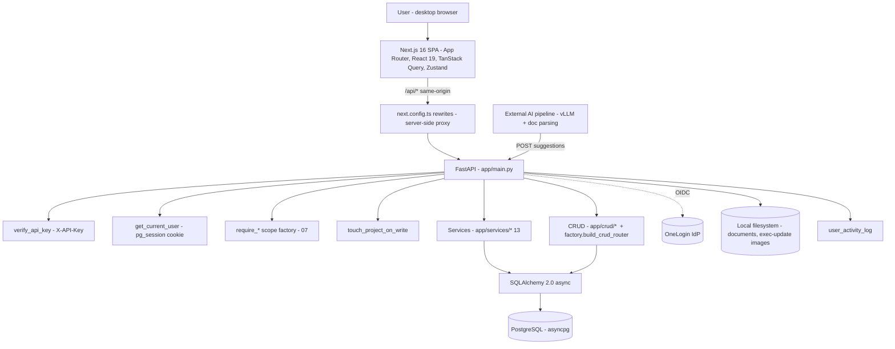
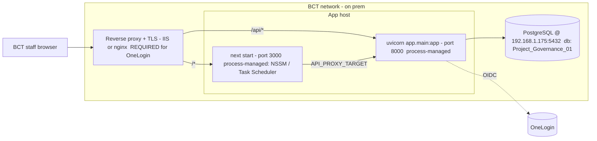

# 18 — Solution Architecture

**Document type:** Product-Brain Specification
**Product:** ProjectGovernance (working title)
**Status:** Draft — generated 2026-08-30, pending review
**Depends on:** product-brain/01, product-brain/13, product-brain/17, product-brain/19, product-brain/22
**Feeds:** product-brain/20, product-brain/24, product-brain/25

> **Purpose of this document.** What the system looks like and how it is deployed —
> current state, with forward items flagged. ProjectGovernance is a **greenfield build**:
> there are **no stored procedures** and **no ORM migration framework**, so the sample
> pack's "retain proven `PKG_*` logic" principle does not apply. All business logic is
> Python (`product-brain/13`); the schema of record is hand-written DDL
> (`product-brain/11`).

---

## 1. Architectural principles

| # | Principle | Consequence |
| --- | --- | --- |
| P1 | **All logic in the application tier.** | Rollups, worst-wins, code generation, governance scoring, metric derivation, dashboard aggregation are Python services (`app/services/*`); the DB does storage + FK integrity + one `updated_at` trigger only. |
| P2 | **Thin endpoints.** | Each route: authenticate → authorize → validate (Pydantic) → call CRUD/service → map. No business rule lives only in a route body that a service couldn't also enforce. |
| P3 | **One access-enforcement path.** | `verify_api_key` + `get_current_user` on every non-auth route, then one `require_*` scope factory (`product-brain/07`). The frontend re-checks for UX only. |
| P4 | **Same-origin browser.** | The SPA always calls its own origin; `next.config.ts` `rewrites()` proxies `/api/*` server-side to FastAPI. This is what makes the httpOnly `pg_session` cookie work in every environment without CORS gymnastics or local HTTPS. |
| P5 | **Externalised identity (target).** | Authentication via the corporate IdP (OneLogin OIDC); no local password store. Until then a `no_password` prototype toggle is in place. |
| P6 | **History is retained.** | Dated records (status, health, assessments) accumulate; nothing is overwritten (BRS NFR-5). No archival policy yet. |
| P7 | **On-prem, data stays inside BCT.** | No public cloud; no project/RAID/contractual data leaves the network (NFR-1/2). |
| P8 | **Additive schema changes.** | No migration tool — changes land as appended `db/tables/NN_*.sql` and `db/add_*.sql` patch scripts (`product-brain/11` §1). A `RISK`. |

---

## 2. Logical architecture

| Layer | Technology | Notes |
| --- | --- | --- |
| Frontend | Next.js 16 (App Router), React 19, TanStack Query (server state), Zustand + `persist` (session/UI), Radix + shadcn + Tailwind v4, TipTap (exec updates), SheetJS (register import/paste), `sonner` toasts | `AuthGuard` gates `(app)/*`; custom `fetch` wrapper `lib/api/client.ts` (`credentials: "include"`, `X-API-Key`, `401` → clear session + redirect) |
| Proxy | `next.config.ts` `rewrites()` | `/api/:path*` → `API_PROXY_TARGET`; browser stays same-origin |
| API | FastAPI 0.115 on Uvicorn 0.34 | 2 gates + `touch_project_on_write` on every `/api/v1` route except `/auth/*`; `SessionMiddleware` used **only** for transient OIDC state during the OneLogin round-trip (separate from the long-lived `pg_session` app cookie) |
| Domain | `app/services/*` (9 services, `product-brain/13`), `app/crud/*` (`CRUDBase` + generic router factory) | no stored procedures |
| ORM | SQLAlchemy 2.0 **async**; `get_db()` = session-per-request, commit-on-success / rollback-on-exception | |
| DB | PostgreSQL (`asyncpg`) shared/prod; SQLite (`aiosqlite`) local/dev & tests | tests build from `Base.metadata`, not the DDL |
| Validation | Pydantic v2 `StrEnum`s — the **only** value-set enforcement (no DB CHECK constraints) | |

---

## 3. Identity

- **`AUTH_TYPE` toggle** (`core/config.py`): `no_password` \| `onelogin`.
- **`no_password` (default today):** `POST /auth/login` matches a free-text identifier to a
  `users` row with **no password check** — an explicit prototype stopgap. Session = signed
  JWT (`PyJWT`, HS256, `SESSION_SECRET`) in the httpOnly `pg_session` cookie
  (`SameSite=Lax`, `Secure` off localhost).
- **`onelogin` (target):** OIDC via Authlib — `GET /auth/onelogin/login` (PKCE + state) →
  OneLogin hosted login → `GET /auth/onelogin/callback` validates the `id_token`, reads the
  `email` claim, looks up a **pre-provisioned** active user (case-insensitive), sets the
  same `pg_session` cookie. **Strict — no auto-create.** One OneLogin app per environment;
  issuer URL is all the backend needs (`.well-known` auto-discovery).
- **`X-API-Key`** — a single shared static key on every request, defence-in-depth,
  independent of the user session. Not per-user, not rotated automatically.
- Details + threat model: `product-brain/19`.

---

## 4. Integration seams

| Seam | Direction | Mechanism | Current status |
| --- | --- | --- | --- |
| **OneLogin (OIDC)** | Inbound auth | Authlib OIDC client; per-environment app registration | **Planned / in progress** — `no_password` is the default; OneLogin needs HTTPS (see §7). |
| **AI extraction pipeline** | Inbound | Document text is parsed **outside** the LLM; a local **vLLM** server (OpenAI-compatible API) does structured extraction; results are **POSTed into** `POST /projects/{id}/ai-suggestions` / `/ai-row-suggestions` (a **Kafka**-fed pipeline per the backend design notes). The app stores JSON only — **never writes to business tables** (`product-brain/22`). | **Working** for Project Creation / Reporting extraction. No LLM library runs in-process. |
| **BCT Oracle Application** | Inbound | The Charter stores one or more Oracle Project IDs (`project_oracle_ids`); intended source for Resource Allocation / head count and PM/employee lookups. | **ID mapping only** — the linkage is stored; **no live data sync**. |
| **Microsoft 365** | Bidirectional (future) | `integration_connections` registry row with `connection_status` + `config` JSON. | **Registry only** — nothing syncs. |
| **Ticketing tools** | Inbound (future) | Registry row; intended feed into Support metrics. | **Registry only.** |
| **Database backup / restore** | Internal | Admin triggers a `Backup` / `Restore`; `backup_restore_log` records `In Progress` → `Completed` \| `Failed`. | **Logged trigger only** — end-to-end operation unverified. |

No message broker, cache, or search index is used by the app itself (Kafka, if present,
sits in front of the external AI pipeline, not inside `app/`).

---

## 5. Document & media storage

- Uploaded project documents: **local filesystem** under `document_storage_dir`
  (`./storage/documents`), path recorded in `project_documents.storage_path`.
- Executive Update images: **local filesystem**, served by
  `GET /geos/{id}/executive-updates/images/{filename}`.
- **No object storage.** `documents.py::upload_document` writes the file then the DB row —
  a crash between the two leaves an orphan file (BACKEND_CODE_REVIEW note).

---

## 6. Logging, audit & observability

- **Business audit:** `user_activity_log` (`ENT-ACTIVITYLOG`) + `touch_project_on_write`
  activity marker. Coverage across modules is unconfirmed (BRS FR-AUTH-4) — a `GAD`.
- **Application logging / metrics / tracing:** not specified; no APM, structured-logging,
  or metrics stack is configured in the repo. `product-brain/20` sets observability targets.
- **Error handling:** `get_db()` rolls back on any exception; FastAPI returns `{detail}`.

---

## 7. Deployment topology

- **Hosting:** on-prem, inside the BCT network. Two bare processes: `uvicorn app.main:app`
  (:8000) and `next start` (:3000), each wrapped by a process manager (NSSM / Task
  Scheduler on Windows) to survive reboots. Firewall opens 8000 + 3000 (or just the proxy
  port).
- **Database:** `ASSUMPTION:` PostgreSQL at `192.168.1.175:5432`, database
  `Project_Governance_01` (from `deployment.md`; re-confirm per environment). `pg_hba.conf`
  must allow the app host's IP.
- **Key env vars** (`deployment.md`): `DATABASE_URL`, `API_KEY`, `CORS_ORIGINS`,
  `AUTH_TYPE`, `SESSION_SECRET`, `SESSION_TTL_MINUTES` (480), `SESSION_COOKIE_SECURE`,
  `FRONTEND_BASE_URL`, `ONELOGIN_CLIENT_ID/SECRET/ISSUER/REDIRECT_URI`; frontend
  `NEXT_PUBLIC_API_KEY` (= backend `API_KEY`), `API_PROXY_TARGET`.
- **HTTPS prerequisite.** The app runs **HTTP-only on internal IPs** today. OneLogin
  requires **HTTPS redirect URIs** for any non-localhost environment, so a reverse proxy +
  TLS certificate in front of shared/prod is a hard prerequisite before `AUTH_TYPE=onelogin`
  can be enabled there. Local dev is unaffected (OneLogin allows `http://localhost`).
- **No CI/CD, container, or IaC** is defined in the repo — deployment is manual per
  `deployment.md`.

---

## 8. Forward items (→ `product-brain/24`)

| Item | Detail |
| --- | --- |
| Reverse proxy + TLS | Prerequisite for OneLogin outside localhost; also lets `CORS_ORIGINS` drop to same-origin. |
| OneLogin rollout | Create the OIDC app per environment; flip `AUTH_TYPE=onelogin` after TLS. |
| Migration tooling | Adopt Alembic (or equivalent) — the biggest structural risk (`product-brain/11` §7). |
| Live integrations | Oracle resourcing sync; M365 / ticketing feeds. |
| Object storage | Replace local-filesystem document/image storage for resilience. |
| Observability | Structured logging, metrics, tracing, and full audit-log coverage. |
| Backup/restore | Verify the triggered operation end to end; schedule it. |

---

## 9. Assumptions

| ID | Assumption |
| --- | --- |
| A-ARCH-001 | `ASSUMPTION:` DB host `192.168.1.175` / database `Project_Governance_01` are from `deployment.md` and may differ per environment. |
| A-ARCH-002 | `ASSUMPTION:` Kafka fronts the **external** AI pipeline (backend design notes); it is not a dependency of `app/` itself — the app only receives HTTP POSTs of extraction JSON. |
| A-ARCH-003 | `ASSUMPTION:` No APM / metrics / structured-logging stack is configured (none found in the repo); confirm whether infra provides one out of band. |
| A-ARCH-004 | `ASSUMPTION:` Frontend and backend run on the same host in the reference deployment; they could be split, in which case `API_PROXY_TARGET` crosses hosts. |
