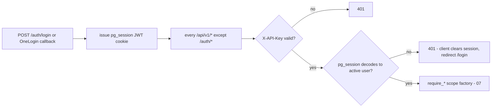

# 19 — Security & Audit Specification

**Document type:** Product-Brain Specification
**Product:** ProjectGovernance (working title)
**Status:** Draft — generated 2026-08-30, pending review
**Depends on:** product-brain/07, product-brain/17, product-brain/18
**Feeds:** product-brain/20, product-brain/23, product-brain/24, product-brain/25

> **Purpose of this document.** How authentication, authorization, sessions, sensitive
> data, and audit work — current state with the target where different. The single most
> important fact: **the default authentication mode does not check a password**
> (`AUTH_TYPE=no_password`). Numeric security targets live in `product-brain/20`
> (`NFR-SEC-*`). The VAPT scope in `vapt-prompt.txt` is the source for several risks in §9.

---

## 1. Security objectives

| Objective | How it is met (or the gap) |
| --- | --- |
| Only known, current users act, and as themselves | **Gap** — `no_password` mode matches an identifier to a user with no credential check. Target: OneLogin OIDC, pre-provisioned users only. |
| Users do only what their role and scope allow | `require_role` + `require_*_scope` on every non-auth route (added in commit `a6c607e`); `ADMIN` bypass; SoD on review. See `product-brain/07`. |
| The API is not a bypass of the UI | Same authz path for API and UI; the UI hides controls only for UX, never as the boundary (`vapt` lead 3). |
| Sessions can't be trivially replayed | Signed JWT in an httpOnly cookie, 8-hour TTL; `401` clears the client session. No refresh/rotation/revocation list. |
| Data stays inside BCT | On-prem only; no project/RAID/contractual data leaves the network (NFR-1/2). |
| Consequential actions are attributable | `user_activity_log` + `touch_project_on_write`; **coverage across modules unconfirmed** (BRS FR-AUTH-4). |
| Integrations can't be abused | OneLogin confidential client (secret server-side); `X-API-Key` on every call. |

---

## 2. Authentication

### 2.1 `AUTH_TYPE = no_password` (current default) — **highest-priority risk**

`POST /auth/login` takes `{ "identifier": "<username/email>" }`, looks up the `users` row,
and — **with no password check at all** — issues the session. It is an explicit prototype
stopgap. Consequence: anyone who can reach the app and knows (or guesses) an identifier can
sign in as that user, including `ADMIN`. Recorded as `RISK` + `DECISION REQUIRED`
(`product-brain/23`). **The app must not be exposed beyond a controlled pilot until real
authentication ships.**

### 2.2 `AUTH_TYPE = onelogin` (target)

OIDC via Authlib (`product-brain/17` §2, `18` §3): `GET /auth/onelogin/login` (PKCE +
state) → OneLogin hosted login → `GET /auth/onelogin/callback` validates the `id_token`
(issuer / audience / signature via OneLogin JWKS), reads the `email` claim, and looks up an
**active, pre-provisioned** user (case-insensitive). **No auto-create** — an unknown email
gets a clean `403`. One OneLogin app per environment; MFA is configured OneLogin-side (§3).

### 2.3 `X-API-Key`

A **single shared static key** (`API_KEY` env var) required on every request
(`verify_api_key`, `product-brain/17` §1). It is **not per-user, not rotated**, and — for
the browser — **ships in the public JS bundle** as `NEXT_PUBLIC_API_KEY` (visible in
devtools; `vapt` lead 7). It is defence-in-depth against unauthenticated hits on the API
origin, not a user-auth mechanism.

### 2.4 Session token

Signed JWT (`PyJWT`, HS256, `SESSION_SECRET`) in the httpOnly cookie `pg_session`
(`SameSite=Lax`; `Secure` when not on localhost, via `SESSION_COOKIE_SECURE`). TTL =
`SESSION_TTL_MINUTES` (default **480** = 8 h). Verified by `get_current_user` on every
non-auth route → loads the `User`, `401` if missing / invalid / `is_active = false`
(BR-SEC-020, BR-USER-030).

---

## 3. Multi-factor authentication

MFA is a listed Security requirement (BRS NFR-7, FR-AUTH-2). Under OneLogin it is enforced
**at the IdP**, not by ProjectGovernance. **Open decision** (BRS §8 Open Item 1): is MFA
mandatory for every role, or configurable / mandatory only for `ADMIN` / `CXO` / `FIN`-type
roles? Recorded as `DECISION REQUIRED`. Under `no_password` mode MFA is meaningless.

---

## 4. Authorization

Fully specified in `product-brain/07`. Summary:

- **Model:** one role per user (`RoleCode`, 8 values) + an Account/Geo scope
  (`user_accounts` / `user_geos`).
- **Enforcement:** `require_role`, `require_account_scope`, `require_account_or_geo_scope`,
  `require_account_geo_scope`, `require_geo_scope` (`bypass_roles`),
  `require_project_account_scope`, `require_project_de_scope`, `require_project_access`
  (`app/api/deps.py`).
- **Bypass:** `ADMIN` skips all scope checks; `CXO` skips geo scope for geo review + GEO
  Actions.
- **SoD:** a PM cannot review their own project's report; DE governance approval is
  separate from authoring; reference/user/integration config is `ADMIN`-only.
- **Known gaps** (`product-brain/07` §8, `GAD` in `23`): PM self-approval has no server
  gate; `DELIVERY_EXCELLENCE` write coverage is partial; `PMO` is in **no** write gate;
  `TEAM_MEMBER` is effectively read-only; `user_projects` unenforced; Region unscoped.
- **Pre-`a6c607e`:** before that commit there was **no per-request identity or role check
  at all** — `X-API-Key` was the only gate. Verify the fix covers every route
  (`data_integrity.py` "fix diff looked small" — `vapt` lead, and `documents.py`
  list/download may still be ungated — `vapt` lead 1).

---

## 5. Session management

| Aspect | Value |
| --- | --- |
| Store | stateless — signed JWT in `pg_session` cookie; nothing server-side |
| TTL | 8 h (`SESSION_TTL_MINUTES=480`); no sliding renewal, no refresh token |
| Revocation | none — a stolen/!valid token works until expiry; deactivating the user (`is_active=false`) is the only kill switch, effective on the next request |
| Flags | httpOnly, `SameSite=Lax`, `Secure` off-localhost |
| Client | Zustand `persist` mirror in `localStorage` (`pg-session`); on any `401` the client clears it and hard-redirects to `/login` |
| Logout | `POST /auth/logout` clears the cookie; under OneLogin also returns the end-session URL |

---

## 6. Sensitive data & data residency

- **Residency (hard):** on-prem, BCT network only; no project, RAID, or contractual data
  leaves the network (NFR-1/2/3). No public cloud, no external SaaS in the data path
  (OneLogin handles auth assertions only; the AI pipeline is local vLLM).
- **At rest:** PostgreSQL on an internal host; disk encryption is an infra responsibility,
  not configured in the app. `pgcrypto` is available but not used for column encryption.
- **In transit:** **HTTP-only on internal IPs today** — a `RISK`. TLS via reverse proxy is
  required for OneLogin (`product-brain/18` §7) and should front all environments.
- **Documents / images:** stored on the **local filesystem** (`./storage/documents`), not
  object storage; served by authenticated routes. `documents.py` list/download authz needs
  re-verification (`vapt` lead 1); upload has **no size / MIME / extension allow-list**
  (`vapt` lead 2).
- **Secrets:** `API_KEY` and `SESSION_SECRET` come from env; **insecure hardcoded fallback
  defaults** (`"change-me-local-dev-key"`, `"change-me-session-secret"`) apply if `.env` is
  missing (`vapt` lead 6) — a `RISK` for any environment that forgets to set them.
- **Rich-text XSS:** Executive Update content is stored TipTap HTML rendered via
  `dangerouslySetInnerHTML` — **must** be sanitised (server and/or client) or it is
  stored-XSS (`vapt` lead 4).

---

## 7. Audit & activity logging

| Tier | Mechanism | Coverage |
| --- | --- | --- |
| Business-transaction audit | `user_activity_log` (`ENT-ACTIVITYLOG`: `user_id`, `action`, `entity_type`, `entity_id`, `details` JSON, `ip_address`) | **Partial / unconfirmed** — BRS FR-AUTH-4 says "an audit log table exists; coverage of what's logged needs confirmation". |
| Project activity marker | `touch_project_on_write` after any successful project-scoped write (BR-AUDIT-010) | project-scoped routes only |
| Approvals / rejections / health changes | `reviewed_by` / `reviewed_at` / `review_comment` on report rows; `de_reviewed_by` / `de_reviewed_at` / `de_review_remarks` on projects; `declared_by` on declarations; `action_history` on Actions | attributable where those columns exist |
| Login audit | `ASSUMPTION:` not explicitly implemented — no dedicated login-event log seen | gap |
| Admin-change audit | `ASSUMPTION:` reference-data / user / role changes rely on `user_activity_log` if that endpoint writes one | unconfirmed |
| Retention | none — `user_activity_log` is append-only with no purge; no write-once store | — |

BRS NFR-4: approvals, rejections, and health-rating changes must be attributable to a user
and timestamp — met for reports / DE decisions / Actions; **full-coverage audit is a `GAD`.**

---

## 8. Integration security

| Integration | Controls | Notes |
| --- | --- | --- |
| OneLogin | Confidential OIDC client — `ONELOGIN_CLIENT_SECRET` held server-side, never in the browser; PKCE + `state`; per-environment app; issuer-based JWKS discovery. | Requires HTTPS redirect URIs (non-localhost) — TLS prerequisite. |
| AI pipeline | The external pipeline **POSTs** extraction JSON to `/projects/{id}/ai-suggestions` — protected by the same `X-API-Key` + session gates as any write; authz `require_project_access(...)`. | `ASSUMPTION:` the pipeline authenticates as a real provisioned service user; how it obtains a session is unconfirmed. |
| Oracle / M365 / ticketing | Registry rows only — no credentials stored beyond a `config` JSON blob; nothing connects out. | When live, credential handling must be specified. |
| Backup / restore | `ADMIN`-triggered; logged. | The operation's own security (where the dump lands) is undefined. |

`main.py` CORS is `allow_methods=["*"]`, `allow_headers=["*"]`, `allow_credentials=True`;
there is **no CSP / HSTS / X-Frame-Options middleware and no rate limiting** anywhere,
including `/auth/login` (`vapt` lead 5).

---

## 9. Known gaps & risks (→ `product-brain/23`)

| Severity | Gap | Source |
| --- | --- | --- |
| **Critical** | `no_password` is the default auth mode — no credential check on sign-in. | §2.1 |
| **High** | Insecure hardcoded fallback secrets if `.env` is absent. | §6, `vapt` 6 |
| **High** | HTTP-only in transit on internal IPs; no TLS enforced. | §6, `18` §7 |
| **High** | No rate limiting on `/auth/login` (or anywhere). | §8, `vapt` 5 |
| **High** | Possible IDOR — `documents.py` list/download may be ungated; any authed user could fetch any project's docs by UUID. | §6, `vapt` 1 |
| **High** | Stored-XSS risk in Executive Update rich text (`dangerouslySetInnerHTML`, sanitisation unverified). | §6, `vapt` 4 |
| **Medium** | Shared static `X-API-Key` ships in the public JS bundle; no rotation. | §2.3, `vapt` 7 |
| **Medium** | File upload: no size / MIME / extension allow-list. | §6, `vapt` 2 |
| **Medium** | No CSP / HSTS / X-Frame-Options; permissive CORS. | §8, `vapt` 5 |
| **Medium** | Audit-log coverage unconfirmed; no login-event or write-once audit. | §7 |
| **Medium** | Authorization gaps — PM self-approval, PMO/DE write coverage, `data_integrity.py` fix completeness. | §4, `product-brain/07` §8 |
| **Medium** | No session revocation / refresh; long 8-h TTL. | §5 |
| **Low** | MFA scope undecided (BRS §8 Open Item 1). | §3 |
| **Low** | `xlsx` sourced from a SheetJS CDN tarball — supply-chain provenance; dependency CVEs unaudited (`pip-audit` / `npm audit` not run). | `vapt` 8, 9 |

A full VAPT is scoped in `vapt-prompt.txt`; this section is the design-time register, not a
pen-test result.

---

## 10. Assumptions

| ID | Assumption |
| --- | --- |
| A-SEC-001 | `ASSUMPTION:` Several items in §9 are inferred from `vapt-prompt.txt` "known leads" and code reading, **not** verified dynamically — a running VAPT is needed to confirm each. |
| A-SEC-002 | `ASSUMPTION:` `get_current_user` + `require_*` (commit `a6c607e`) cover every non-auth route; `data_integrity.py` and `documents.py` list/download are called out for re-verification. |
| A-SEC-003 | `ASSUMPTION:` The AI pipeline authenticates as a provisioned service principal; the exact mechanism (a long-lived session? a dedicated key?) is unconfirmed. |
| A-SEC-004 | `ASSUMPTION:` No login-event log, no write-once audit store, and no audit retention policy exist. |
| A-SEC-005 | `ASSUMPTION:` `NFR-SEC-*` numeric targets (password policy, session timeout, rate limits, TLS versions) are owned by `product-brain/20`. |
