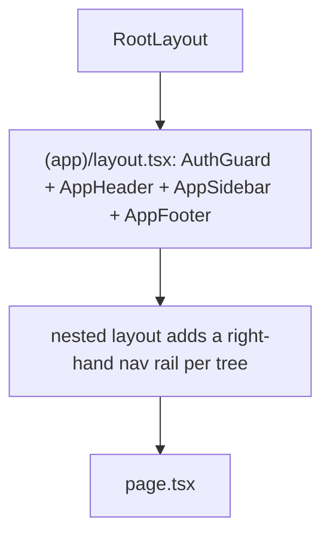

# 21 — UI/UX Pattern Specification

**Document type:** Product-Brain Specification
**Product:** ProjectGovernance (working title)
**Status:** Draft — generated 2026-08-30, pending review
**Depends on:** product-brain/06, product-brain/07, product-brain/08, product-brain/22
**Feeds:** product-brain/25, product-brain/26

> **Purpose of this document.** The common UX patterns every screen follows and — critically
> — how **entity status** and **user permissions** drive what the UI shows and enables. It
> does **not** re-design each screen (`product-brain/08` already defines every screen's
> purpose, sections, fields, and actions); it says *how* those screens look and behave
> consistently.

---

## 1. Scope & principles

Applies to the internal desktop web SPA (the only surface — no portal, no mobile app).

| # | Principle | In practice |
| --- | --- | --- |
| U1 | **Status- and permission-aware, always.** | Every actionable control is gated by (a) the entity's status (`product-brain/06`) and (b) the user's role + Account/Geo scope (`product-brain/07`). |
| U2 | **The server is the boundary; the UI is convenience.** | `auth-guard.tsx` checks *authentication* only; role/scope gating is by hiding sidebar links (`menu-config.ts`) and by the backend `403`. A page may render for a user who cannot act — **the API is the real gate** (`vapt` lead 3). Never rely on hiding for security. |
| U3 | **One way to do a thing.** | An action (Submit, Approve, Pull, Add row) looks and behaves the same on every screen — same label, same confirmation, same toast. |
| U4 | **Computed ≠ entered.** | Derived fields are visually distinct and read-only (§7). |
| U5 | **Periodic vs one-time records.** | One-time/setup data (Charter setup fields) is a plain form; recurring dated data (status, health, measurement, DE assessment) has a period selector + history (§9). |
| U6 | **Fail informatively.** | API errors map to a human message via a `sonner` toast; validation errors highlight the field (§11). |
| U7 | **Fast perceived performance.** | TanStack Query cache; optimistic where safe; a global overlay during writes; skeleton/empty states. |
| U8 | **Accessible, keyboard-first, not colour-alone.** | RAG shows text + colour; WCAG 2.1 AA target (§13). |

**Stack:** Next.js 16 App Router · React 19 · TanStack Query (server state) · Zustand +
`persist` (session, UI, page-banner) · Radix UI + shadcn conventions · Tailwind v4 ·
`lucide-react` · `sonner` (toasts) · TipTap (Executive Update) · SheetJS `xlsx` (register
import/export).

---

## 2. App shell

| Element | Component | Behaviour |
| --- | --- | --- |
| Auth guard | `shell/auth-guard.tsx` | waits for Zustand hydration; no `user` → `router.replace("/login")`. Authentication only. |
| Header | `shell/app-header.tsx` | product title, current user, **Work Context ("act as") combo** (§ below), logout. |
| Sidebar | `shell/app-sidebar.tsx` | renders `ROLE_MENUS[effectiveRole]` from `lib/menu-config.ts` — role-aware entry list. `ADMIN` sees the union. A dead `system-health` link exists. |
| Footer | `shell/app-footer.tsx` | static. |
| Page banner | `shell/page-banner.tsx` + `page-banner.ts` store + `page-banner-navigation-listener.tsx` | contextual banner (e.g. "Project is Pending Approval — click Edit Project to change"). |
| Breadcrumb | `shell/reporting-breadcrumb.tsx` | tier context inside the reporting trees. |
| Global mutation overlay | `shell/global-mutation-overlay.tsx` | dims + blocks input while any mutation is in flight. |

### Work Context ("act as")

Config: `menu-config.ts` `WORK_CONTEXTS`. `ACCOUNT_MANAGER` → act as `PROJECT_MANAGER`;
`GEO_HEAD` → act as `ACCOUNT_MANAGER` / `PROJECT_MANAGER`. `useEffectiveRole()` =
`workContext ?? realRole`. The combo **only** changes: the sidebar menu, list scoping, and
the landing route (`ROLE_LANDING_ROUTE`). It is **not** a privilege escalation — `realRole`
+ the user's `user_accounts` / `user_geos` still bound data scope, and the backend
independently permits the lower-role writes only within that patch (`require_project_access`,
`product-brain/07` §6).

---

## 3. Navigation

- **Route groups:** `(app)/*` (authenticated shell) and `login/*` (public).
- **Nested layouts add a right-hand rail** per reporting tree:
  - `new-project/[projectId]` → `new-project-nav` (Create/Maintain checklist)
  - `project-reporting/[projectId]` → `shell/project-nav` — **Weekly / Monthly grouped**
    checklist (`product-brain/14` §5)
  - `account-reporting/[accountId]` → `shell/account-nav`
  - `geo-reporting/[geoId]` → `shell/geo-nav`
  - `project-health` → `shell/project-health-nav` (14 grids)
  - `dashboard`, `de-allocation`, `de-approval`, `de-assessment` → their own layouts
- **Landing:** on login, `ROLE_LANDING_ROUTE[role.code]` → `/dashboard/<role>` "My Summary".
- **Menu framings** "Create Project" / "Maintain Project" / "View / Amend Project" are
  labels over the same `new-project` / `project-reporting` trees (`PendingPoints` #19).

---

## 4. List / register tables

The five RAID(O) tabs, Contractual, Measurement grids, and the resource list share one
pattern:

| Aspect | Component / lib | Behaviour |
| --- | --- | --- |
| Grid | `forms/register-table.tsx` | columns per `product-brain/08`; sortable; row → detail/edit drawer. |
| Filter | in-grid | filter/sort by Status, Category, Owner, Project; text search on title. |
| Pagination | `forms/pagination-bar.tsx` | `?skip/limit` (`product-brain/17` §1); default page 50. |
| Import | `forms/register-import-toolbar.tsx` + `register-import-dialog.tsx` + `lib/register-import-match.ts` | paste a range **or** upload an `.xlsx` (`lib/excel-io.ts` — SheetJS); matched to existing rows by a key, then confirmed. |
| Clipboard paste | `lib/clipboard-table-parse.ts` + `clipboard-api.ts` + `table-grid-shape.ts` | parse clipboard **HTML** (preferred) with tab/newline text fallback; **merged cells flattened** to a rectangular grid (value in the top-left, others blank); **no spreadsheet library**, no formulas. |
| Export | SheetJS | download the current grid as `.xlsx`. |
| Empty state | `forms/empty-state.tsx` | "No risks yet — Add the first one" etc. |

---

## 5. Entry forms

| Pattern | Component | Notes |
| --- | --- | --- |
| Field primitives | `forms/form-primitives.tsx` + `ui/{input,textarea,label,checkbox,native-select}` | Radix/shadcn styling; label + control + inline error. |
| Repeating text list | `forms/editable-text-list.tsx` (`EditableTextList`) | the status-report per-category item lists — add / edit / reorder / delete short text rows. |
| Multi-select | `forms/multi-select-checklist.tsx` | Applicable Phase (multiple), user's Accounts/Geos in Admin. |
| Generic record form | `forms/entry-form.tsx` | create/edit a register row in a drawer/modal. |
| Confirmation | `forms/confirmation-dialog.tsx` | destructive or state-changing actions (Delete, Submit, Approve/Reject) — never a raw `window.confirm` (would block the extension / lose focus). |
| Rich text | TipTap (`@tiptap/*`) | Executive Update blocks only — headings, bold, italic, bullets, numbered, links. Stored as HTML; **must be sanitised** on render (`product-brain/19` §6). |
| Table block | bespoke (`executive-content-builder`) | editable cells, add/remove row/column; **not** a data-grid library. |
| Image block | bespoke + existing upload | Browse **or** `Ctrl+V` paste a screenshot → preview → save via the normal upload; empty clipboard → silent no-op. |

---

## 6. Status & health display

- **RAG is a semantic 4-state indicator** — `Red`, `Potential Red`, `Amber`, `Green`
  (`lib/health-categories.ts`). It is **not** a generic 2- or 3-state badge. The same
  four-colour + label treatment is reused on the Charter, Self-Assessment, DE Assessment,
  Account/Geo RAG, the RAG grid, and the governance matrices. Colour is **never** the only
  signal — the rating text is always shown.
- **Status badge** — `forms/status-badge.tsx` renders lifecycle statuses (`Draft`,
  `Submitted`, `Approved`, `OPEN`, `IN_PROGRESS`, …) with a consistent colour per state
  family (`product-brain/06`).
- **Section accents** — `lib/section-accent-colors.ts` gives the Executive Update sections
  (Delivery / People / Financials / Operations) stable accent colours.

---

## 7. Computed vs entered fields

Rendered visually distinct (muted background, no border, a small "computed" marker) and
**never editable**:

- Project ID / `project_code`, Overall Project Health, Head Count / total FTE, derived
  Durations (`product-brain/08` §3.1).
- Every Measurement "metrics" column (`product-brain/15`) — e.g. SPI, CPI, Defect
  Leakage %, MTTR, availability %.
- Risk Score (Probability × Impact).
- Rollup sums pre-filled on Account/Geo Key Metrics (editable there, but shown as
  "pre-filled from rollup").

(BR-MEAS-010, BR-PROJ-100, BR-RAID-030.)

---

## 8. AI-assist surfacing

Per `product-brain/22` / `AI-Implementation.md`; components in `components/ai/`.

- Each AI-populated control shows a **confidence box before the control**: 🟩 High · 🟨
  Medium · 🟥 Low.
- Clicking the box opens an **info popup**: Confidence, Source document, Source location,
  Evidence (exact supporting text), and **Apply** / **Ignore**.
- **Grids** (RAID rows, Resources, Milestones): confidence applies to the **whole row**,
  not individual cells.
- **The AI indicator is removed** the moment the user edits an AI value, or clicks Save /
  Edit / Create — from then on it is ordinary manual data (BR-AI-040).
- The AI action button is **enabled only when AI data exists** for that screen + period
  (`PendingPoints` #2).
- The AI **never** writes to business tables — Apply on a field copies into the form; Apply
  on a row calls that entity's normal create endpoint (BR-AI-010/030).

---

## 9. Reporting-period selector & badge

- `shell/reporting-period-badge.tsx` + `useReportingPeriod()` + `lib/period-utils.ts`
  (`currentPeriod`).
- Periodic screens (Status = Weekly; Measurement / Contractual / RAIDO / RAG = Monthly)
  carry a **period selector**; the badge shows the active period; default = the period
  bracketing today, else the latest active one (`product-brain/14` §3).
- Screens in the "recurring dated record" group show a **history list** (past periods,
  date-sorted) alongside the current entry (`product-brain/14`, BRS FR-CHART-8 / FR-STAT-2).
- Create-Project-context records use the `BASELINE` sentinel period silently.

---

## 10. Review approve/reject action bar

- On `/project-review/[id]`, `/account-review/[id]`, `/geo-review/[id]` the read-only
  tier-below data is shown (Overview quadrants, RAG Status) with an **Approve / Reject bar**
  that appears **only when the underlying report is `Submitted`** (BR-STATUS-030,
  BR-REVIEW-010). Reject requires a comment (`confirmation-dialog` with a required field).
- A disabled action shows an inline reason ("Report not yet submitted", "You do not have
  permission to review this project").

---

## 11. Feedback, empty/loading/error

| State | Treatment |
| --- | --- |
| Mutation in flight | `global-mutation-overlay` dims + blocks; button shows a spinner. |
| Success | `sonner` toast ("Status report submitted."). |
| API error | `sonner` toast with the `{detail}` message; `422` field errors highlight the field(s). |
| `401` | client clears the Zustand session and hard-redirects to `/login`. |
| Loading | skeleton rows / panels via TanStack Query `isLoading`. |
| Empty | `forms/empty-state.tsx` with a primary action. |
| Not authorised (renders but `403` on action) | the action fails with a toast; U2 — the page may still render. |

---

## 12. Responsive behaviour

Desktop-first, data-entry-heavy (BRS NFR-6, `product-brain/20` NFR-BROWSER-20). Layouts use
Tailwind flex/grid; tables scroll inside their own `overflow-x:auto` container; the sidebar
collapses on narrow viewports. Tablet/mobile is "should work", **not** a design target — no
mobile-specific screens.

---

## 13. Accessibility

Target WCAG 2.1 AA (`product-brain/20` NFR-A11Y-10):

- Keyboard-navigable: every control reachable and operable without a mouse; visible focus.
- Labels: every input has an associated `<label>`; icon-only buttons have `aria-label`.
- Not colour-alone: RAG and status always carry text; error state is text + colour + icon.
- Radix primitives provide the base ARIA semantics for dialog, popover, dropdown, sheet.
- Rich-text output sanitised (also an a11y + security concern).

---

## 14. Assumptions

| ID | Assumption |
| --- | --- |
| A-UX-001 | `ASSUMPTION:` The `ui/` primitive set is deliberately small (10 components — `button, checkbox, dialog, dropdown-menu, input, label, native-select, popover, sheet, textarea`); anything richer is composed from these + Tailwind, not a component library. |
| A-UX-002 | `ASSUMPTION:` `auth-guard.tsx` does **not** role-gate pages; confirmed as authentication-only. Any per-page role gate would be an addition. |
| A-UX-003 | `ASSUMPTION:` Rich-text sanitisation is **not yet applied** (`vapt` lead 4); this doc states the required pattern, not the current state. |
| A-UX-004 | `ASSUMPTION:` The confidence colour scale (🟩/🟨/🟥) and the info-box fields are from `AI-Implementation.md`; the running component may differ. |
| A-UX-005 | `ASSUMPTION:` History-list views for recurring records are proposed in `docs/ux-requirements.md` §7 and partly built; coverage per screen is in `product-brain/24`. |
