# 22 — AI-Assist Specification

**Document type:** Product-Brain Specification
**Product:** ProjectGovernance (working title)
**Status:** Draft — generated 2026-08-30, pending review
**Depends on:** product-brain/01, product-brain/06, product-brain/08, product-brain/17, product-brain/21
**Feeds:** product-brain/23, product-brain/25, product-brain/26

> **Purpose of this document.** How the AI assistant works and what it guarantees. It
> **supersedes `AI-Implementation.md`**. The one rule that shapes everything: **the AI never
> writes to business tables** — it only produces reviewable suggestions that a
> `PROJECT_MANAGER` applies, edits, or ignores through the normal forms.

---

## 1. Objective & non-goals

**Objective:** use a **local LLM** to speed up **Project Creation** and **Project
Reporting** by extracting structured information from project documents, prepared for the
user to review.

**Non-goals:**
- The AI does **not** update the project directly, and **never** writes to business tables.
- No separate "AI review" or field-mapping screen — review happens inside the existing
  Project Governance screens.
- No agentic behaviour, no chat, no generation of narrative content — extraction only.
- Document parsing (PDF / DOCX / XLSX → text) is **not** done by the LLM.

---

## 2. Pipeline boundary

```mermaid
flowchart LR
    U[PM uploads docs to the AI Hub] --> APP1[App stores ProjectDocument - ai_status Not Processed]
    APP1 --> P[POST .../documents/process -> ai_status Processing]
    P --> PARSE[Document parsing OUTSIDE the LLM - PDF/DOCX/XLSX -> text]
    PARSE --> Q[[Kafka / pipeline]]
    Q --> VLLM[Local vLLM server - OpenAI-compatible API - dynamic extraction schema]
    VLLM --> JSON[Structured JSON per field / per row]
    JSON --> POST[POST /projects/id/ai-suggestions + /ai-row-suggestions]
    POST --> APP2[App stores suggestions - status pending; doc ai_status Processed]
    APP2 --> RV[PM reviews inside the normal screen - confidence + evidence]
    RV --> ACT{Apply / edit / ignore}
    ACT -- apply field --> FORM[value copied into the form control]
    ACT -- apply row --> CREATE[real row created via that entity normal create endpoint]
    ACT -- ignore --> IGN[status ignored]
    FORM --> SAVE[on Save/Edit/Create: AI indicators removed; field suggestions resolved]
```



- **In-process:** the ProjectGovernance backend has **no LLM library** — it only stores and
  serves the extraction JSON that the pipeline POSTs back.
- **External:** a local **vLLM** server (OpenAI-compatible API) does the structured
  extraction, fed by a **Kafka**-based pipeline. Document parsing happens outside the LLM;
  the LLM receives extracted text (`product-brain/18` §4, A-ARCH-002).
- **On-prem:** the vLLM server is inside the BCT network — no data leaves it (NFR-2).

---

## 3. Supported inputs

Any DOCX, PDF, XLSX, or plain-text document, e.g.: Project Charter, Statement of Work,
Contract, Proposal, Schedule (Excel), commercial documents, resource plans, weekly status
reports, steering-committee presentations, risk registers, issue registers, meeting minutes
/ transcripts. `ProjectDocument.file_type` ∈ `DOCX | PDF | XLSX | OTHER`. Files are stored
on the local filesystem (`storage_path`); no size / MIME / extension allow-list today
(`product-brain/19` §9).

---

## 4. Extraction schemas

The app supplies a **dynamic extraction schema** telling the LLM what to extract. Named
schemas:

| Schema | Used for | Bound to |
| --- | --- | --- |
| **Project Creation** | Charter fields at Create Project | `DocumentContext = create`; `BASELINE` period |
| **Project Reporting** | status-report items, RAID rows, measurement inputs at a reporting period | `DocumentContext = reporting`; the selected period |
| **General Extraction** | free extraction not tied to a target form | — |

`DocumentContext` (`schemas/enums.py`) = `create | reporting`. The schema determines the
`field_key` set (field suggestions) and the target register (row suggestions).

---

## 5. Output JSON shape

Per extracted field, the pipeline returns:

```json
{
  "field_key": "project_name",
  "value": "Digital Field Optimization",
  "confidence": 0.96,
  "source_document": "Project_Charter.pdf",
  "source_location": "page 3",
  "evidence": "The project shall be called Digital Field Optimization."
}
```

Stored in `ai_field_suggestions` (`ENT-AIFIELDSUGG`): `project_id`, `screen`, `period_id`,
`field_key`, `value` (text), `confidence` (float 0–1), `source_document`,
`source_location`, `evidence`, `status`. **Scoped by `(project_id, screen, period_id,
field_key)`** — suggestions are per-screen and per-period.

Row suggestions (`ai_row_suggestions`, `ENT-AIROWSUGG`) carry `row_values` (JSON — the
candidate record), `match_key`, `matched_entity_id` (set after Apply), plus the same
`confidence` / `source_*` / `evidence` / `status`, scoped by `(project_id, screen,
period_id)`.

---

## 6. Field suggestions vs row suggestions

| | Field suggestion | Row suggestion |
| --- | --- | --- |
| Targets | one form control (`field_key`) | a whole candidate RAID(O) / grid row (`row_values`) |
| Screens | Project Charter/Profile, Project Status, Measurement | the five RAID(O) registers (Risks/Issues/Dependencies/Assumptions/Opportunities), and grids like Resources / Milestones |
| Confidence granularity | per field | **per row** (not per cell) |
| Apply | copies `value` into the control (form only) | **creates the real row via that entity's normal create endpoint** (`POST /projects/{id}/risks`, …), then sets `matched_entity_id` |
| Lifecycle | `pending → ignored \| resolved` | `pending → ignored \| applied` |
| "Resolved" | implicit — the user saved / edited / created on the screen | n/a (there is no implicit resolve for rows) |
| Table | `ai_field_suggestions` | `ai_row_suggestions` |
| Endpoints | `API-AI-10` (`/ai-suggestions` + `/{id}/ignore` + `/resolve`) | `API-AI-20` (`/ai-row-suggestions` + `/{id}/ignore` + `/{id}/apply`) |

---

## 7. Confidence model & info box

- Each AI-populated control shows a **confidence box before the control**:
  🟩 **High** · 🟨 **Medium** · 🟥 **Low / Review Required**. The mapping from the numeric
  `confidence` to the three bands is a UI threshold (`ASSUMPTION:` exact cutoffs in
  `components/ai/`).
- Clicking the box opens the **AI info popup**: Confidence, Source document, Source
  location, Evidence (exact supporting text), and **Apply** / **Ignore** buttons.
- For grids the confidence box sits on the **row**, not each cell.
- The confidence indicator applies **only** to AI-populated values.

---

## 8. Apply / Ignore & lifecycle

| Action | Field suggestion | Row suggestion |
| --- | --- | --- |
| **Apply** | `value` copied into the control; stays `pending` until the screen is saved (then `resolved`) | `POST` the real row via the entity's create endpoint; suggestion → `applied`, `matched_entity_id` set |
| **Ignore** | `POST /ai-suggestions/{id}/ignore` → `ignored` | `POST /ai-row-suggestions/{id}/ignore` → `ignored` |
| **Edit the value** | AI indicator removed; becomes ordinary manual data; on save → `resolved` | edit the applied row like any other |
| **Save / Edit / Create on the screen** | **all** on-screen AI-derived values become manual; indicators removed; `POST /ai-suggestions/resolve` marks them `resolved` | — |

Lifecycles are authoritative in `product-brain/06` §18 (`AiSuggestionStatus`,
`AiRowSuggestionStatus`, `DocumentAiStatus`).

---

## 9. Core guarantees

1. **The AI never writes to business tables** (BR-AI-010). Extraction output lives only in
   `ai_field_suggestions` / `ai_row_suggestions`. A value reaches a business table only
   when the **user** saves a form or applies a row (which uses the same create path as
   manual entry).
2. **The user is the final authority** — accept, modify, or ignore.
3. **Editing or saving strips the AI indicator** — from that point the value is
   indistinguishable from manual data (BR-AI-040).
4. **The AI button is enabled only when AI data exists** for that screen + period
   (`PendingPoints` #2) — no dead button when there is nothing to review.
5. **The existing screens are the workspace** — no separate review/mapping app.

---

## 10. Screens covered

| Screen (`product-brain/08`) | Route | Suggestion type |
| --- | --- | --- |
| SCR-AI-10 / 20 / 30 / 40 — AI Hub / Document Processing | `.../ai-hub/document-processing` under new-project / project-reporting / account-reporting / geo-reporting | upload + process + review list |
| SCR-PROJ-30 — Project Profile | `/new-project/[id]/project-charter` | field (Project Creation schema) |
| SCR-STATUS-20 — Project Status | `/project-reporting/[id]/project-status` | field + row (Project Reporting schema) |
| SCR-RAID-10 / SCR-PROJ-70 — RAIDO Register | `.../raido` | **row** (per register) |
| SCR-MEAS-10 — Measurement | `.../measurement` | field |

`ASSUMPTION:` account/geo AI-Hub routes exist but the account/geo forms are not primary AI
targets — the extraction schemas are project-oriented.

---

## 11. Backing tables & endpoints

| Concern | Table (`product-brain/11`) | Endpoints (`product-brain/17`) |
| --- | --- | --- |
| Documents | `project_documents` (file 32) | `API-AI-30` — `GET/POST /projects/{id}/documents`, `POST …/process`, `DELETE …/{id}`, `GET …/{id}/download` |
| Field suggestions | `ai_field_suggestions` (file 30) | `API-AI-10` — `GET/POST /projects/{id}/ai-suggestions`, `POST …/{id}/ignore`, `POST …/resolve` |
| Row suggestions | `ai_row_suggestions` (file 31) | `API-AI-20` — `GET/POST /projects/{id}/ai-row-suggestions`, `POST …/{id}/ignore`, `POST …/{id}/apply` |

Writes are gated by `require_project_access(PROJECT_MANAGER, ACCOUNT_MANAGER, GEO_HEAD,
ADMIN)`; the pipeline POSTs suggestions in through the same gate (`product-brain/19` §8,
A-SEC-003). Tests: `backend/tests/test_ai_suggestions.py`.

---

## 12. Gaps & open items (→ `product-brain/23`)

| Gap | Detail |
| --- | --- |
| Pipeline authentication | How the external pipeline obtains a session / passes `X-API-Key` to POST suggestions is unconfirmed (`product-brain/19` A-SEC-003). |
| File upload hardening | No size / MIME / extension allow-list; files on local FS, no AV scan (`product-brain/19` §9). |
| Confidence thresholds | The numeric → 🟩/🟨/🟥 cutoffs are UI-defined and undocumented. |
| Row-match semantics | `match_key` / `matched_entity_id` de-dupe behaviour (does Apply update an existing row or always create?) needs confirming. |
| Re-processing | `ai_status` can go `Processed → Processing` again; whether re-processing supersedes or appends suggestions is unconfirmed. |
| Scope of AI | Extraction only; no summarisation or narrative drafting is planned — confirm that is the intended ceiling. |

---

## 13. Assumptions

| ID | Assumption |
| --- | --- |
| A-AI-001 | `ASSUMPTION:` The Kafka-fed pipeline is external infrastructure; `app/` only receives HTTP POSTs of extraction JSON (backend design notes). |
| A-AI-002 | `ASSUMPTION:` `confidence` is a 0–1 float; the band cutoffs (e.g. ≥ 0.9 High, 0.6–0.9 Medium) are indicative — see `components/ai/`. |
| A-AI-003 | `ASSUMPTION:` Row "Apply" always calls the entity's create endpoint (never a bespoke path), so all `BR-*` for that register apply. |
| A-AI-004 | `ASSUMPTION:` Account/Geo AI-Hub routes exist for symmetry but the extraction schemas are project-scoped. |
