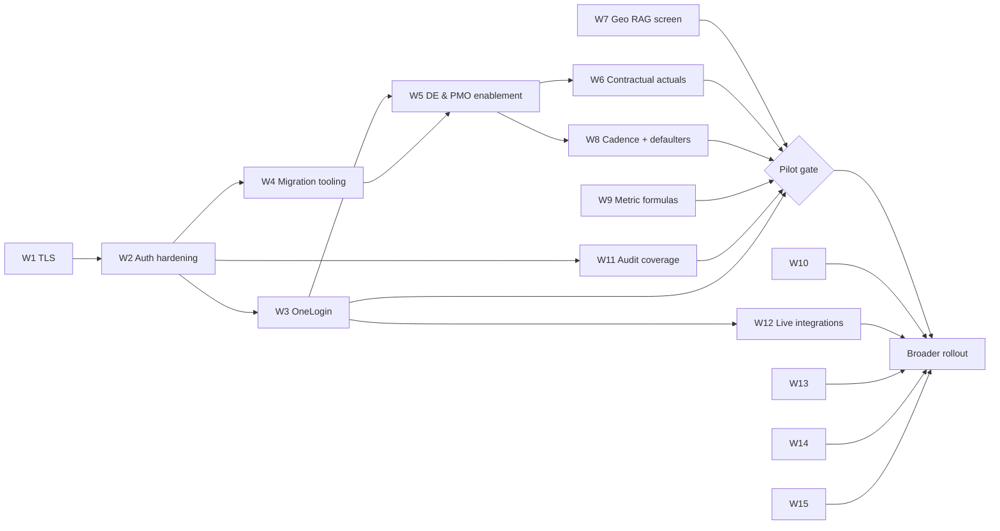

# 24 — Build Status & Delivery Roadmap

**Document type:** Product-Brain Forward-Plan
**Product:** ProjectGovernance (working title)
**Status:** Draft — generated 2026-08-30, pending review
**Depends on:** product-brain/01, product-brain/19, product-brain/23
**Feeds:** product-brain/25, delivery planning

> **Purpose of this document.** Where each module is today (Built / Partial / Planned),
> refreshed against the actual code — correcting the BRS v0.1 where it is stale — and the
> forward plan: an incremental, module-by-module, **pilot-gated** sequence of workstreams.
> ProjectGovernance is greenfield, so there is nothing to migrate *from*; "roadmap" here
> means the order in which the remaining work is done. `GAD-*` links are to
> `product-brain/23`.

---

## Part A — Build Status

**Legend:** **Built** = working in the current system · **Partial** = some part exists,
incomplete · **Planned** = specified, not yet built.

| MOD | Module | Status | Notes (and BRS-refresh) |
| --- | --- | --- | --- |
| MOD-AUTH | Authentication & Access | **Partial** | Server-side session + `require_*` gates exist (commit `a6c607e`). **`no_password` is the default — no credential check** (GAD-401). OneLogin OIDC coded behind `AUTH_TYPE` but not rolled out. |
| MOD-REF | Reference / Master Data | **Partial** | CRUD API for all 7 entities; **only Accounts has an admin screen** — the rest are seed/CLI only (GAD-142, GAD-313). |
| MOD-USER | User & Role Administration | **Built** | `/admin/users` — create/edit/deactivate, role + Account/Geo scope. |
| MOD-INTG | Integrations & Backup | **Partial** | Registry + backup-log tables and screen exist; **nothing syncs live**; backup operation unverified (GAD-213, GAD-504). |
| MOD-AUDIT | Audit / Activity Log | **Partial** | `user_activity_log` + `touch_project_on_write`; **coverage unconfirmed**, no login-event log (GAD-201). |
| MOD-PROJ | Project Charter | **Built** *(with gaps)* | Create → Send for Approval; Oracle-ID mapping; resource list. **Post-approval immutability and all-fields-mandatory checks are UI-only** (GAD-110). `PendingPoints` field changes partly applied (GAD-316). |
| MOD-STATUS | Project Status Reporting | **Built** | Weekly report, items, Submit; per-item rollup status. |
| MOD-RAID | RAID(O) Registers | **Built** | All 5 registers, CRUD, import/paste. Review-date fields on Risk only (GAD-207/303). |
| MOD-HEALTH | Project Health Declarations | **Partial — migrating** | Legacy single-rating **and** itemised `project_health_items` **coexist** (GAD-104). Worst-wins rollup working. |
| MOD-MEAS | Measurement / Delivery Metrics | **Built** *(formulas provisional)* | All 7 types incl. Consulting; computed metrics wired. **Baselines / some formulas "QA to provide"** (GAD-505); several metrics permanently `None` (GAD-209). Period selector guaranteed only for Development (GAD-208/304). |
| MOD-TARGET | Metric Targets | **Built** | Per-type upsert; drives dashboard variance. |
| MOD-CONTRACT | Contractual Compliance | **Partial** | Commitment/milestone **definitions** work; **actuals-entry UI missing on some flows** → dashboards show "Not Recorded" (GAD-205). Intended `PMO` ownership not wired (GAD-311). |
| MOD-DEA | Delivery Excellence Assessment | **Built** | Assessment + Findings + Alerts; DE workspace; DE dashboard **wired to a real API** (BRS refresh — not "mock stub"). "Alert removed / Finding has Alert" change pending (GAD-315). |
| MOD-DEAL | DE Allocation | **Built** | `/de-allocation` grid, bulk assign. *(Newer than the BRS.)* |
| MOD-DEAP | DE Governance Approval | **Built** | Queue + per-module review + completeness + Approve/Return. *(Newer than the BRS.)* **PM self-approval still has no server gate** (GAD-311). |
| MOD-ACCT | Account Reporting & Health | **Built** | Status report + RAG + rollup + review. |
| MOD-GEO | Geo Reporting & Health | **Partial** | Geo status report + review built; **Geo RAG-status screen does not exist** — endpoints only (GAD-206). |
| MOD-ROLLUP | Rollup & Aggregation | **Built** | Project→account→geo status/health/metric rollup; Pull/Ignore/Undo. |
| MOD-REVIEW | Reporting / Review Cascade | **Built** | Approve/Reject at all 3 tiers; Work Context act-as. `Rejected` re-open path unconfirmed (GAD-106). |
| MOD-EXEC | Executive Updates | **Built** | Section/block builder, clipboard image + Excel paste. *(Newer than the BRS.)* Rich text unsanitised (GAD-407). |
| MOD-ACTION | Action Tracker | **Built** | Project/Account/Geo actions, history, lifecycle. *(Newer than the BRS.)* |
| MOD-DI | Data Integrity Checklist | **Partial** | Catalog + freshness rollup + portfolio grid. **Coverage holes in the lookup map**; not truly period-scoped (GAD-216/217). `PMO` cannot act (GAD-311). |
| MOD-DASH | Dashboards & Project Health | **Built** *(one gap)* | Per-role My Summary + 14-grid Project Health portfolio. **PM "My Summary" on mock data** (GAD-215). No "data as of" indicator (GAD-306). |
| MOD-AI | AI Assist & Documents | **Built** | Document upload/process, field + row suggestions, Apply/Ignore. Depends on the external pipeline (GAD-506). Upload not hardened (GAD-219). |

**BRS v0.1 refresh summary.** The BRS (2026-08-12) predates and mislabels: DE has a full
menu + `/de-allocation` + `/de-approval` + `/de-assessment` route trees and a **real** DE
dashboard (not a "dashboard-only stub"); Executive Updates, Action Tracker, the Project
Health portfolio, the Consulting engagement type, and Regions all ship. `roles-actions.md`
§5 (DE has "no path") is superseded by `product-brain/07`.

---

## Part B — Delivery Roadmap

### 1. Guiding approach

- **Incremental, module by module.** No big-bang — each workstream lands and is verified
  behind its own gate (`product-brain/25` per-module gates) before the next.
- **Pilot-gated.** The app runs only for a controlled pilot audience until §3's criteria
  are met.
- **Fix the foundation first.** Auth, TLS, and migration tooling precede feature work —
  building more on `no_password` and hand-applied DDL compounds risk.

### 2. Workstreams in sequence

| # | Workstream | Entry criteria | Key `GAD` / `BR` | Exit criteria |
| --- | --- | --- | --- | --- |
| W1 | **Foundation: TLS + reverse proxy** | infra approves a proxy + cert for shared/prod | GAD-404, GAD-500 | HTTPS terminates in front of both processes in every shared environment |
| W2 | **Auth hardening** | W1 | GAD-401, GAD-403, GAD-405, BR-SEC-010/020 | fail-fast on default secrets; login rate-limiting; session review; `a6c607e` route sweep passes (GAD-202) |
| W3 | **OneLogin rollout** | W1–W2; OneLogin app per env (GAD-501) | GAD-300, BR-SEC-090 | `AUTH_TYPE=onelogin` in shared/prod; pre-provisioned-only verified; `no_password` disabled outside local |
| W4 | **Migration tooling** | decision to adopt Alembic (GAD-314) | GAD-402, GAD-210/211 | every schema change flows through versioned migrations; a CI DDL↔ORM diff runs |
| W5 | **DE & PMO role enablement** | GAD-311 decided | GAD-311, GAD-114, BR-PROJ-070, BR-DEAP-030 | `DELIVERY_EXCELLENCE` is the sole path to `Approved` (PM self-approval removed); `PMO` owns Contractual + Data Integrity writes |
| W6 | **Contractual & Milestone actuals UI** | W5 (PMO can write) | GAD-205, BR-CONTRACT-020/030 | actuals entry exists on every flow; dashboards move off "Not Recorded" |
| W7 | **Geo RAG-status screen** | — | GAD-206, BR-GEO-020 | geo health entered via UI; geo health rollup no longer needs the API |
| W8 | **Cadence model + defaulter tracking** | GAD-122/305/312 ratified | GAD-214, GAD-217, BR-DI-010 | cadences fixed; Data Integrity period-scoped; a cross-tier defaulter view exists |
| W9 | **Measurement formula & baseline sign-off** | QA delivers (GAD-505) | GAD-505, GAD-209, BR-MEAS-010 | every metric has a confirmed formula + baseline, or is removed |
| W10 | **Itemised-health migration completion** | — | GAD-104, BR-HEALTH-050 | legacy single-rating columns retired; one health model |
| W11 | **Audit-log coverage** | W2 | GAD-201, BR-AUDIT-020, NFR-4/NFR-OBS-20 | every approval/rejection/health-change/admin-change logged; login-event log; retention policy (GAD-118) |
| W12 | **Live integrations** | W3 (identity), W4 | GAD-503, GAD-504, BR-INTG-020 | Oracle resourcing sync; M365 / ticketing feeds |
| W13 | **Notification delivery** | W12 (M365 mail) or a chosen channel | GAD-213 | `N-*` reminders/alerts actually send |
| W14 | **Observability + object storage + upload hardening** | — | GAD-218, GAD-219, GAD-409 | structured logs + metrics; documents on object storage; upload allow-list + AV |
| W15 | **Backlog field changes** | per item | GAD-316, GAD-315, GAD-317 | `PendingPoints` "decided, not done" items applied |

### 3. Pilot-gating criteria

The application **must not be exposed beyond a controlled pilot** until **all** of:

1. **Real authentication** — `AUTH_TYPE=onelogin` in the pilot environment; `no_password`
   disabled; pre-provisioned-only confirmed (W2–W3, GAD-401).
2. **TLS** everywhere the pilot is reachable (W1, GAD-404).
3. **No default secrets** — the app fails to start on `"change-me-*"` values (W2, GAD-403).
4. **Authorization sweep** — every non-auth route has a `require_*` guard; `documents.py`
   list/download and `data_integrity.py` verified (GAD-202/406); a VAPT pass is scheduled.
5. **Rich-text sanitisation** in place (GAD-407).
6. **DE/PMO can do their jobs** — DE is the sole approver; `PMO` owns Contractual + Data
   Integrity (W5, GAD-311).
7. **No "Not Recorded" dead-ends** — contractual/milestone actuals entry exists (W6).
8. **Cadence ratified** so Data Integrity verdicts and defaulter lists are trustworthy (W8).
9. **Metric formulas signed off** by QA (W9).

Broader / general rollout additionally needs W10–W15 and a resolved product name (GAD-301).

### 4. Dependencies

All tracked in `product-brain/23` §8: reverse proxy + TLS (GAD-500), OneLogin app per
environment (GAD-501), process manager + firewall (GAD-502), Oracle integration (GAD-503),
M365 / ticketing (GAD-504), QA measurement formulas/baselines (GAD-505), the external vLLM
pipeline (GAD-506), environment seed data (GAD-507).

---

## 5. Assumptions

| ID | Assumption |
| --- | --- |
| A-RM-001 | `ASSUMPTION:` Build status is inferred from the code inventory and `DATA-ENTRY-GUIDE.md` "Known gaps"; a walkthrough with the dev team should confirm each Built/Partial call. |
| A-RM-002 | `ASSUMPTION:` The workstream sequence is a recommendation, not a committed plan — W1–W5 (foundation + role enablement) are the firm prerequisites; W6+ can be reordered. |
| A-RM-003 | `ASSUMPTION:` No dates or effort estimates are given — this pack scopes *what* and *in what order*, not *when*. |
| A-RM-004 | `ASSUMPTION:` "Broader rollout" is not the same as "GA to all of BCT" — the internal audience size and phasing is a PMO decision. |
